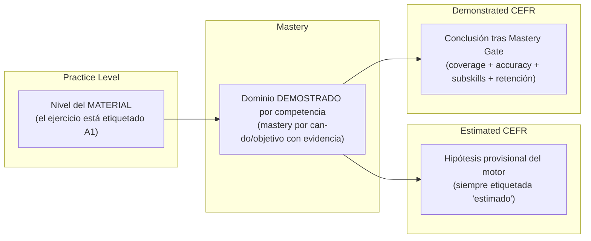
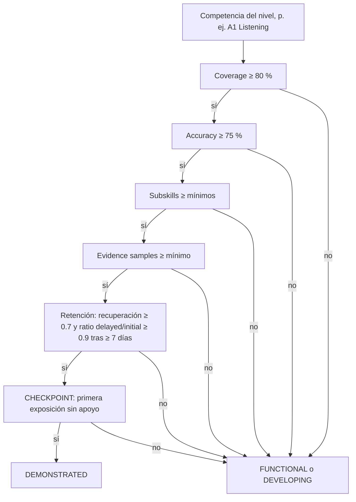

# Constitución pedagógica CEFR (Pre-A1 → C2)

> Especificación normativa del modelo de nivelación de English Tutor.
> Estado: **borrador normativo aprobado por el gerente (2026-09-03)**; sección 9
> ampliada en **V3.13 (2026-09-05)** con la calibración de evidencia pedagógica
> (reglas inmutables R1–R7, §6.4 evidence depth, modalidades por destreza) e
> **implementada en v3.13.0** (incrementos P0–P2, ver §9).
> No impone
> cambios de código por sí misma; define QUÉ debe demostrar un alumno para que se
> le considere en un nivel y CÓMO debe mostrarse eso en la UI. Los cambios de
> implementación se listan en la sección 9 como incrementos priorizados.
>
> Documentos relacionados: auditoría que motiva este documento en
> `docs/audit/H-NIVELACION-PEDAGOGICA.md`; descriptores can-do por banda en
> `backend/curriculum/cefr_descriptors.json`; matriz de requisitos en
> `backend/curriculum/cefr_matrix.json`; currículo por nivel en
> `backend/curriculum/<nivel>.json`; progresión de listening en
> `docs/LISTENING_CURRICULUM.md`.

## 1. Principios

1. **Terminar actividades NO demuestra nivel.** Completar un ejercicio, una
   lección o una ruta es práctica (premisa 21 de `docs/PREMISAS.md`: terminar no
   es evidencia de dominio). La demostración requiere, además, evidencia mínima,
   variedad y retención (secciones 6.2 y 6.3 de esta constitución).
2. **El vocabulario es condición de apoyo, no el nivel.** Saberse "palabras" no
   equivale a poseer una competencia CEFR. El CEFR describe *capacidad funcional*
   con descriptores can-do en situaciones comunicativas (Council of Europe,
   Companion Volume); Cambridge evalúa por destrezas (Listening, Reading &
   Writing, Speaking) y ofrece *wordlists* como apoyo, no como criterio.
3. **La demostración se acumula por competencia**, no por "contador de ítems".
   Cada destreza (Listening, Speaking, Interaction, …) tiene su propia evidencia.
4. **La retención forma parte de la demostración.** Un acierto puntual no basta:
   la capacidad debe mantenerse en el tiempo.
5. **Toda lectura de nivel es una afirmación con matiz.** "Estimado" es una
   hipótesis del motor; "demostrado" es una conclusión respaldada por gates. La
   UI nunca presenta una hipótesis como una conclusión.
6. **Nada de esto se traduce en una fórmula única para toda la app.** Cada
   competencia declara sus propios gates y sus propios instrumentos.

### 1.1 Reglas inmutables (R1–R7)

Reglas no negociables en ninguna capa (motor, currículo, UI, contenidos). Un
cambio futuro que las toque exige revisar primero esta constitución. Cuando una
pantalla o un motor acopla dos conceptos separados por estas reglas sin pasar
por el gate correspondiente, se considera un **bug pedagógico** de prioridad
máxima, no una mejora.

| Regla | Enunciado | Garantía actual en esta constitución | Violación típica |
|---|---|---|---|
| **R1** | Practice ≠ Mastery | §2.1 (FUNCTIONAL es hito de práctica, nunca certifica) y premisa 21 | "Has conseguido A1" por terminar una ruta |
| **R2** | Mastery ≠ CEFR certification | §2.1 y §6 (DEMONSTRATED exige el gate completo) | badge "demostrado" sin retención |
| **R3** | Vocabulary ≠ CEFR level | §3.1 (Vocabulary Coverage Indicator, indicador, no puerta) | palabras → banda CEFR (H1, eliminado en v3.3.0) |
| **R4** | One skill ≠ Overall CEFR | §7.2 (el perfil se expresa como tupla por destreza) | un único nivel global sin distribución |
| **R5** | Recognition ≠ Production | §7 (modalidades de evidencia por destreza) | MC aprobado → estructura "dominada" |
| **R6** | Immediate success ≠ Retention | §6.3 (ventana ≥ 7 días y ratio estable) | un acierto puntual → demostrado |
| **R7** | Small sample ≠ Demonstrated competence | §6.4 (mínimo de muestras y evidence depth) | 4 checks de C2 → lectura de competencia C2 |

La columna "Garantía actual" referencia secciones normativas; cuando una de
estas reglas se haga cumplible en código se anota en la sección 8 y en el
roadmap de la sección 9.

## 2. Modelo conceptual (regla arquitectónica)

Cuatro conceptos **separados y no intercambiables**. Ninguna capa puede usar uno
en lugar del otro.



| Concepto | Pregunta que responde | Ejemplo de UI (correcto) | Ejemplo de UI (prohibido) |
|---|---|---|---|
| **Practice Level** | "¿De qué nivel es este material?" | "Estás practicando **Listening A1**" | "Estás en A1 porque haces ejercicios A1" |
| **Mastery** | "¿Qué competencias ha demostrado y con qué evidencia?" | "Basic instructions · Mastery 82 % · 17 evidencias" | "Dominado = 1 acierto" |
| **Estimated CEFR** | "¿Qué nivel sugiere la evidencia actual?" | "Nivel estimado: **A1 — developing**" | badge crudo "A1" sin matiz |
| **Demonstrated CEFR** | "¿Ha superado el conjunto de evidencias requerido?" | "A1 Listening — **demonstrated**" | "Has conseguido A1" por 30 palabras |

### 2.1 Estados por competencia

Cada competencia observable transita por cuatro estados. La equivalencia con lo
que ya existe en el código es orientativa (ver sección 8 para las brechas).

| Estado | Definición | Condición mínima | Constructos actuales próximos |
|---|---|---|---|
| **NOT STARTED** | No hay evidencia. | `evidence_count == 0` | `mastery_stage == "acquire"`, `dimension_state == "not_started"` |
| **DEVELOPING** | Se está aprendiendo: hay intentos, aún no consistentes. | evidencia > 0 sin cumplir el gate | `readiness_band == "developing"`, `mastery_stage == "practice"` |
| **FUNCTIONAL** | Puede usar la competencia en las situaciones previstas del nivel, con apoyo o con ayuda. | cumple el **gate de práctica** (coverage/precisión/amplitud) sin retención retardada | `readiness_band == "ready"` o `approaching`; `route_gate.passed` de listening; gates de unidad del Course Engine |
| **DEMONSTRATED** | Ha superado el **conjunto completo de evidencias**: gate de práctica + retención retardada + mínimo de muestras. | sección 6 (Mastery Gate) | `mastery_evidence_gate.met` de Assessment 2.0 (initial+practice+transfer+novel+delayed); hoy NO existe como estado de nivel |

**Regla:** solo el estado DEMONSTRATED permite frases del tipo "A1 — demonstrated".
FUNCTIONAL permite "puede desenvolverse en A1"; DEVELOPING solo "está
practicando/desarrollando A1".

### 2.2 Regla de separación en la UI

- El material se etiqueta con **su** nivel (`Practice Level`), no con el del alumno.
- El nivel estimado global lleva siempre un calificador: "estimado · no
  certificado" o "Pre-A1 — sin evidencia suficiente".
- "Demostrado" aparece únicamente donde un gate lo respalda y por competencia
  (p. ej. "A1 Listening — demonstrated" junto a "B1 Speaking — developing";
  nunca un único nivel global para todo el perfil).

## 3. Cobertura léxica y unidades léxicas

### 3.1 Rangos de cobertura léxica (indicadores internos, NO puertas)

El vocabulario es un **Vocabulary Coverage Indicator**: informa, no certifica.
Los rangos se calibrarán con corpus/wordlists apropiados (p. ej. English
Vocabulary Profile) antes de usarlos en cualquier umbral.

| Nivel | Léxico receptivo objetivo | Léxico productivo objetivo |
|---|---|---|
| Pre-A1 | ~150–300 | ~50–100 |
| A1 | ~700–1.000 | ~400–600 |
| A2 | ~1.200–1.800 | ~800–1.200 |
| B1 | ~2.000–3.000 | ~1.500–2.000 |
| B2 | ~3.500–5.000 | ~2.500–3.500 |
| C1 | ~5.000–7.000+ | ~4.000–5.000+ |
| C2 | muy amplio | muy amplio |

Uso permitido:
- Mostrar "A1 lexical coverage: 683 conocidas · 91 aprendiendo · 47 débiles ·
  78 %" como **indicador**.
- Ayudar a decidir qué nivel de material ofrecer (Practice Level).

Uso **prohibido**:
- "X palabras → nivel CEFR" (ver `docs/audit/H-NIVELACION-PEDAGOGICA.md`, H1).
- Bloquear o conceder un nivel por un contador de palabras.

### 3.2 Lexical Unit (evolución del Personal Dictionary)

El Personal Dictionary pasa de ítem `word` a **Lexical Unit**: cualquier unidad
funcional de comunicación. La tabla `vocabulary` ya soporta `kind`
(`word`/`structure`, `backend/services/lexicon.py`); la taxonomía se amplía a:

| Tipo | Ejemplo | ¿Indexa como palabra? |
|---|---|---|
| word | `train`, `station` | sí |
| collocation | `catch a train`, `strong coffee` | no (frase) |
| phrasal verb | `get up`, `look for` | no (unidad) |
| expression | `I don't understand.` | no |
| sentence frame | `Where is …?`, `Can I have …?` | no (slot) |
| functional chunk | `How are you?`, `Could you repeat that?` | no |

Regla de diseño: **las unidades funcionales se siembran y evalúan como tales**
desde los `concepts`/`vocabulary` de los objetivos del currículo
(`backend/curriculum/<nivel>.json`), y su dominio se registra igual que el de las
palabras (producción espaciada ≥3 en ≥2 días para `mastered`).

## 4. Progresión de Listening (práctica)

La práctica auditiva avanza por fases acumulativas dentro y entre niveles. La
fase que un nivel entrena de forma principal se declara en
`LISTENING_FOCUS_BY_LEVEL` (`backend/services/curriculum.py:133-139`) y se audita
en `docs/LISTENING_CURRICULUM.md`.

| Fase (práctica) | Qué se entrena | Subskills canónicos reales |
|---|---|---|
| 1. Word recognition | reconocer palabras sueltas claras | `word_recognition`, `sound_recognition` |
| 2. Phrase recognition | reconocer frases y expresiones fijas | `phrase_recognition` |
| 3. Sentence comprehension | comprender oraciones sencillas (gist/detalle) | `gist`, `detail` |
| 4. Natural short dialogue | diálogos cortos, 2 hablantes | `multiple_speakers`, `fast_speech` |
| 5. Reduced / connected speech | habla conectada y reducciones | `connected_speech` |
| 6. Simple inference | inferir intención/actitud | `inference`, `speaker_intention`, `attitude` |

Mapeo con `LISTENING_FOCUS_BY_LEVEL`: A1 declara reconocimiento (fase 1); A2
añade gist/detalle (fases 1 y 3); B1 añade frase, habla rápida y connected
speech (fases 2, 4 y 5); B2–C2 trabajan inferencia y actitud (fase 6) con
progresión de matiz. **Consecuencia pedagógica:** un alumno A1 no debe leer
"A1 Listening demostrado" por dominar ítems de word recognition si no ha
trabajado frases ni oraciones; el gate de subskills del listening (sección 6.2)
ya lo evita al exigir variedad.

## 5. Unidades de medida (evidencia, no etiquetas)

El sistema debe distinguir tres magnitudes que hoy conviven:

1. **Corpus size** — ítems disponibles por nivel (p. ej. corpus de listening
   A1/A2 con 200 ítems cada uno, `docs/audit/B-LISTENING-CEFR.md`).
2. **Curriculum exposure** — ítems/competencias que el alumno ha trabajado
   (p. ej. `mastered` de una ruta = acertado al menos una vez).
3. **Mastery evidence** — evidencias válidas de dominio (filas
   `academy_evidence` con kind `familiar`/`transfer`/`novel`/`delayed`).

A estas se añade **Retention evidence** (sección 6.3). Ninguna de estas
magnitudes se presenta como nivel por sí sola.

## 6. Mastery Gate general (especificación)

Un nivel por competencia se considera **DEMONSTRATED** cuando se cumplen todos
los componentes del gate. La fórmula es conceptual (no necesariamente un único
número visible):

```
Readiness_competencia =
    Coverage            (competencias/objetivos cubiertos del nivel)
  × Accuracy            (rendimiento sobre lo practicado)
  × Subskill breadth    (variedad de subskills entre lo demostrado)
  × Difficulty progress (dominio en la dificultad propia del nivel)
  × Retention           (mantenimiento en el tiempo: recuperación ≥ 0.7 y
                         ratio estable delayed/initial ≥ 0.9, ventana ≥ 7 días)
```



### 6.1 Bloques que ya existen (se REUTILIZAN, no se reinventan)

- **Coverage + Accuracy + variedad + checkpoint** de listening:
  `route_gate` (`backend/services/listening.py:1309-1390`) con
  `ROUTE_MIN_COVERAGE=0.8`, `ROUTE_MIN_ACCURACY=70.0`, `ROUTE_MIN_TOPICS=3`,
  `ROUTE_MIN_SUBSKILLS=3` y checkpoint `0.1` del banco acotado 5–25
  (`backend/services/listening.py:925-948`).
- **Evidencia por kind** `familiar`/`transfer`/`novel`/`delayed` y pesos
  (`backend/services/academy.py:628-787`; `EVIDENCE_KIND_WEIGHTS`).
- **Gate MASTERED de Assessment 2.0** (initial+practice+transfer+novel+delayed):
  `mastery_evidence_gate` (`backend/services/assessment_v2.py:362-388`).
- **Matriz de requisitos por nivel** `cefr_matrix.json` (mastery/confidence/
  evidence/transfer/novel para A1–B2 × 4 macro-destrezas).
- **Curva de olvido** `backend/services/forgetting.py` y reassessment ≥7 días
  (`RETENTION_MIN_DAYS`, `backend/services/assessment_v2.py:58-63`).

### 6.2 Mínimo de evidencias por subskill (especificación)

Cada competencia del nivel debe demostrar al menos:

| Subskill de la competencia | Mínimo de evidencias | Naturaleza |
|---|---|---|
| cada subskill del foco del nivel (ver sección 4) | ≥ 3 intentos con ≥ 1 correcto | práctica |
| subskills representativos (amplitud) | ≥ 2 subskills distintos (≥ 3 en Listening) | variedad |
| transfer (situación nueva) | ≥ 1 | generalización |
| novel (ítem no visto en práctica) | ≥ 1 | no memorización |
| delayed (≥ 7 días tras la evidencia) | ≥ 1 | retención |

Regla anti-bombeo: ningún 100 % con menos de `MIN_SAMPLES` de la competencia
equivale a demostrado (los mínimos actuales por destreza están en
`backend/services/cefr.py:29-37` y en `cefr_matrix.json`).

### 6.3 Definición de retención

- **Ventana:** ≥ 7 días entre la evidencia inicial y la retardada
  (`RETENTION_MIN_DAYS`).
- **Ratio:** la re-evaluación retardada mantiene al menos el 90 % de la inicial
  (`RETENTION_STABLE_RATIO`, `backend/services/assessment_v2.py:337-360`).
- **Suelo de recuperación:** por debajo de `REVIEW_THRESHOLD = 0.7`
  (`backend/services/forgetting.py:22`) la competencia se considera a repasar y
  no puede estar DEMONSTRATED.
- El `checkpoint` de listening (primera exposición correcta sin replay) NO es
  retención: es condición de no-memorización y se suma, no se sustituye.

### 6.4 Evidence depth y mínimo de muestras (especificación)

La evidencia de una destreza en un nivel se clasifica por **profundidad**, no
solo por conteo (V3.13). La profundidad se mide contra los mínimos de
`backend/curriculum/cefr_matrix.json` (`minimum_evidence`,
`transfer_required`, `novel_required`; carga en `services/cefr_matrix.py`) y
los kinds de `academy_evidence`
(`familiar`/`transfer`/`novel`/`delayed`, `services/academy.py`).

| Banda | Condición | Lectura permitida |
|---|---|---|
| **LOW** | muestras < `minimum_evidence` del nivel, **o** el banco oficial de práctica del nivel es corto (< `QUIZ_SHORT_BANK` = 12 checks) | a lo sumo "practice coverage · evidence depth LOW" |
| **MEDIUM** | muestras ≥ `minimum_evidence` con kinds variados (`familiar` + al menos uno de `transfer`/`novel`) | apoya el estado FUNCTIONAL |
| **HIGH** | muestras ≥ `minimum_evidence`, kinds completos y retención retardada estable (≥ 1 `delayed` o ruta DEMONSTRATED de listening) | sustenta el estado DEMONSTRATED |

**Regla anti-bombeo (R7):** un nivel cuyo banco oficial de práctica tenga menos
de `QUIZ_SHORT_BANK` checks —p. ej. Grammar B2 = 8 y C2 = 4— solo puede
declarar evidencia de profundidad **LOW** para esa práctica. Aunque la puerta de
la ruta pase (la cobertura se mide sobre el banco disponible y el checkpoint se
adapta al banco corto), la lectura pedagógica nunca supera *practice coverage*:
reconocer 4 checks no es evidencia suficiente de competencia C2. Demostrar un
nivel con banco corto exige instrumentos fuera de la ruta (producción,
transferencia, retención) que aporten muestras a la matriz del nivel.

## 7. Especificación por destreza (Pre-A1 → C2)

Para cada destreza se define QUÉ cuenta como demostración. El contenido can-do
de cada banda ya existe en `backend/curriculum/cefr_descriptors.json` y el
contenido de práctica en `backend/curriculum/<nivel>.json` (módulos/unidades/
objetivos con `can_do`, `skills`, `subskills`, `checks`). Esta constitución NO
duplica ese contenido: fija la **estructura de demostración** y las fuentes.

### Modalidades de evidencia (R5: Recognition ≠ Production)

Toda evidencia se clasifica por la modalidad cognitiva que exige (V3.13):

| Modalidad | Qué demuestra | Instrumentos típicos |
|---|---|---|
| **Recognition (REC)** | reconocer la forma correcta entre distractores | checks MC (rutas quiz, listening audio-MCQ, examen MCQ) |
| **Controlled production (CP)** | producir la forma guiada (hueco / transformación), sin elegirla | ítems de producción controlada (completar, reescribir), dictado |
| **Free production (FP)** | usar la forma espontáneamente en una tarea comunicativa | speaking cards, conversación, writing, misiones |

Regla de lectura: aprobar solo REC no demuestra la destreza productiva
asociada. Una destreza se considera "demostrada" cuando el mínimo de la matriz
se cumple en las modalidades que le corresponden (ver tabla por destreza y
sección 6.4).

### Estructura de demostración por nivel

| Destreza | Modalidades que aportan | Instrumentos actuales | "Demostrado A1–C2" exige (mínimos de `cefr_matrix.json`) |
|---|---|---|---|
| Vocabulary | REC + CP (lexical units) | rutas quiz MC, diccionario/lexicon | es **condición de apoyo** (§3), nunca puerta de nivel por sí sola; no produce "demostrado" |
| Grammar | REC + CP (A2+) + FP vía Speaking/Writing | rutas quiz (MC hoy; CP en V3.13), examen, análisis de chat | REC sola **nunca** demuestra: exige muestras de producción (CP o FP) del nivel + `minimum_evidence` + retención |
| Listening | REC (audio-MCQ) + CP (dictado) | `route_gate` + corpus | subskills del foco + retención (gate completo H3); la ruta con retención estable puede demostrar |
| Speaking | FP | Speaking Mission/Assessment, scenarios, rutas | tareas comunicativas del nivel (misión) + `minimum_evidence` + retención |
| Interaction | FP (turnos) | `services/interaction.py`, Conversation routes | turnos reales en conversación del nivel |
| Reading | REC (comprensión) | checks deterministas | comprensión de textos del nivel |
| Writing | FP | `services/writing.py` | tareas escritas del nivel |
| Mediation | FP | sin instrumento propio | transmisión/mediación en tareas |

Estructura de demostración por nivel (todas las destrezas):

1. **Cobertura:** objetivos/can-do del nivel trabajados con dominio ≥ umbral
   (`DEFAULT_THRESHOLD=0.8` y `minimum_attempts≥3`,
   `backend/services/curriculum.py:165-169`).
2. **Amplitud:** subskills del foco del nivel representados (sección 6.2).
3. **Transfer/novel:** evidencia en situación nueva y en ítem no memorizado.
4. **Retención:** re-evaluación ≥ 7 días con ratio estable.
5. **Mínimo de muestras:** respetando la matriz `cefr_matrix.json` (a extender a
   C1/C2 y a las 8 destrezas, ver sección 9).

### 7.1 Estado de Pre-A1

`Pre-A1` es una banda legítima de la escalera de competencia (sin curso propio:
la progresión curricular arranca en A1; ver `backend/services/cefr.py`). Lectura
correcta: un perfil sin evidencia suficiente es **Pre-A1 — sin evidencia
consolidada**, nunca "A1 por defecto". Los descriptores can-do de Pre-A1 ya
existen en `cefr_descriptors.json` (banda `pre-a1`).

### 7.2 Sobre el nivel global del perfil

Puede existir un "Overall" agregado, pero se expresa como tupla, no como un único
código:

```
Overall: B1 Developing
  Listening:  B2 Functional
  Speaking:   B1 Developing
  Interaction:A2 Functional
  Vocabulary: B1
  Grammar:    B1
```

Regla: cuando el perfil muestre "B1" como global, debe ir acompañado de la
distribución por destreza o de un estado de desarrollo, de modo que no se lea
como "tengo B1 en todo".

## 8. Mapeo componente-actual → concepto de la constitución

| Componente actual | Concepto de la constitución | Brecha |
|---|---|---|
| `adaptive.estimated_level` + `estimated_numeric` | Estimated CEFR | v3.5.0: todo badge de nivel estimado lleva "estimado · no certificado" (`EstimatedLevelBadge`, P2-9); coherencia `Pre-A1` por destreza en P0-3/P2-9 |
| `estimated_bands` (`heuristic_band(score)`) | Estimated CEFR (por destreza) | v3.3.0: sin evidencia la banda es "—" (P0-3); v3.5.0: el perfil nota que las bandas son estimaciones, no certificaciones (P2-9) |
| `VOCABULARY_BAND_EDGES`/`vocabulary_band`/`evaluate_cefr` | — (interpretación palabras→nivel) | eliminado en v3.3.0 (P0-1) |
| `route_gate` + `level_status.completed` | Mastery Gate de la competencia Listening (FUNCTIONAL) | v3.3.0: gate de la competencia listening con retención retardada para DEMONSTRATED (P0-4) |
| `MasteryRecord` (9 destrezas, `mastery_stage`) | Mastery transversal (DEVELOPING/FUNCTIONAL) | no decide "demostrado" |
| `mastery_evidence_gate` (Assessment 2.0) | Gate DEMONSTRATED (evidencia por kind) | solo en la escalera, no por competencia libre |
| `cefr_matrix.json` | Requisitos mínimos por nivel×destreza | v3.4.0: matriz a C1–C2 × las 8 destrezas de la sección 7 (P1-5); `pronunciation` es componente de Speaking y conserva su mínimo plano |
| examen MCQ `min_per_skill=0.75` | Instrumento de certificación de nivel de curso | v3.4.0: *completado ≠ certificado*; la certificación exige retención retardada estable por destreza del examen (P1-6) |
| tabla `academy_skill_mastery` + `student-model.mastery` | (duplicidad) | v3.3.0: endpoint legacy retirado; `student-model.mastery` es la fuente expuesta (P0-2) |
| textos `routeNote`/`routePendingCert`/tooltip de bandas | Honestidad de práctica | v3.5.0: la UI tipa el estado por ruta (`functional` ≠ `demonstrated`) y lee "A1 Listening — not yet demonstrated" hasta la retención estable ≥7 días (P2-8) |
| `modeCefrLevel`/`modeCefrBand` (`frontend/src/utils/modes.ts`) | — | eliminado en v3.5.0 (P2-10): código muerto sin uso en componentes |
| `lexicon.item_status` y tabla `vocabulary` (`kind` word/structure) | Vocabulary Coverage Indicator + base de Lexical Units | v3.4.0: taxonomía `LEXICAL_KINDS` ampliada (§3.2, P1-7) y `coverage` receptivo/productivo en `/api/vocabulary/lexicon` (§3.1, P1-7) |
| `quiz_routes.current_level` (primer nivel cuyo banco no está dominado) | Practice Level (material a practicar) | v3.13.0: pasa a sugerencia de material con fallback por `review_due` (V3.13-P0 #14) |
| ruta quiz con banco corto (B2=8, C2=4 de grammar) | Practice Level con depth LOW (§6.4, R7) | v3.13.0: `stats` expone `bank_size` y `evidence_depth`; la UI lee "practice coverage · evidence depth LOW" (V3.13-P0 #12) |
| `competence_state` (`demonstrated` = functional + retención) | Demonstrated CEFR (§2.1) | v3.13.0: exige además `minimum_evidence` de la matriz y producción donde la destreza la requiere (V3.13-P0 #13) |
| evidencia `academy_evidence` sin atribución de nivel | Evidencia (glosario) | v3.13.0: filas nuevas con `level` para medir evidence depth por nivel (V3.13-P0 #11) |

## 9. Roadmap de implementación (incrementos futuros)

Los incrementos P0 (1–4) se ejecutaron en **v3.3.0** (código backend + tests),
los P1 (5–7) en **v3.4.0** y los P2 (8–10) en **v3.5.0**; la cola queda
abierta a nuevos incrementos. Los incrementos se priorizan
igual que la cola de `docs/RELEVO.md` §37. Cada incremento debe actualizar esta
constitución si cambia umbrales o estructura.

### P0 — Separación conceptual en backend

1. **Eliminar la interpretación palabras→nivel** (H1) — implementado en v3.3.0:
   retirados `VOCABULARY_BAND_EDGES`, `vocabulary_band` y el resto del evaluador
   legacy (`evaluate_cefr`/`estimate_cefr` y sus tests) de `services/cefr.py`; se
   conservan `PRE_A1`, descriptores y la recomendación de vocabulario como
   indicador de cobertura léxica (`VOCAB_EXPANSION_HINT_WORDS`), sin semántica CEFR.
2. **Introducir el par Estimado/Demostrado por competencia** (H2) — implementado
   en v3.3.0: `services/competence.py` expone un registro por competencia con los
   4 estados (sección 2.1) en `/api/profile.competence_states`, y se retiró el
   endpoint legacy `/api/academy/mastery` (`student-model.mastery` es la fuente
   expuesta, H6). El nivel estimado global queda explícitamente como hipótesis.
3. **Coherencia Pre-A1 en bandas por destreza** (H7) — implementado en v3.3.0:
   una destreza sin evidencia se muestra "—", nunca "A1" por defecto.

### P0 — Listening como evidencia del Student Model

4. **Cablear la práctica de listening al modelo de destreza** (H3) — implementado
   en v3.3.0: `route_competence` convierte `listening_attempts` en un estado por
   ruta (los 4 estados) y el `route_gate` pasa a ser el **gate de la competencia
   Listening** (FUNCTIONAL), consolidado con la retención retardada estable
   (≥ 7 días y ratio ≥ 0.9) para DEMONSTRATED (H5). El Student Model expone las
   rutas de la destreza listening y `/api/listening/stats` su estado y retención
   por ruta.

### P1 — Requisitos y retención

5. **Extender `cefr_matrix.json` a C1/C2 y a las 8 destrezas** (H4) — implementado
   en v3.4.0: `cefr_matrix.json` 2.0.0 cubre los 6 niveles (A1–C2) × las 8
   destrezas de la sección 7 (`services/cefr_matrix.py` los carga y valida).
   Listening/speaking/reading/writing extrapolan su calibración V2.x; las
   destrezas sin calibración per-nivel (vocabulary/grammar/interaction/mediation)
   declaran en la matriz el mismo suelo que su fallback plano histórico, de modo
   que ninguna destreza depende del fallback; `pronunciation` queda por diseño
   como componente de Speaking con su mínimo plano. Los gates de transfer/novel
   se aplican por destreza y la matriz sigue siendo retrocompatible con perfiles
   legacy (`services/adaptive.readiness`).
6. **Definición formal de retención en la certificación** (H5) — implementado en
   v3.4.0 con la semántica **completado ≠ certificado**: aprobar el examen
   completa el nivel y desbloquea el siguiente, pero la certificación plena exige
   evidencia `delayed` por cada destreza del examen (escrita solo tras el
   retention reassessment ≥ 7 días con ratio estable, `certification_gate` en
   `services/assessment_v2.py`; expuesto como `certification` en el resultado del
   examen y en el listado de completados). En la escalera, el nivel se certifica
   solo cuando el peldaño `level` (examen) **y** el retention reassessment están
   completos (`readiness.level_certified`). La retención ya no es evaluación
   aparte: es requisito del nivel.
7. **Lexical Units** (sección 3.2) — implementado en v3.4.0: la taxonomía de
   `kind` pasa a `LEXICAL_KINDS` (`word`, `collocation`, `phrasal_verb`,
   `expression`, `sentence_frame`, `functional_chunk`, `structure` genérico) y
   las semillas curriculares se tipan con `classify_kind` (los `concepts`/
   `vocabulary` no declaran tipo: se tipa solo lo inequívoco y lo ambiguo queda
   `structure`). El `/api/vocabulary/lexicon` expone el **Vocabulary Coverage
   Indicator** receptivo/productivo por nivel (`coverage`, sección 3.1): es un
   indicador interno, no una puerta.

### P2 — UI y Demonstration Checkpoints

8. **Pantallas honestas de entrenamiento** (H7) — implementado en v3.5.0: la UI
   tipa el estado pedagógico por ruta que ya expone el backend
   (`ListeningLevelProgress.state`: `not_started`/`developing`/`functional`/
   `demonstrated`) y lo lee sin engaño: `functional` se muestra como hito de
   práctica ("A1 Listening — not yet demonstrated", con el requisito de retención
   retardada estable ≥7 días), y solo `demonstrated` muestra la pantalla "A1
   Listening — demonstrated" con el desglose del gate y la retención
   (`ListeningPractice` y `ListeningRecorridoPanel`; `ListeningLevelPanel` expone
   el estado y la retención actual por nivel desplegado).
9. **Etiquetado del estimado** — implementado en v3.5.0: `EstimatedLevelBadge`
   (`LevelBadge` + calificador "estimado · no certificado", clave i18n
   `profile.estimatedQualifier`) sustituye a todo badge de **nivel estimado**
   (Home, cabecera de Progreso y ResumenTab); el perfil global se muestra con su
   distribución por destreza y la nota de que las bandas son estimaciones, no
   certificaciones (`LearningProfile`, `profile.bandNote`).
10. **Eliminar `modeCefrLevel`/`modeCefrBand`** (H7) — implementado en v3.5.0:
    retirados `frontend/src/utils/modes.ts` y `modes.test.ts` (código muerto sin
    uso en componentes; la fuente real de los modos de chat es `TUTOR_MODES` de
    `hooks/useChat.ts`).

### V3.13 — Calibración de evidencia pedagógica (implementada en v3.13.0)

Incrementos de la iteración V3.13, que priorizan la pregunta *"¿la evidencia que
genera esta actividad demuestra que el alumno sabe hacer algo?"* frente a
"¿está implementada la actividad?". Todos los incrementos P0/P1/P2 quedaron
**implementados en v3.13.0** con backend `3.12.0 → 3.13.0` (marcas
"implementado en v3.13.0" por ítem).

**P0 — Motor de evidencia y honestidad de claims**

11. **Evidence depth por destreza/nivel** (R7, §6.4) — implementado en v3.13.0:
    `services/evidence_depth.py`
    nuevo y puro: por destreza/nivel devuelve `{samples, by_kind, depth
    (LOW/MEDIUM/HIGH), meets_matrix}` contra `cefr_matrix.json`. La evidencia de
    `academy_evidence` se atribuye a un nivel (columna `level` en filas nuevas,
    retrocompatible) y se expone junto a `competence_states`.
12. **Claims de ruta honestos para bancos cortos** (R7) — implementado en v3.13.0:
    las rutas quiz ya techan
    en `functional`; añaden a `stats` `bank_size` y `evidence_depth` para que la
    UI muestre "practice coverage · evidence depth LOW" en bancos cortos (B2=8,
    C2=4 de grammar) y nunca invite a leer competencia fuerte.
13. **Suelo de "demostrado" por destreza** (R1/R2/R5/R6) — implementado en
    v3.13.0: `demonstrated` exige
    gate funcional + `minimum_evidence` de la matriz + retención retardada
    estable ≥ 7 días; las destrezas productivas (grammar/speaking/writing)
    exigen además muestras de producción (REC solo nunca demuestra).
14. **`current_level` como sugerencia de material** — implementado en v3.13.0:
    deja de ser "primer nivel
    cuyo banco no está 100% dominado"; con todo dominado elige por repaso
    pendiente (`review_due`), y la UI nunca lo lee como banda del alumno.
15. **Suite de invariantes pedagógicas** — implementado en v3.13.0:
    `test_pedagogical_invariants.py`
    (4 preguntas C2 no prueban C2, vocabulario solo no prueba CEFR, MC de
    reconocimiento solo no demuestra, la práctica no certifica, el dominio exige
    evidencia mínima).

**P1 — Producción de Grammar y evidencia cross-skill**

16. **Grammar en 3 niveles** (R5) — implementado en v3.13.0: ítems
    `controlled_production` (hueco +
    respuestas aceptadas, corrección determinista) en el currículo y en el motor
    compartido de rutas; la producción libre se conecta a Speaking/Writing vía
    cross-skill.
17. **Cross-skill evidence** (R4) — implementado en v3.13.0 (prototipo B1):
    registro de estructuras por nivel que cruza
    grammar/speaking/listening/writing por objetivo; matriz por estructura y
    panel (prototipo B1).
18. **Golden pedagogical dataset** — implementado en v3.13.0:
    `backend/tests/golden/pedagogy/` con casos
    A1–C2 de evidence depth y de "demostrado".

**P2 — UI y consistencia**

19. **LearnRoutePage compartido** — implementado en v3.13.0: shell único
    (`frontend/src/features/routes/QuizRoutePage.tsx` + `routeSession.ts`) que
    parametriza por skill la página de rutas (ejercicio, mapa CEFR, panel de
    nivel, modos, gate y assessment formal). Migradas Grammar, Vocabulary,
    Pronunciation, Conversation y Speaking; Listening no migra por diseño: es
    la única práctica del hub servida dentro del runner `PracticeView` del
    workspace, no una página de ruta standalone.
20. **Parity i18n automática** — implementado en v3.13.0: test que garantiza claves `en`/`es` no vacías,
    sin duplicados y sin claves usadas no resueltas.

## Glosario mínimo

- **Competencia**: destreza observable (8 de la sección 7) o can-do de un objetivo.
- **Evidencia**: registro verificable de rendimiento (fila de `academy_evidence` o
  equivalente) con fuente y fecha.
- **Gate**: conjunto de condiciones que promueven una competencia a un estado.
- **Checkpoint**: subconjunto reservado acertado a la primera, sin apoyo.
