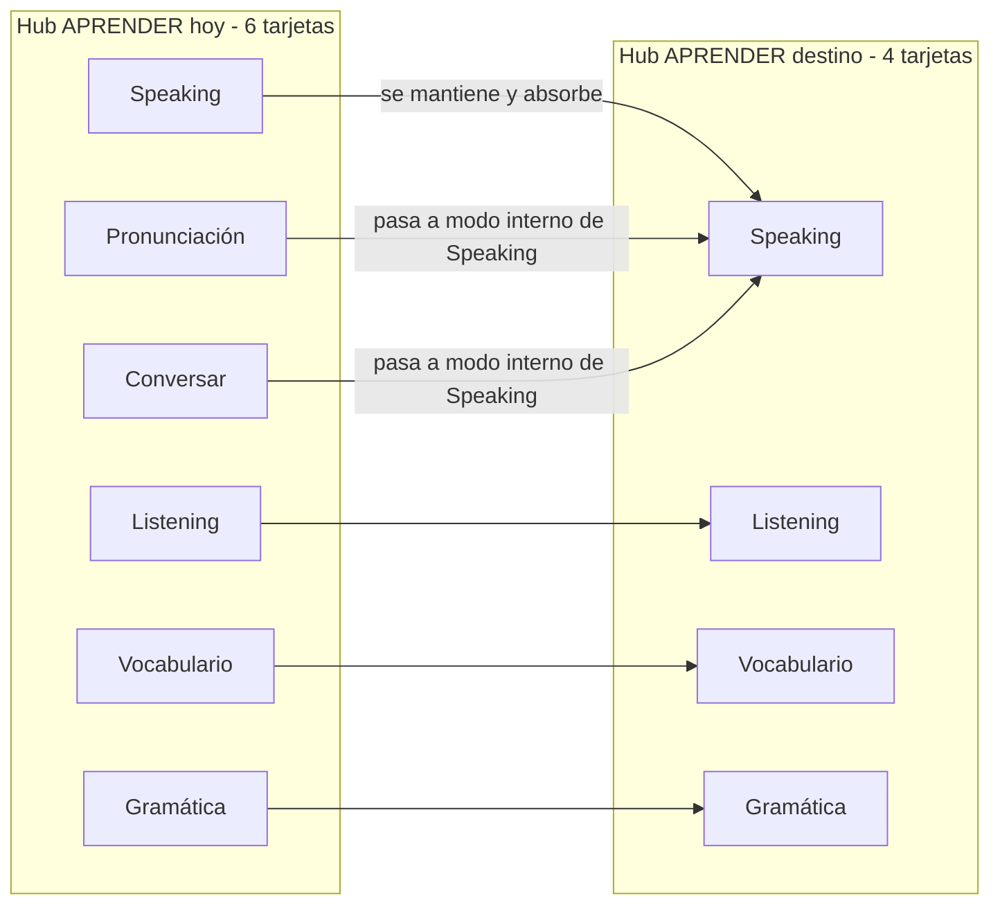
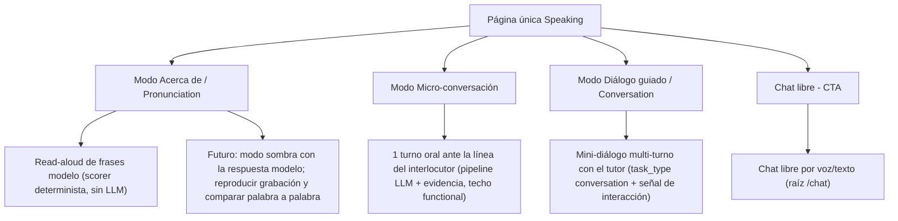
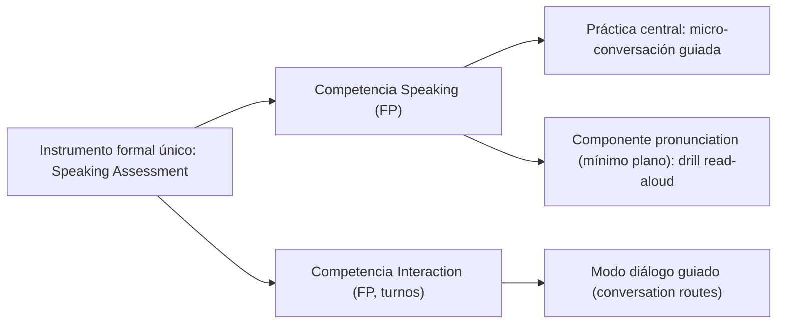

# Documento de diseño — Un solo Speaking en APRENDER (decisión A)

> **Estado:** propuesta de diseño (sin implementar). Documento de decisión previo a
> briefing/código, siguiendo el patrón de `docs/UI_V3.1.md` (acta de decisiones + wireframes).
> **Fecha:** 2026-09-07 · **Decisión estudiada:** A — fusionar Speaking / Pronunciación /
> Conversación en una única área oral «Speaking» dentro de APRENDER.
> **Fuentes normativas:** `docs/CONSTITUCION-PEDAGOGICA.md`, `docs/UI_V3.1.md`,
> `docs/PREMISAS.md`, `docs/audit/I-AUDITORIA-PROFUNDA-V318.md`, `docs/RELEVO.md`.
> **Este documento NO cambia código:** solo propone; los cambios se ejecutarían en fases
> posteriores (sección 7) y solo tras confirmación del gerente (sección 8).
>
> **Estado de implementación:** **F1, F4 COMPLETADAS** y **F3 (turnos hablados
> en el diálogo guiado) COMPLETADA a nivel frontend**, más **feedback palabra a
> palabra del modo Acento** (2026-09-07, working tree):
> hub a 4 tarjetas y página Speaking unificada con modos Micro-conversación / Acento /
> Diálogo guiado (véase `docs/RELEVO.md`, candidato V3.20). Extras del hilo
> anterior también aplicados: el texto «Cada nivel es una ruta…» es ahora un
> desplegable tras un botón (i) en `QuizRoutePage`, y en el resultado de los modos
> Micro-conversación y Acento se puede **reproducir la grabación real del alumno**
> junto a la respuesta/frase modelo (`components/RecordingPlayButton.tsx`). En el
> Diálogo guiado el micrófono graba **turnos de voz reales** que se persisten con
> `mode="voice"` y duración del audio (computan como habla). El modo Acento
> muestra la frase **palabra a palabra** (chips verde/ámbar/rojo + extra, mockup
> §6.3) con alineación idéntica al backend. **F4 — URL por modo**: el modo vive
> en la sub-ruta `/aprender/speaking[/acento|/dialogo|/micro]` y las URLs
> legadas `/aprender/pronunciacion` y `/aprender/conversar` abren Speaking con su
> modo y se canonicalizan (`router/learnHub.ts`). Pendiente (no iniciado): F2
> (pulido de claims, opcional) y la decisión abierta de emitir evidencia formal
> de interaction (CONV-02, backend), además del cierre del candidato V3.20
> (versión + CHANGELOG) tras la prueba del gerente.

---

## 1. Resumen ejecutivo y decisión A

### 1.1 Qué se decide

El hub de APRENDER muestra hoy **tres tarjetas orales hermanas** — Speaking,
Pronunciación y Conversar — que para el alumno comparten el **mismo bucle**
(grabar/responder → feedback → comparar → avanzar por rutas A1–C2) y que en el código
son tres páginas casi paralelas sobre el mismo armazón (`QuizRoutePage`). Esa
triplicidad no aporta claridad: el usuario no debe elegir entre «pronunciación» y
«hablar», porque las apps de referencia no se lo hacen elegir (sección 3).

**Decisión A:** APRENDER pasa de 6 a **4 tarjetas** (Listening, **Speaking**,
Vocabulario, Gramática). Pronunciación y Conversación dejan de ser puertas hermanas y se
integran como **modos internos de una única área Speaking**:



### 1.2 Qué NO cambia (núcleo a conservar)

La redundancia es de **puerta/UI**, no de motor. Los tres kernels de evaluación son
distintos, valiosos y **se conservan intactos** dentro de Speaking:

| Superficie actual | Kernel de evaluación | Señal distintiva |
|---|---|---|
| Pronunciación (read-aloud) | Scorer **determinista** `composite_score` (palabra/fonema/prosodia), sin LLM por intento | Cerrado: se lee una frase modelo fija |
| Speaking (micro-conversación) | LLM extrae evidencia + `scores_from_evidence(task_type="conversation")` | Abierto: 1 turno oral ante una línea del interlocutor |
| Conversación (diálogo guiado) | Mismo pipeline LLM + señal objetiva de interacción (`services/interaction.py`) | Multi-turno con el tutor |

Tampoco cambian: las **tablas de intentos** por superficie, los **canales de léxico**
V3.19 (`speaking`/`conversation`), la **puerta honesta** («la ruta no certifica»), el
**Speaking Assessment** como instrumento formal único, ni las rutas del curso/evidencia.

---

## 2. Premisas normativas (fuente de verdad pedagógica)

La CONSTITUCIÓN-PEDAGÓGICA ya separa los conceptos que hoy el hub presenta como tarjetas:

- **La demostración se acumula por competencia y cada destreza tiene su propia evidencia**
  (`docs/CONSTITUCION-PEDAGOGICA.md:31-32`):

  > «**La demostración se acumula por competencia**, no por "contador de ítems". Cada
  > destreza (Listening, Speaking, Interaction, …) tiene su propia evidencia.»

- **Speaking = producción libre (FP); Interaction = turnos reales**. La conversación guiada
  pertenece a la competencia Interaction, no a Speaking
  (`docs/CONSTITUCION-PEDAGOGICA.md:343-344`):

  | Competencia | Modalidad | Instrumentos |
  |---|---|---|
  | Speaking | FP | Speaking Mission/Assessment, scenarios, rutas |
  | Interaction | FP (turnos) | `services/interaction.py`, Conversation routes |

- **Pronunciación NO es una novena competencia**: es componente de Speaking
  (`docs/CONSTITUCION-PEDAGOGICA.md:396` y `448-449`):

  > «`pronunciation` es componente de Speaking y conserva su mínimo plano.»

  → Esto es la **justificación formal** de la decisión A: la CONSTITUCIÓN ya concibe la
  pronunciación como parte de Speaking; el hub la elevó a tarjeta hermana (decisión D6 de
  UI_V3.1) y eso es lo que esta propuesta revierte al nivel estructural correcto.

- **Regla honesta de las rutas** (repetida en `PLAN.md` V3.7–V3.12): la ruta es un hito de
  práctica con techo `functional`; demostrar el nivel es del Speaking Assessment + evidencia
  formal + retención. Se mantiene idéntica: fundir puertas no funde evidencias.

- **Modalidades de evidencia REC/CP/FP** (`docs/CONSTITUCION-PEDAGOGICA.md:325-332`): la
  pronunciación leída en voz alta aporta **CP** (producción controlada); la micro-conversación
  y el diálogo aportan **FP**. Ambas modalidades coexisten dentro de la misma competencia
  Speaking, igual que en el resto del currículo.

- **La UI referencia a las apps del sector** (`docs/PREMISAS.md:109-113`, #16): tomar lo mejor
  de Duolingo, Busuu, Babbel… adaptándolo a una app 100% local — exactamente el espíritu de la
  comparativa de la sección 3.

---

## 3. Comparativa — cómo estructuran las apps top las destrezas orales

Investigación sobre las apps de referencia (2026). **Ninguna de las apps analizadas muestra
tres puertas orales paralelas**; la separación dominante es *por tarea/modo*, no por nombre
de destreza, y suele estar jerarquizada: primero el alumno elige «lección / conversar» y
dentro aparece el ejercicio oral como paso.

| App | Estructura oral | Dónde vive la pronunciación | Patrón de feedback |
|---|---|---|---|
| **Babbel** | Speaking integrado en lecciones de diálogo real (check-in, restaurante…); conversación como **modo** de IA (Babbel Speak) | Ejercicio de *speech recognition* dentro de la lección (repetir la frase), no una skill aparte | SR permisivo («¿se te entiende?»), sin fonema a fonema |
| **Duolingo** | Speaking como tipo de ejercicio en lecciones + conversación por voz/video como **función aparte** (Duolingo Max) | Igual que Babbel: repetir frases en la lección | SR básico; feedback no fonético |
| **Busuu** | «Speaking practice» es **una** superficie de shadowing: video del nativo → grabas repitiendo | La pronunciación ES esa superficie (misma página) | Resalta las **palabras** a repetir; escuchas tu grabación **lado a lado** con el nativo; feedback LLM |
| **ELSA Speak** | Hub centrado en pronunciación/acento + role-plays de conversación como actividad secundaria | Es el **foco** de la app (fonema a fonema) | Coloreado por palabra/fonema (verde/ámbar/rojo), score por frase, waveform, guías |
| **Speakometer / BoldVoice / Speechling** | App **monopropósito** de pronunciación/acento: una sola superficie estrecha | Toda la app | Comparación «tu voz vs modelo» (Speechling/Speakometer), IPA coloreado |
| **Praktika / PrepareBuddy / Speak** | Conversación **por voz en vivo** con IA; al final un informe por criterios (CEFR) | Es **una dimensión** del informe, no una puerta | Informe post-sesión: criterios + transcripción anotada |

**Conclusiones trasladables:**

1. **No hay «pronunciación» como puerta paralela**: o es el foco de la app (ELSA,
   Speakometer — pero entonces no hay «Speaking» general) o es un ejercicio dentro de la
   lección oral (Babbel/Duolingo). En una app que sí tiene speaking general, lo natural es
   anidar la pronunciación como drill/entrenador (Busuu lo hace: mismo shadowing con
   resaltado de palabras).
2. **«Conversación» no es una skill, es un modo** (Babbel Speak, Duolingo Video Call). El
   conversar se elige dentro de la superficie oral, no al lado de ella.
3. **El comparador «tu grabación vs modelo»** (Busuu, Speechling, Speakometer, ELSA) es el
   estándar de feedback y es justo la mejora que se venía diseñando en el hilo anterior
   (reproducir la grabación + modo sombra + comparación por palabras). Ver mockups §6.3.
4. Ninguna app analizada muestra un **espectrograma/osciloscopio** interactivo como pieza
   pedagógica central: las formas de onda sí aparecen (ELSA), pero lo accionable es el
   coloreado por palabra y la comparación lado a lado.

> Lectura recomendada si se quiere profundizar: guías comparativas de Speakometer
> («Best English Pronunciation Apps in 2026»), blog oficial de ELSA (tipos de feedback),
> ayuda oficial de Busuu (Speaking practice = shadowing) y artículos comparativos
> Babbel/Duolingo de 2026 (speaking integrado vs conversación como función).

---

## 4. Estado actual (mapa con referencias a código)

### 4.1 Hub y navegación

- Las 6 actividades del hub están definidas en `frontend/src/router/learnHub.ts`
  (`LEARN_ACTIVITY_IDS`: `listening`, `speaking`, `pronunciacion`, `conversar`,
  `vocabulario`, `gramatica`) y se pintan como tarjetas en
  `frontend/src/features/learn/LearnHub.tsx` (`ACTIVITIES`, ~L40-47) y como píldoras en
  `frontend/src/components/LearnActivitySwitcher.tsx` (~L34-55). Tres listas duplicadas.
- El despacho de páginas está en `frontend/src/app/Workspace.tsx` (~L175-225): cada
  actividad de APRENDER renderiza su `*RoutesPractice`. `conversar` es el legado `chat`
  reubicado (`frontend/src/router/paths.ts:48` `LEGACY_CHAT_ACTIVITY = "conversar"`).

### 4.2 Las tres superficies orales comparten el armazón

- Las tres son **wrappers finos** de la página compartida `frontend/src/features/routes/QuizRoutePage.tsx`
  (+ su máquina de sesión `frontend/src/features/routes/routeSession.ts`), que aporta
  cabecera, estadísticas, **mapa de rutas A1–C2** (`QuizRoutesSection`), panel de nivel,
  máquina de sesión (level/drill/review) y la vista «Demostrar el nivel» → **Speaking
  Assessment** (`config.assessment = "speaking"` en las tres).
- Configs y escenas propias: `frontend/src/features/speaking/SpeakingRoutesPractice.tsx`,
  `frontend/src/features/pronunciation/PronunciationRoutesPractice.tsx`,
  `frontend/src/features/conversation/ConversationRoutesPractice.tsx`. Cada escena aporta su
  bucle (read-aloud / micro-conversación / chat guiado) y su tarjeta de resultado con
  `ActivityResult` + `SkillBar`.
- Los **paneles de nivel** (`SpeakingLevelPanel.tsx`, `PronunciationLevelPanel.tsx`,
  `ConversationLevelPanel.tsx`) son clónicos casi línea a línea (mismos callbacks, misma
  puerta de ruta, mismo bloque de «nivel oral actual (examen)»).
- Refactor V3.13 ya fusionó la página única de las 6 rutas (~1.600 líneas menos,
  `docs/RELEVO.md:212-218`); lo que queda duplicado es la puerta, los paneles y los motores
  de ruta espejo.

### 4.3 Motores de evaluación: 2 iguales + 1 distinto

- **Pronunciación**: determinista y sin LLM. `POST /api/pronunciation/routes/attempt` →
  Whisper → `services/pronunciation.py::score_pronunciation` → `services/phonetics.py`
  (`composite_score`: word 0.35 / phoneme 0.35 / Soundex 0.15 / prosody 0.15 + breakdown
  por palabra). Frase fija, corpus `pronunciation_corpus.json`.
- **Speaking**: `POST /api/speaking/attempt` → Whisper →
  `domain/speaking_routes.py::submit_attempt` → `speaking_llm.extract_speaking_evidence`
  (LLM local) + `scores_from_evidence(..., task_type="conversation")`. Un turno oral abierto.
  **Se puntúa como conversación** (`domain/speaking_routes.py:303`).
- **Conversación**: `POST /api/conversation/routes/attempt` → reconstrucción de turnos del
  transcripto persistido → el **mismo** pipeline LLM + inyección de `interaction_objective`
  (`domain/conversation_routes.py`). Hoy la entrada es **mayormente tecleada**
  (`mode="conversation"`), con el micrófono transcribiendo al campo.
- Motores de ruta espejo triplicados en backend:
  `services/{speaking,pronunciation,conversation}_routes.py` (gate/competencia/nivel/motor de
  ítems) + tres `domain/*.py` + tres repositorios/tablas de intentos
  (`speaking_attempts`, `pronunciation_route_attempts`, `conversation_route_attempts`).

### 4.4 Evidencia y claims (hallazgos de la auditoría V3.18 que apoyan la fusión)

Del dossier `docs/audit/I-AUDITORIA-PROFUNDA-V318.md`:

- **CLAIM-01** (L74): los tres paneles orales muestran la misma etiqueta de nivel
  «demostrado» derivada del mismo `assessedLevel` EMA → «dos semánticas de "demostrado"».
  Con una sola superficie oral la duplicidad de claim desaparece de raíz.
- **CONV-01** (L93): la conversación guiada es un mini-chat tecleado y `duration_ms` medía
  redacción → ya corregido en V3.19 (reconstrucción por `mode`).
- **CONV-02** (L94): la conversación guiada no escribe `academy_evidence` ni alimenta la
  dimensión `interaction`; sin camino a la evidencia FP de Interaction de la CONSTITUCIÓN §7.
  Es la decisión abierta nº 1 (sección 8): fusionar la puerta obliga a decidir si la
  conversación emitirá evidencia propia o se documenta como práctica (D5/E3).
- **SKILL-01** (L90): la evidencia de práctica (misión) y formal (assessment) se mezclan en
  el pool `skill=speaking`. Ajeno a esta propuesta, pero conviene resolverlo al tocar la
  superficie oral (separar `source` en la agregación del claim).
- Veredictos por área (L46-52): A3 Speaking/pronunciación 8,5/10; A4 writing/conversación 7/10.

### 4.5 Evidencia que produce cada superficie (se conserva)

| Superficie | Tabla de intentos | Canal léxico (V3.19) | Evidencia formal |
|---|---|---|---|
| Pronunciación | `pronunciation_route_attempts` | `"speaking"` (vía `record_production_text`) | No; solo ruta (techo `functional`) |
| Speaking rutas | `speaking_attempts` | `"speaking"` | No directa; assessment separado |
| Conversación rutas | `conversation_route_attempts` | `"conversation"` | No (abierto CONV-02) |
| Speaking Assessment | `academy_evidence` `skill=speaking` | `"speaking"` | Sí — instrumento formal (único) |

Nota interesante ya en producción: la pronunciación vuelca al canal léxico `"speaking"`,
no a uno propio (`backend/domain/pronunciation_routes.py:110`) — coherente con que la
CONSTITUCIÓN la trata como componente de Speaking.

---

## 5. Propuesta de destino

### 5.1 Estructura de la página Speaking (modos internos)

La página única de Speaking conserva el mapa A1–C2 (rutas + anillos + puerta honesta) y
ofrece **cuatro modos** que el alumno elige dentro de la superficie (segmento superior o
pestañas, no tarjetas hermanas):



### 5.2 Jerarquía de competencias (cómo encaja con la CONSTITUCIÓN)



- Speaking (producción) y Interaction (turnos) siguen siendo competencias con evidencia
  propia en el modelo; lo que cambia es que **comparten una misma puerta de práctica**.
- Pronunciación queda donde la CONSTITUCIÓN siempre dijo que estaba: *dentro* de Speaking.
- El Speaking Assessment sigue siendo el único instrumento que puede «demostrar el nivel»
  para las destrezas orales.

### 5.3 Impactos concretos

**Hub / navegación**
- `LEARN_ACTIVITY_IDS` en `frontend/src/router/learnHub.ts` pasa de 6 a 4 (`listening`,
  `speaking`, `vocabulario`, `gramatica`); se sincronizan `LearnHub.tsx`,
  `LearnActivitySwitcher.tsx` y las listas de i18n (`skill.pronunciation`,
  `learn.conversation` pueden seguir existiendo como etiquetas de modo).
- `frontend/src/app/Workspace.tsx` deja de despachar `pronunciacion` y `conversar` como
  rutas propias y monta la página Speaking con el selector de modos.

**Speaking único (nuevo o reestructurado)**
- `QuizRoutePage` gana un **selector de modo/superficie oral** (p. ej. un segmento
  «Acento · Conversar · Dialogar» o pestañas). Cada modo usa su escena actual
  (`PronunciationScene`, `SpeakingScene`, `ConversationScene` + `ConversationGuidedChat`) y
  su `LevelPanel` propio, ya existentes — se reutilizan, no se reescriben.
- El modo de pronunciación conserva su feedback determinista profundo (palabra/fonema/
  prosodia + breakdown) y es ahí donde encajan las mejoras del hilo anterior (reproducir la
  grabación, modo sombra, comparador por palabras → sección 6.3).

**Evidencia y léxico (sin cambios de fondo)**
- Tablas de intentos y canales de léxico intactos: `speaking_attempts`,
  `pronunciation_route_attempts`, `conversation_route_attempts` y los canales `"speaking"` /
  `"conversation"` se conservan tal cual (son los que alimentan la puerta honesta por
  superficie y el micro-drill de léxico V3.19).
- Si se decide que la conversación emita evidencia de interaction (decisión abierta nº 1),
  será un cambio posterior independiente de la fusión de puertas.

**Rutas/URLs antiguas**
- `#/aprender/pronunciacion` y `#/aprender/conversar` deberán **redirigir** a la página de
  Speaking con el modo correspondiente activo (param `?modo=` o segmento) durante una
  transición, o eliminarse si se asume que no hay deep links externos. Decisión abierta nº 2.

**Código muerto / deuda (oportunidad, no obligación)**
- Con una sola puerta se puede unificar (no en F1) el trío espejo de motores de ruta backend
  (`services/{speaking,pronunciation,conversation}_routes.py` y repos) en un motor
  parametrizado por superficie, estilo lo ya hecho para grammar/vocabulary
  (`services/quiz_routes.py`). Debe ser una fase aparte con tests de paridad (sección 7, F4)
  porque toca el corazón de las puertas honestas.

---

## 6. Mockups / wireframes (ASCII)

> Nivel de fidelidad: wireframes de decisión. El estilo visual seguirá el design system
> actual (tarjetas `Card`, `Badge`, `ProgressRing`, tipografía del `index.css`).

### 6.1 Hub APRENDER — antes y después

```
HOY (3x2)                            DESTINO (2x2)
┌─────────────┬─────────────┐        ┌─────────────┬─────────────┐
│  Listening  │   Speaking  │        │  Listening  │   Speaking  │
├─────────────┼─────────────┤        ├─────────────┼─────────────┤
│ Pronunciación│ Conversar   │        │  Vocabulario│  Gramática  │
├─────────────┼─────────────┤        └─────────────┴─────────────┘
│ Vocabulario │  Gramática  │
└─────────────┴─────────────┘
```

### 6.2 Página única Speaking (selector de modos arriba, mapa debajo)

```
┌──────────────────────────────────────────────────────────────┐
│ ← Aprender   [Listening|SPEAKING|Vocabulario|Gramática]      │
├──────────────────────────────────────────────────────────────┤
│ Speaking                                                     │
│ Práctica oral libre… (subtítulo)                             │
│                                                              │
│ [* Micro-conversación ]  [ Acento ]  [ Diálogo guiado ]     │   ← modo activo
│                                                              │
│ ┌──────────────────────────────────────────────────────────┐ │
│ │ Situación: …   Tú: …                                     │ │
│ │ Interlocutor: "…"  [escuchar]                            │ │
│ │                                                          │ │
│ │              [ Grabar respuesta ]                        │ │
│ └──────────────────────────────────────────────────────────┘ │
│                                                              │
│ Rutas A1–C2 (anillos + panel del nivel del modo activo)      │
│ [Demostrar el nivel] → Speaking Assessment (único)           │
└──────────────────────────────────────────────────────────────┘
```

Nota: al pulsar «Acento» la tarjeta superior pasa a read-aloud (frase modelo + grabar) con
su feedback fonético; al pulsar «Diálogo guiado» se abre el mini-diálogo multi-turno; el
chat libre queda como CTA persistente («Conversación libre») que enlaza a `/chat`.

### 6.3 Tarjeta de feedback con reproducción + comparación por palabras (modo Acento)

```
┌──────────────────────────────────────────────────────────────┐
│  Acento · B1   [play Modelo]  [play Mi grabación]  (nuevo)   │
│                                                              │
│  Frase:  "I would like to book a table for two"              │
│                                                              │
│  I   would   like   to   book   a   table   for   two        │
│  OK   OK     OK    OK   [X]     OK  OK      [X]   OK         │
│                         (book→bock)     (for→four)           │
│                                                              │
│  Sonido a practicar: /ʊ/ (book), /ɔːr/ (for)                 │
│  Puntuación: 87 · Word 90 · Phoneme 84 · Prosody 88          │
│                                                              │
│  [ Repetir frase ]      [ Continuar → ]                      │
└──────────────────────────────────────────────────────────────┘
```

Esto materializa el patrón Busuu/ELSA/Speechling (resaltar la palabra a mejorar + escucha
lado a lado) y es la base donde encajarían las mejoras ya estudiadas: modo sombra contra la
respuesta modelo y (decisión posterior) visualización de forma de onda.

---

## 7. Plan de migración por fases (sin fecha comprometida)

Cada fase cierra con los gates del proyecto (build + tests + bump de versión cuando
aplique, según `docs/RELEVO.md` §37 y `scripts/check_release_consistency.py`).

| Fase | Contenido | Alcance | Gates |
|---|---|---|---|
| **F0** | Este documento de diseño, revisado y aprobado por el gerente; decisiones abiertas (sección 8) cerradas | Docs | — |
| **F1** | Hub y navegación a 4 tarjetas; página Speaking única con **selector de modos** que monta las escenas/paneles existentes sin tocar motores | Frontend (`learnHub.ts`, `LearnHub.tsx`, `LearnActivitySwitcher.tsx`, `Workspace.tsx`, `QuizRoutePage.tsx`, i18n, tests de rutas `routeMap.test.ts`/`hash.test.ts`/`learnHub.test.ts`) | vitest + tsc + build; parity i18n; sin cambios de API |
| **F2** | Ajustes de modo Acento: títulos/subtítulos únicos, estado del selector, consistencia de claims (revisitar CLAIM-01 ya resuelto en V3.19 para el copy único) | Frontend i18n + componentes | vitest + parity i18n |
| **F3** | Conversación como modo interno + decisión voz/tecleo (abierta nº 1): si aplica, emitir evidencia de interaction (cierra CONV-02) o documentar como práctica D5/E3 | Frontend + backend | pytest + ruff + vitest |
| **F4** | Redirecciones de `#/aprender/pronunciacion` y `#/aprender/conversar` (abierta nº 2); si se decide, unificación del motor de ruta espejo en un motor parametrizado (con tests de paridad de puertas) | Frontend rutas + backend refactor | pytest + ruff + vitest + consistencia de versión |

**F1 es suficiente para eliminar la redundancia percibida** sin tocar evaluación ni
evidencia; F2–F4 son pulido y deuda opcional. La mejora de feedback del hilo anterior
(sección 6.3: reproducir grabación, modo sombra, comparador por palabras) puede
implementarse **sobre la página única de Speaking** en F2 o como fase propia.
Estado: **F1 y F4 completadas** (frontend); **F3 parcial** (turnos por voz en el diálogo
guiado, sin evidencia formal de interaction — decisión nº 1 sigue abierta).

---

## 8. Decisiones abiertas para el gerente

1. **Conversación guiada — voz o tecleo.** Hoy es un mini-chat tecleado (`mode="conversation"`).
   Al integrarla como modo de Speaking: (a) convertirla en **turnos hablados reales** con
   micrófono (evidencia de Interaction real, cerraría CONV-02) o (b) mantenerla como
   práctica escrita (D5/E3, sin acceso al modelo de demostración). Recomendado: (a) a medio
   plazo, alineado con el estudio de apps top (conversación por voz en vivo); (b) como
   paso intermedio no bloqueante.
2. **URLs antiguas.** `#/aprender/pronunciacion` y `#/aprender/conversar`: (a) redirigir a la
   página Speaking con el modo activo durante la transición, o (b) eliminarlas directamente.
   Recomendado: (a) si hay deep links/bookmarks; (b) si no se considera necesario.
   **RESUELTA en F4 (2026-09-07): opción (a).** Las URLs legadas resuelven síncrono como
   Speaking con su modo (`/aprender/pronunciacion` → Acento, `/aprender/conversar` → Diálogo
   guiado) y App canonicaliza la URL a `/aprender/speaking/acento` o
   `/aprender/speaking/dialogo`. El modo vive además en la sub-ruta de Speaking (F4).
3. **Nombres y orden de los modos internos.** Propuesta: «Micro-conversación», «Acento»,
   «Diálogo guiado» + CTA «Conversación libre». El orden puede priorizar el modo
   recomendado por el motor adaptativo.
4. **Acceso rápido a Pronunciation.** ¿La pronunciación debe quedar además accesible como
   drill independiente del mapa de rutas (p. ej. desde el diccionario personal o desde un
   botón en la Home), o solo dentro del modo Acento de Speaking? La decisión afecta al
   `SKILL_TO_SECTION` / `NextBestCard` que hoy puede sugerir `section: "pronunciation"`.
5. **Cuándo abordar la mejora de feedback** (hilo anterior): ¿dentro de F2 sobre la página
   única, o como fase independiente antes de la fusión de puertas? Recomendado: sobre la
   página única (F2), para no rehacer la UI dos veces.

---

## 9. Resumen

Speaking, Pronunciación y Conversación no son hoy «tres destrezas redundantes»: son **tres
motores de evaluación legítimos** (cerrado-determinista, abierto-LLM y multi-turno) que el
producto presenta como tres tarjetas orales paralelas con el mismo bucle y el mismo armazón,
contra lo que hace el mercado (una superficie oral con modos) y contra la propia
CONSTITUCIÓN-PEDAGÓGICA (pronunciación = componente de Speaking; conversación = modo de
Interaction). La **decisión A** fusiona la *puerta* —hub a 4 tarjetas y una página única
Speaking con modos «Micro-conversación / Acento / Diálogo guiado / Conversación libre»—
conservando intactos kernels, tablas, canales de léxico y el Speaking Assessment. La fase
F1 consigue la simplificación percibida con solo cambios de frontend; el resto de fases
afina claims, evidencia de interacción y deuda de motores espejo. Las cinco decisiones
abiertas de la sección 8 (sobre todo voz vs tecleo en conversación y el destino de las URLs)
deben cerrarse antes de abrir el briefing de implementación.
