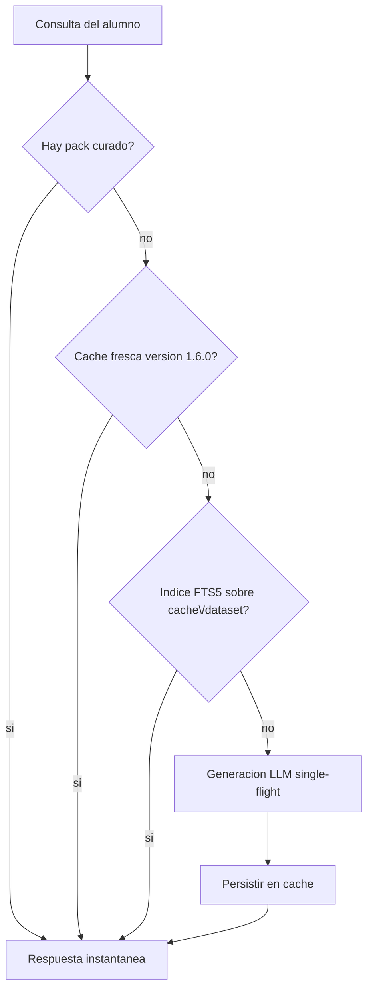

# Documento de diseño — V3.88.0: el diccionario offline y el coste real del diccionario

> **Estado:** estudio de viabilidad **entregado sin implementar** (encargo del gerente, 2026-09-29).
> **No cambia código de producto**: aquí no se empaqueta ningún dataset, no se añade ninguna tabla
> y no se toca ninguna licencia. Lo único que V3.88.0 hace de este documento es lo que el
> Incremento C ya cerró: el **precalentado del léxico** del alumno (Incremento C2, con su endpoint
> y su acción), el **script de cobertura** `scripts/dictionary_cache_report.py` (C3) y **este
> estudio** (C1). El resto son **decisiones para el gerente**, no trabajo hecho.
>
> **Regla de lectura:** cada cifra lleva su procedencia. **`[M]` = medida en este equipo el
> 2026-09-29** (con el comando o la sonda al lado, §8). **`[D]` = declarada por la fuente o por el
> código, no reproducida aquí.** **`[?]` = no verificada**, y por tanto **no** se usa para decidir.
>
> Antes de implementar cualquier cosa de aquí, leer `docs/PREMISAS.md` (fuente de verdad) y la
> sección de proceso de `docs/RELEVO.md`. El diseño predecesor es
> `docs/DISENO-V330-DICCIONARIO-CONSULTA.md` (D1 y su frontera de contenido).

---

## 1. Resumen ejecutivo (veredicto)

1. **Hoy no hay nada offline y tampoco se necesita para el uso real de la app.** Lo único
   empaquetado con la app son **15 packs de vocabulario curados: 725 pares, 65.471 bytes `[M]`**, y
   el conjunto de palabras inglesas distintas de **todo** `backend/curriculum/**` es de **2.238
   `[M]`**. Ese —no el millón de entradas de Wiktionary— es el techo de contenido que la app
   necesita hoy.
2. **El coste del diccionario actual no es la falta de datos: es la latencia del modelo.** Una
   palabra nueva tarda **4,05 s de media `[M]`** (3,57–4,59 s, 4 palabras reales, con el modelo que
   elige la propia política de la app: `llama3.1:8b`) y los topes configurados permiten hasta
   **90 s** `[D]`. La caché evita repetir, pero **la primera consulta siempre la paga el alumno**.
3. **La caché es pequeña y está entera obsoleta.** **33** filas EN→ES y **13** ES→EN `[M]`, y **0
   frescas** contra `GENERATOR_VERSION = 1.6.0` (el bump de V3.88.0 las invalida todas a
   propósito). Medido con el instrumento de C3.
4. **La consulta inversa (ES→EN) hace un escaneo O(N) en Python** en cada petición: lee **toda** la
   tabla `dictionary_entries` y la recorre con `match_translation`. Medido con la forma de fila
   actual: **192 ms por consulta con 64.258 filas** (80,5 ms de SQL + 111,7 ms de decodificar JSON)
   **+ 76 ms** del bucle en Python `[M]`. Con las 46 filas de hoy es gratis; con un diccionario
   completo, inservible.
5. **Sí existe una fuente empaquetada bilingüe EN→ES con licencia declarada** —FreeDict eng-spa
   2025.11.23, **64.258 entradas, 3,5 MiB comprimido, CC BY-SA 3.0 `[M]`**—, así que la premisa con
   la que V3.30 descartó el empaquetado («sin fuente con licencia y bilingüe EN→ES disponible»)
   **era falsa**. La conclusión de V3.30 («no empaquetar todavía») sigue siendo correcta, pero por
   **otras tres razones** que sí se sostienen (§5).
6. **Veredicto:** **NO** se empaqueta un diccionario completo ahora. **SÍ** conviene (a) poner un
   **índice FTS5** sobre la caché para matar el O(N) —coste medido: **+4,58 MiB y 0,2 s** de
   construcción a tamaño de diccionario completo `[M]`—, y (b) **precalentar por lotes las 2.238
   palabras del currículum** con el modelo local: **≈ 2 h 31 min de CPU `[M]`**, una sola vez, sin
   licencias de terceros y reanudable. Detalle y fases en §6.

---

## 2. Estado real medido (2026-09-29)

### 2.1 El producto hoy

| Qué | Valor medido `[M]` |
|---|---|
| `backend/data/tutor.db` completo (BD de uso) | **1.044.480 B** (0,996 MiB), `page_size` 4096 × 255 páginas |
| Packs curados (`backend/curriculum/vocab_packs/*.json`) | **15 packs · 725 pares · 65.471 B** |
| Palabras inglesas distintas en `backend/curriculum/**` | **2.238** |
| Caché de consulta EN→ES (`dictionary_entries`) | **33 filas** |
| Caché de consulta ES→EN (`dictionary_reverse_entries`) | **13 filas** |
| Payload textual medio por fila | **302 B** (directa) · **226 B** (inversa) |
| Filas frescas contra `GENERATOR_VERSION = 1.6.0` | **0 de 46** (todo obsoleto por el bump de V3.88.0) |
| Índices sobre las tablas de caché | **solo el autoindex de la PK `word`** (nada por versión, traducción ni fecha) |
| Lanzadera SQLite del runtime (`backend/.venv`) | Python **3.13.7**, SQLite **3.50.4**, **FTS5 disponible** `[M]` |

**Lo que esto significa.** La caché global funciona como estaba diseñada (una generación sirve a
todos los alumnos), pero su cardinalidad es de juguete: 46 filas. Cualquier plan de «diccionario
completo en la app» parte de **cuatro órdenes de magnitud** más de contenido que el que hoy existe,
y de un conjunto de datos realmente necesario (`curriculum`) que es **el 6 % del subconjunto más
pequeño** que ofrece la fuente empaquetada más razonable (§3).

### 2.2 El coste por consulta, medido y no estimado

Sonda real contra el modelo local con el prompt vigente (el de `MIN_MEANINGS = 2` de V3.88.0), y no
un cálculo de servilleta (§8.2):

| Palabra (no cacheada) | Tiempo `[M]` | Significados devueltos |
|---|---|---|
| `lantern` | 3,70 s | 1 (`lanterna`) |
| `estuary` | 4,59 s | 2 (`delta del río`, `Estuario de la Laguna`) |
| `quaint` | 4,33 s | 3 (`encantador`, `antiguo`, `San Miguel`) |
| `hedgehog` | 3,57 s | 2 (`erizo`, `erizar`) |

- **Media: 4,05 s** por palabra nueva, **rango 3,57–4,59 s `[M]`**.
- **El modelo elegido por la política de la app es `llama3.1:8b` `[M]`**, no un modelo pequeño: es lo
  que `translate.pick_model(None)` devuelve hoy en este equipo.
- **Topes y cuotas que acotan ese coste `[D]`** (`backend/config.py:27-30` y `:33-41`):
  `DICTIONARY_GENERATION_TIMEOUT_SECONDS = 90` (dueño del vuelo; los *waiters* esperan 60 s),
  negative cache de 30 s, **10 palabras nuevas por usuario y minuto**, **40 por minuto global**, y
  `DICTIONARY_WARMUP_MAX_WORDS = 60` para la pasada de precalentado.
- **Hallazgo lateral, medido y honesto:** la exigencia de **2 significados del prompt no está
  garantizada por el modelo**. De 4 palabras, 3 devolvieron ≥2 y `lantern` devolvió 1 (que además es
  defendible: en español «lantern» es esencialmente «farol/linterna»). Y `quaint` devolvió
  `San Miguel` como tercer significado: el filtro de nombres propios de V3.86.0 y la regla de
  ordenarlos al final hacen su trabajo, pero **el modelo sigue metiendo topónimos**. El prompt
  **orienta**, no **garantiza**: si algún día se quiere una garantía, hará falta validación dura
  o una fuente que no sea generativa.

**Extrapolación con la única cifra medida (4,05 s/palabra):**

| Conjunto | Palabras | Coste de CPU (una vez) |
|---|---|---|
| Léxico útil de la app hoy (`curriculum`) | 2.238 `[M]` | **≈ 2 h 31 min** |
| Subconjunto simple de FreeDict eng-spa (§3) | 35.935 `[M]` | **≈ 40,5 h** |
| Todas las entradas de FreeDict eng-spa | 64.258 `[M]` | **≈ 72,3 h** |

Es decir: **generar con el modelo local el diccionario entero es una idea peor que empaquetarlo**
(3 días de CPU frente a 3,5 MiB de descarga). Y **generar sólo lo que la app usa es una idea mejor
que empaquetarlo** (2 h 31 min, una vez, sin licencias, sin datos de terceros).

### 2.3 Los dos defectos de arquitectura que ya están en el código

1. **`dictionary_repo.list_entries()` lee la tabla ENTERA de caché** con `ORDER BY word` y **sin
   filtrar por versión** (`backend/repositories/dictionary.py:238-253`), y se invoca desde **cinco
   puntos** de `backend/domain/vocabulary.py` (`:1299`, `:1334`, `:1395`, `:1487` y `:2316`). En el
   camino ES→EN, lo que se persigue con ese volcado es una coincidencia por traducción, que luego
   se calcula **en Python** con `dictionary_reverse.match_translation(term, entries)`
   (`backend/services/dictionary_reverse.py:109`).
2. **Medido a tamaño de diccionario real:**

| Operación (64.258 filas con la forma actual) | Coste `[M]` |
|---|---|
| `SELECT` completo + decodificar `senses_json`/`meanings_json` de todas las filas | **192,2 ms** (80,5 ms SQL + 111,7 ms JSON) |
| `match_translation` (bucle Python) sobre esa lista | **76,0 ms** |
| **Total por consulta ES→EN** | **≈ 268 ms de CPU, por consulta y por alumno** |
| Con `WHERE word = ?` por PK | **0,015 ms** (15 µs) |
| Con índice FTS5 y `MATCH` | **0,034 ms** (prefijo) / **0,078 ms** (frase) |

La conclusión no es «FTS5 es moderno»: es que **hoy la inversa cuesta 268 ms de CPU con un
diccionario completo y con índice costaría 0,03 ms**, y que esos 268 ms se pagan **en cada
petición**, no una vez.

---

## 3. Fuentes candidatas, tamaños y licencias

Todo lo de esta tabla se consultó/descargó el **2026-09-29** (§8.3). **Ninguna cifra es de memoria.**

| Fuente | Tamaño medido `[M]` | Contenido medido `[M]` | Licencia | Veredicto |
|---|---|---|---|---|
| **FreeDict `eng-spa` 2025.11.23** | `.src.tar.xz` **3.715.012 B** (3,54 MiB); `eng-spa.tei` **34.358.251 B** (32,8 MiB) | **64.258** `<entry>` · **76.743** traducciones ES (`<cit type="trans">`) · **79.743** definiciones EN (`<def>`, media **84 chars**) · **80.471** transcripciones IPA (`<pron>`) · 63.811 con `<pos>` | **CC BY-SA 3.0** — *leído del fichero `COPYING` dentro del propio tarball (22.459 B): «Attribution-ShareAlike 3.0»* | ✅ **la única fuente EN→ES seria.** Apta en tamaño; la licencia es la decisión del gerente (§5) |
| **FreeDict `spa-eng` 0.3.1** | slob 276.096 B · stardict 94.784 B `[M]` | **4.502 headwords**; su propio índice la marca `status: "too small"` `[M]` | `[?]` no leída | ❌ **insuficiente para la inversa**: ES→EN seguiría dependiendo del modelo |
| **kaikki.org / Wiktextract (inglés)** | `Content-Length` **3.335.555.506 B** (3,11 GiB) `[M]` | no contadas (no se descarga: 3,1 GiB) | kaikki.org/dictionary/ menciona **GFDL** en su HTML `[M]`; GitHub da **`NOASSERTION`** para `tatuylonen/wiktextract` `[M]` → **la afirmación «CC BY-SA 4.0» no se ha verificado `[?]`** | ❌ **3,1 GiB es incompatible con el producto** (la app entera pesa ~1 MB de BD) |
| **kaikki.org / Wiktextract (español)** | `Content-Length` **1.054.565.867 B** (0,98 GiB) `[M]` | no contadas | íd. | ⚠️ mismo problema de tamaño; además es monolingüe |
| **Apertium `eng-spa`** | `.dix` **3.237.856 B** (3,09 MiB) `[M]` | **37.685** `<e>` · **30.366** pares bilingües `<p>` `[M]` | **GPL-2.0** (API de GitHub sobre `apertium/apertium-eng-spa`) `[M]` | ❌ **copyleft fuerte sobre los datos**: incompatible con distribuir la app sin arrastrar la obligación |

**Nota de precisión sobre cifras que circulan.** El encargo de este estudio citaba «~58.630
entradas» para Apertium eng-spa y «~5 MB» para FreeDict eng-spa. **Medido:** Apertium tiene
**30.366 pares** (37.685 entradas `<e>`) y FreeDict **64.258 entradas / 3,54 MiB**. Las cifras del
encargo no se reproducen; se usan las medidas.

**Nota legal, declarada como tal (no es asesoramiento jurídico).** FreeDict eng-spa se publica bajo
**CC BY-SA 3.0**: atribución **y *ShareAlike***. Eso significa que **una obra derivada** (y un
diccionario convertido al esquema de la app lo es) tendría que distribuirse **bajo la misma
licencia**, con atribución visible. Para un producto de escritorio esto es una obligación de
**producto y de documentación** (una pantalla de créditos y el texto de licencia), no un detalle: si
esa premisa no se acepta, la fuente queda descartada **antes** de escribir código. Los datos de
Wiktionary/kaikki arrastran la misma familia de obligaciones (GFDL `[M]`, y CC BY-SA `[?]`), y
Apertium añade **GPL-2.0 `[M]`** sobre los datos.

### 3.1 Qué sale de convertir FreeDict eng-spa al contrato de la app (medido de verdad)

Se descargó el tarball, se parseó el TEI y se construyó **un SQLite real con el esquema de
`dictionary_entries`**, quedándose con lo que la app puede usar (palabras simples, en minúscula,
deduplicadas por `casefold`), mapeando `<pos>` a la taxonomía de la app y volcando los equivalentes
españoles a `meanings_json` (§8.4):

| Medida del subconjunto convertido | Valor `[M]` |
|---|---|
| Entradas simples en minúscula (deduplicadas) | **35.935** (de 64.258 crudas) |
| Con al menos una traducción ES | **35.935 — el 100 %** |
| **Con ≥2 equivalentes ES** | **16.072 — el 44,7 %** |
| Con IPA | **26.172 — el 72,8 %** |
| POS que mapea limpio a la taxonomía | noun **23.043** · adjective **8.280** · verb **2.777** · adverb **1.353** (+ cola de 155 y menos) |
| **Fichero SQLite con el esquema de la app** | **19,94 MiB** |
| **Idem + índice FTS5** (`content=''`) | **24,52 MiB** (**+4,58 MiB**, índice construido en **0,2 s**) |
| Búsqueda por PK · por prefijo FTS5 · por frase FTS5 | **0,015 ms** · **0,034 ms** · **0,078 ms** |

**La cifra que importa y su letra pequeña.** El 93,1 % de las entradas tiene **≥2 nodos `<sense>`**
(medido sobre el XML crudo), pero eso cuenta también los nodos de definición anidados: los
**equivalentes españoles distintos** son ≥2 en el **44,7 %** de las entradas. Es decir, **la fuente
es polisémica de verdad** (más que la caché del modelo, que hoy está en 6/33 `[M]`), pero **no hay
que vender «93 % de palabras con varios significados»**: la cifra honesta es **44,7 %**.

**Basura conocida y declarada.** El subconjunto contiene entradas de relleno que habría que
limpiar antes de publicar (`&amp;`, `\*69`, `'umra` aparecieron entre las traducciones medidas). No
se ha medido el porcentaje de ruido: **queda `[?]`** y sería trabajo de la fase de conversión.

---

## 4. Arquitectura propuesta (SQLite + FTS5)

### 4.1 Por qué FTS5, con la medición delante

- **FTS5 está disponible en el intérprete real del producto `[M]`** (`backend/.venv`, SQLite 3.50.4,
  verificado creando una tabla virtual), y es una extensión **compilada en SQLite**, no un paquete:
  no añade dependencias a `requirements`.
- **Coste del índice, medido sobre el dataset real de 35.935 entradas: +4,58 MiB y 0,2 s de
  construcción `[M]`.** Sobre la caché de hoy (46 filas) es **cero medible**.
- **Ganancia, medida:** de **192 ms + 76 ms** (escaneo completo + bucle Python) a **0,034 ms**
  (prefijo) o **0,078 ms** (frase). No es una optimización cosmética: es lo que separa «la inversa
  es gratis» de «la inversa cuesta 268 ms de CPU por consulta».
- **Matiz medido, no escondido:** un prefijo que coincide con **todas** las filas (`wor*` sobre
  64.258 filas) tarda **2,47 ms** de mediana —tres órdenes más que un prefijo selectivo—, porque
  FTS5 tiene que listar el término entero. Un buscador de diccionario con una sola letra escrita
  está en ese caso; se acota con **longitud mínima de consulta** y `LIMIT`, no con esperanza.
- **`MATCH` no sustituye a la búsqueda exacta:** la exacta por PK ya está a **0,015 ms** y debe
  seguir siendo un `WHERE word = ?`. FTS5 es sólo la **segunda** vía: «buscar por significado» y
  «resolver la inversa».

### 4.2 Qué habría que cambiar en el código (y qué no)

| Punto | Hoy | Cambio propuesto | Coste |
|---|---|---|---|
| `repositories/dictionary.py::list_entries()` `[D]` | volcado completo sin filtro de versión, usado en 5 sitios | sustituirlo por consultas dirigidas: `get_entry(word)` (ya existe), `find_by_translation(term)` (nueva, vía FTS5), `search(prefix)` (nueva, vía FTS5) | medio: tocar 5 llamadas y sus tests |
| `services/dictionary_reverse.py::match_translation` `[D]` | escaneo en Python con ranking propio | misma semántica de ranking, resuelta **en SQL** sobre el índice (el `bm25` de FTS5 sustituye al scoring manual, o se conserva el scoring puro sobre un conjunto ya reducido) | bajo–medio |
| Esquema | `dictionary_entries` + PK `word` | **índice FTS5 externo** (`content=''` o tabla externa) sobre `(word, translation)` + **triggers de sincronización** en `save_entry`/`save_reverse_entry` | bajo, migración aditiva e idempotente al estilo del proyecto |
| Arranque | nada | **sonda de FTS5** en `init_db()`: si el intérprete no la trae, se degrada a `LIKE` y se registra. La disponibilidad **depende del build de Python del usuario**, no del código | bajo |
| Contrato de API | `POST /api/vocabulary/dictionary` | **sin cambios**. Estas son mejoras internas | nulo |

**Lo que NO hay que tocar:** el contrato público de la consulta, la semántica de solo-lectura
(D3 de V3.30), el `meanings` de V3.86.0 ni el `GENERATOR_VERSION`. Un índice no cambia lo que se
sirve: cambia **cuánto tarda** en servirse.

### 4.3 Coste de arranque e instalación

| Concepto | Valor |
|---|---|
| Dependencias nuevas | **0** (FTS5 viene en SQLite `[M]`) |
| Migración de BD | aditiva e idempotente, como las anteriores (`PRAGMA` + `CREATE ... IF NOT EXISTS`) |
| Tiempo de construcción del índice con el diccionario completo | **0,2 s `[M]`** |
| Espacio extra | **+4,58 MiB `[M]`** a tamaño completo; ~0 hoy |
| Si el dataset se empaqueta (fase 3) | **+19,94 MiB `[M]`** con el esquema actual, o **+24,52 MiB** con índice |
| Si se genera con el modelo (fases 1–2) | **0 MiB** de datos nuevos; el coste es **tiempo de CPU** (§2.2) |

---

## 5. Revisión de la decisión D1 de V3.30

V3.30 decidió (**D1**) «LLM local a demanda con caché persistente» frente a «dataset empaquetado»,
y la alternativa descartada se justificó así (`docs/DISENO-V330-DICCIONARIO-CONSULTA.md:62`):
*«sin fuente con licencia y bilingüe EN→ES disponible, autoría enorme, desalineación con el léxico
real de la app»*.

**Lo medido hoy obliga a separar las tres razones:**

1. **«Sin fuente con licencia y bilingüe EN→ES disponible» → FALSA `[M]`.** Existe FreeDict eng-spa
   2025.11.23 con licencia declarada dentro de su propio tarball (CC BY-SA 3.0), 64.258 entradas y
   3,54 MiB. La premisa era incorrecta. **Esto no invalida D1**, pero sí exige corregir la letra:
   la razón por la que no se empaqueta **no** es que no exista fuente.
2. **«Autoría enorme» → cierta, y además medida.** Convertir la fuente al contrato de la app es
   trabajo real: limpieza del ruido (`&amp;`, artefactos), mapeo de `pos`, deduplicación, capa de
   atribución y licencia, pruebas de contenido y una pantalla de créditos. Y la conversión **medida**
   descarta el 41 % de las entradas crudas (64.258 → 35.935) antes de empezar.
3. **«Desalineación con el léxico real de la app» → cierta y, ahora, cuantificada.** El léxico real
   es **2.238 palabras `[M]`**; el subconjunto empaquetable es **35.935 `[M]`**. Empaquetar 16 veces
   más contenido del que el alumno puede encontrarse en la app no es riqueza: es peso muerto, con
   obligaciones de licencia encima.

**Conclusión sobre D1:** la decisión se **mantiene**, la justificación se **corrige**, y aparece una
razón nueva que V3.30 no consideró porque la caché era diminuta entonces: **la arquitectura interna
de la consulta inversa (O(N) en Python) no escala a un diccionario completo** `[M]`. Es decir, si
algún día se empaqueta, **antes** hay que arreglar §2.3. Ese arreglo (FTS5) es barato y no depende
de ninguna licencia, así que **puede hacerse ya y es el trabajo que este estudio recomienda**.

---

## 6. Veredicto por fases



**Fase 0 — precalentado del léxico propio. ✅ HECHA en V3.88.0 (Incremento C2).**
`POST /api/vocabulary/dictionary/warmup` (202 + trabajo de fondo) + `GET .../warmup/{job_id}` +
acción en la pantalla del diccionario con aviso de espera. Convierte «la primera consulta tarda» en
«ya está listo» **sin añadir una sola fila de datos de terceros y sin licencias**. Es el cambio con
mejor relación valor/riesgo de todo el estudio, y por eso se hizo antes de escribir este documento.

**Fase 1 — índice FTS5 sobre la caché y el contenido curado. ✅ RECOMENDADA (pequeña, sin
licencias).** Elimina los **268 ms por consulta** de la inversa (§2.3), habilita **buscar por
significado** en el contenido que la app ya tiene y **no depende de ninguna decisión del gerente**:
no empaqueta nada, no cambia el contrato y su coste está medido (+4,58 MiB a tamaño completo, ~0
hoy). Es el prerrequisito técnico de la fase 3, así que hacerlo ahora es barato en cualquier
escenario.

**Fase 2 — «diccionario offline» de facto: precalentado por lotes de las 2.238 palabras del
currículum. ✅ RECOMENDADA (no urgente).** Un script de operador (no una pasada por las cuotas de
la API) que genere una sola vez el contenido de las palabras que la app usa de verdad: **≈ 2 h 31 min
de CPU `[M]`**, reanudable, en el equipo del alumno, con el modelo local. Resultado: **todo el
contenido de la app abre al instante y sin red**, con **cero licencias de terceros** y sin
dependencia de forma jurídica alguna. Es, literalmente, «un diccionario completo en nuestra app»
para el único universo de palabras que la app puede presentar hoy.

**Fase 3 — empaquetar FreeDict eng-spa. ❌ NO RECOMENDADA AHORA (condicionada).** Sería viable
técnicamente (**24,52 MiB con índice `[M]`**, búsquedas a 0,034 ms) y daría 35.935 palabras de
verdad, muy por encima del currículum. **Pero** exige tres condiciones que este estudio no puede dar
por hechas: (i) **aceptar CC BY-SA 3.0 con atribución y *ShareAlike* de la obra derivada**, con su
pantalla de créditos y su texto de licencia; (ii) **resolver la dirección ES→EN**, que FreeDict no
cubre (su `spa-eng` tiene 4.502 entradas y está marcado `too small` `[M]`) y que seguiría pagando el
modelo; y (iii) **una decisión explícita del gerente**, porque cambia la naturaleza del producto
—deja de haber sólo contenido propio— y añade obligación documental permanente. Si (i) y (iii) se
aceptan y se decide que la inversa importa poco, la fase 3 es un trabajo acotado; **hasta entonces,
es deuda innecesaria**.

**Fuera de alcance (declarado, no hecho).** El campo `senses_json` (hasta 4 sentidos gramaticales
declarados) **sigue sin pintarse en la UI**: es una fuente de riqueza futura que la conversión de la
fase 3 podría aprovechar, y **no se toca en V3.88.0**. Tampoco se abordan aquí: audio humano de las
entradas empaquetadas, ordenación de acepciones por frecuencia (una fuente empaquetada no declara
frecuencia), ni el uso de las **80.471 transcripciones IPA `[M]`** de FreeDict, que serían un
argumento adicional a favor de la fase 3 (hoy la app no muestra IPA).

---

## 7. Instrumento permanente que deja esta release

`scripts/dictionary_cache_report.py` (Incremento C3) es **solo lectura** y responde a «¿está la BD
al día?» sin abrir la app: volumen y **frescura por `generator_version`**, **porcentaje con 2+
significados** (sobre el total y sobre las frescas), filas con JSON ilegible y muestra de huecos.
Con la BD de uso de hoy devuelve, medido `[M]`:

```
Contrato vigente: GENERATOR_VERSION=1.6.0  MIN_MEANINGS=2
EN→ES (directa)  [dictionary_entries]
  Entradas: 33 · frescas (1.6.0): 0 · obsoletas: 33  (1.5.0: 11, 1.4.0: 17, 1.2.0: 5)
  Significados (todas): >=2 → 6 (18,2 %) · 1 → 5 (15,2 %) · sin significados → 22 (66,7 %)
ES→EN (inversa)  [dictionary_reverse_entries]
  Entradas: 13 · frescas: 0 · obsoletas: 13 (1.4.0: 13)
  Significados (todas): sin significados → 13 (100,0 %)
```

Sirve para lo que este estudio no puede prometer: **comprobar que el diccionario mejora de verdad**
tras el bump a 1.6.0, a medida que el alumno (o el precalentado) va regenerando palabras. Ejecución:

```
python scripts/dictionary_cache_report.py            # informe legible
python scripts/dictionary_cache_report.py --json      # para CI o para volcar a un fichero
python scripts/dictionary_cache_report.py --sample 20 # más huecos listados
```

---

## 8. Cómo se midió todo esto (reproducible)

Todas las medidas son del **2026-09-29**, en el equipo del gerente (Windows 10.0.26200), con
`backend/.venv/Scripts/python.exe` (Python 3.13.7, SQLite 3.50.4) para lo que toca al runtime y con
la BD de uso `backend/data/tutor.db`. Los artefactos temporales de las sondas se borraron al
terminar; nada de esto escribió en `tutor.db` (las conexiones a la app son de solo lectura y la
generación de palabras nuevas no persiste desde la sonda).

1. **Estado de la BD y del contenido** (§2.1): `COUNT(*)` por tabla, `PRAGMA table_info`/`index_list`,
   `page_size`/`page_count`, suma de `length()` del payload textual, y recuento de pares en
   `backend/curriculum/vocab_packs/*.json` (15 ficheros) y de palabras distintas en
   `backend/curriculum/**`.
2. **Latencia real del modelo** (§2.2): `asyncio.run(dictionary_content.generate_content(palabra))`
   con la política de modelo de la app, 4 palabras no cacheadas, cronometradas una a una.
3. **Fuentes y licencias** (§3): `HEAD`/`GET` de los tamaños (`Content-Length`) de kaikki (EN y ES)
   y del `.dix` de Apertium; descarga del tarball `.src.tar.xz` de FreeDict eng-spa y lectura del
   `COPYING` **dentro** del tarball y del índice oficial `https://freedict.org/freedict-database.json`
   (headwords, edición, `sourceURL`); API de GitHub para la licencia de Apertium.
4. **Conversión real y coste del índice** (§3.1, §4): parseo del `eng-spa.tei` con `ElementTree`,
   construcción de un SQLite con el **esquema exacto** de `dictionary_entries` (35.935 filas),
   `VACUUM`, medición del fichero, creación de un índice FTS5 `content=''` y cronometraje de las
   consultas (200–300 repeticiones, mediana y máximo).
5. **Coste del O(N)** (§2.3): replicación del esquema y del tamaño de fila medidos hasta 64.258
   filas, cronometraje del `SELECT` completo + decodificación JSON, y ejecución de
   `dictionary_reverse.match_translation` sobre ese volumen.
6. **Sonda de FTS5 en el runtime** (§4.1): `CREATE VIRTUAL TABLE t USING fts5(x)` **dentro de
   `backend/.venv`**, no con el Python del sistema.

**Lo que este estudio NO ha medido, y por tanto no afirma:** el porcentaje de ruido del dataset de
FreeDict tras una limpieza real `[?]`; el comportamiento de FTS5 en **otro** equipo con un build de
Python distinto `[?]` (de ahí la sonda de arranque de §4.2); y el coste de generar el diccionario
completo con un modelo **más pequeño** que `llama3.1:8b`, que es la única palanca que cambiaría la
tabla de extrapolación de §2.2 `[?]`.
