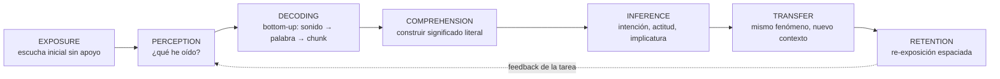
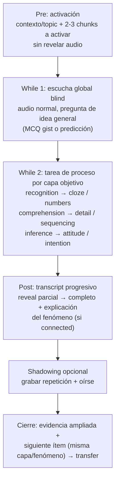
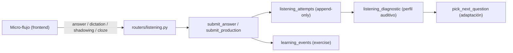

# LISTENING ENGINE 4.0 — Arquitectura pedagógica completa A1→C2

> Documento de diseño (especificación pedagógica). Versión 1.1 — implementada
> (Fases 1 y 2). Base de partida: **freeze arquitectónico V3.26.0**
> (`backend/config.py` → `VERSION = "3.26.0"`). Fecha: 2026-09-09.
> Estado: **aprobada e implementada** — **Fase 1 cerrada en V3.27.0**
> (`docs/PLAN-V327-LISTENING-ENGINE-4.md`) y **Fase 2 cerrada en V3.28.0**
> (Bloques A–F del plan V3.28, `v3.28_listening_engine_fase_2_…plan.md`).
> La Fase 3 (karaoke palabra a palabra / `word_alignment_proxy`) queda como
> propuesta para V3.29+.

---

## 1. Resumen ejecutivo

El proyecto ha alcanzado en V3.26 una madurez arquitectónica excepcional (Student Model, Evidence Graph, retención longitudinal, taxonomía por capas de listening, ledger `vocabulary_events`). La competencia *listening* no está todavía al mismo nivel pedagógico que su infraestructura: hoy tenemos un **sistema excelente de evaluación/práctica** de listening, pero no un **sistema pedagógico completo de aprendizaje auditivo** (procesar el habla con apoyo decreciente y en condiciones cada vez más naturales).

Antes de diseñar ese sistema, se ha ejecutado una **auditoría forense** (git completo con 248 commits + specs históricas + contraste contra el código actual) con un resultado determinante:

1. **No se ha perdido ninguna funcionalidad.** Ningún archivo de listening se borró jamás (el único "delete" es un rename `components/ListeningPractice.tsx` → `features/listening/ListeningPractice.tsx`). Nada de lo documentado como "hecho" falta hoy del código.
2. **Gran parte de la propuesta pedagógica ya existe** y solo necesita adaptación: dictado real, shadowing con grabación+ASR, connected speech (skill + vector + catálogo de reducciones), escalera de velocidad slow/normal/fast, taxonomía de capas recognition/comprehension/inference, retención retardada, e infraestructura completa de audio humano.
3. **Lo que nunca existió** (0 hits en todo el historial de git) debe diseñarse desde cero, pero con **contexto de diseño disponible**: cloze/dictado parcial, transcripción sincronizada por palabra (karaoke), reproductor pedagógico con velocidad/pitch, marco pre/while/post, evidencia ampliada por intento, selección adaptativa por capa y SRS de audios.
4. La deuda real es **de contenido, no de código**: el corpus es 100 % TTS (Piper) y la biblioteca de audio humano está construida pero vacía. Un hallazgo nuevo alivia esta deuda: **Piper ya soporta 11 voces** (en_US/en_GB) y el corpus ya declara `speaker_id`/`accent`/`region`/`speaker_count` por ítem, lo que permite empezar a servir acentos y multi-hablante **asignando voz por ítem** sin grabar humanos.

La decisión de arquitectura adoptada para esta especificación es el **micro-flujo por ítem** (`item_flow`): cada frase/audio del corpus actual gana una secuencia interna Pre → While → Post + shadowing, sin crear una nueva entidad de "lección orquestada" (esa queda como posible V3.28+).

---

## 2. Propósito, alcance y método

### 2.1 Qué resuelve esta pausa

El sistema actual puede describirse así:

```
Listening
   → skill (18 sub-destrezas)
   → layer (recognition / comprehension / inference)
   → difficulty (vector 8D → escalar 1..6)
   → attempt
   → score
```

Eso es correcto, pero responde solo a "¿ha acertado?". Lo que falta es la dimensión pedagógica:

- ¿Qué **proceso auditivo** está entrenando cada tarea?
- ¿Qué **operación cognitiva** no pudo realizar el alumno cuando falla?
- ¿Qué **intervención** necesita ahora mismo (bottom-up, top-down, connected speech, velocidad, etc.)?

### 2.2 Alcance

Este documento especifica:

1. El estudio "implementar vs adaptar" verificado contra el código real.
2. El modelo pedagógico central de Listening 4.0.
3. El perfil auditivo del alumno y la detección automática de intervención.
4. El micro-flujo por ítem (Pre/While/Post + shadowing).
5. El diseño de cloze auditivo y connected speech como objeto pedagógico.
6. La evidencia ampliada por intento y sus límites.
7. La selección adaptativa del siguiente paso.
8. La retención y el repaso de audios (SRS).
9. La progresión A1→C2 y su relación con la calibración CEFR.
10. Los límites del freeze y la hoja de ruta post-aprobación.

No especifica cambios en Student Model, Evidence Graph, SQLite, React, FastAPI ni la introducción de otro LLM (ver §13 Freeze).

### 2.3 Principio rector

> **English Tutor no debe enseñar al alumno a acertar preguntas de Listening. Debe enseñar al alumno a procesar el habla inglesa cada vez con menos apoyo y en condiciones cada vez más naturales.**

El objetivo final no es `listening score = 90 %`, sino la cadena:

```
Can hear → Can decode → Can understand → Can infer
        → Can handle natural speech → Can transfer → Can retain over time
```

---

## 3. Estudio "implementar vs adaptar" (auditoría forense)

### 3.1 Método

- **Git**: recorrido de los 248 commits de `main` con `git log --all`, `-S<termino>` (arqueología de contenido), `--diff-filter=D` (archivos borrados) y `--follow` por archivo.
- **Specs históricas**: lectura íntegra de `agentes/pedagogia/p8-listening-3.0.md`, `p13-delayed-retention.md`, `p14-dictado-shadowing.md`, `p15-variantes-audio.md`, `p17-biblioteca-audio-humano.md`, `p18-corpus-audio-humano.md`, `p20-pronunciacion-proxy.md`, `agentes/curriculum/c1-listening-c1c2.md`.
- **Código actual**: contraste archivo por archivo de cada afirmación de las specs contra `backend/` y `frontend/src/`.

### 3.2 Veredicto: no se ha perdido ninguna funcionalidad

Resultado de la forensia git:

| Funcionalidad | Veredicto forense |
|---|---|
| Dictado real (`POST /api/listening/dictation`) | Nació en V1.18 (`2183849`); **sigue en HEAD** |
| Shadowing real (`POST /api/listening/shadowing`) | Nació en V1.18 (`2183849`); **sigue en HEAD** |
| Connected speech como skill (ítems + vector + reducciones) | Vive desde V1.13/V2.x; **sigue en HEAD** |
| Escalera de velocidad slow/normal/fast | Nació en V1.18 P1.9 (`26ae6c4`); **sigue en HEAD** (variantes pre-renderizadas) |
| Taxonomía de capas recognition/comprehension/inference | Nació en V3.26 (`f8e0c64`); **sigue en HEAD** |
| Retención retardada (`delayed_retention`, buckets) | Nació en V1.18 P1.2 (`6071bca`); **sigue en HEAD** |
| Infraestructura de audio humano (biblioteca, upload, QA, UI) | Nació en V1.20–V1.37; **sigue íntegra en HEAD** (`manifest.json` con 0 entradas) |
| Specs `agentes/pedagogia/*.md` | Siguen en HEAD, sin modificar desde su creación (2026-08-26) |

Los únicos commits que "borran" rutas de listening son renames (R074, UI 2.0). Términos buscados en todo el historial con **0 resultados**: `cloze`, `karaoke`, `word_timestamps`, `playbackRate`, `preservesPitch`, `AudioController`, `partial_dictation`, `pre-listening`, `while_listening`, `post_listening`. Es decir: eso **nunca existió**, no se perdió.

### 3.3 Clasificación por mejora de la propuesta pedagógica

Tabla de veredictos para cada mejora candidata (la pregunta "¿implementar de cero o adaptar?"):

| Mejora candidata | ¿Existe hoy? | Evidencia | Acción |
|---|---|---|---|
| Dictado de frase completa | Sí | `POST /api/listening/dictation` (`backend/routers/listening.py:121`), `submit_production` (`backend/domain/listening.py`), skill `dictation`, ítem `c071` | **Adaptar** |
| Shadowing con grabación + ASR + puntuación | Sí | `POST /api/listening/shadowing` (`backend/routers/listening.py:138`), MediaRecorder → `/api/transcribe`, ítem `c084` | **Adaptar** (falta playback de la grabación del alumno en listening, patrón ya usado en `PronunciationRoutesPractice`) |
| Evaluación de pronunciación honesta | Sí (lección aprendida) | Flujo Whisper → scorer determinista con señales `*_proxy` y `pronunciation_source: "transcript"` (`backend/services/pronunciation.py`, `phonetics.py`, `phonemes.py`) | **Adaptar/heredar** el patrón; nunca vender ASR como "pronunciation score" |
| Connected speech | Base sólida | Skill de corpus (10 ítems), dimensión del vector 8D, `STRONG_REDUCTIONS` (18 ítems) + `MILD_CONTRACTIONS` (`backend/services/listening.py:171-205`) | **Adaptar**: falta motor pedagógico notice→recognize→cloze→shadowing→transfer |
| Velocidad lenta (0.75×) / normal / rápida (1.25×) | Sí (pre-renderizada) | `AUDIO_VARIANTS`, `VARIANT_SPEED_FACTORS`, `variant_speech_rate`, `?variant=` (`backend/services/listening.py:1018-1082`) | **Adaptar**; la velocidad *en vivo* con pitch preservado es mejora opcional de player (§6.6) |
| Transcripción sincronizada por palabra (karaoke) | No | 0 hits `karaoke`/`word_timestamps`; transcript estático post-respuesta | **Crear de cero** (§6.5) |
| Cloze / dictado parcial (gap-fill) | No | 0 hits `cloze`; solo dictado de frase completa | **Crear de cero** (§7.4) |
| Reproductor pedagógico (AudioController) | No | `new Audio()` play-only; sin seek/loop/segmento | **Crear de cero** (§6.4) |
| Marco Pre/While/Post | No | 0 hits; flujo actual audio→pregunta→respuesta | **Crear de cero** (§6.2) |
| Evidencia ampliada por intento (capa, velocidad usada, segmentos) | Parcial | `listening_attempts` no guarda `speed_used`/`layer`/`segments_replayed` | **Ampliar** con cuidado (§8) |
| Selección adaptativa por capa/perfil | Parcial | `pick_next_question` usa sub-destrezas débiles y `_realizes_subskill`; la capa no participa | **Ampliar** (§9) |
| SRS/FSRS de ítems de audio | No | FSRS hoy solo cubre cartas de objetivos (`services/fsrs.py` + `unit_review`) | **Crear de cero**, acotado (§10) |
| Audio humano real (acentos/ruido/multi-hablante) | Infraestructura sí, contenido no | `backend/services/audio_library.py`, `manifest.json` = `entries: []`, corpus 100 % TTS | **Contenido** (deuda); además nuevo atajo con 11 voces Piper (§3.5) |

### 3.4 La deuda real es de contenido, no de código

1. **Corpus 100 % TTS Piper.** De los 513 ítems del banco (`QUESTION_BANK`, `backend/services/listening.py:971`), todos son `audio_type="tts"`. El `listening_corpus.json` (490 ítems: A1=200, A2=200, B1=25, B2=25, C1=20, C2=20) declara metadatos ricos (`accent`, `speaker_count`, `noise_level`, `region`, `spontaneity`…) que el audio Piper no realiza. El sistema ya es **honesto** sobre esto: `realized_vector`/`realization_status`/`realization_gap_factors` (`backend/services/listening.py:1124-1205`) marcan los factores no realizados, y el diagnóstico expone `realization` y `realization_gap` por sub-destreza.
2. **Biblioteca de audio humano vacía.** Infraestructura completa (manifest versionado 1.2.0, `backend/routers/audio_library.py` con status/slots/audit/upload, QA acústico `classify_quality`, CLI `import_audio.py`, UI `AudioLibrary.tsx`), pero `entries: []` y los WAV están en `.gitignore`.
3. **Autoría de la capa recognition escasa** (deuda declarada en V3.26, F-C1): la taxonomía está viva, pero hay pocos ítems diseñados explícitamente para entrenar percepción (pares mínimos, contracciones, palabras funcionales).

### 3.5 Hallazgo nuevo: multi-voz Piper (atajo para acentos y multi-hablante)

El TTS ya no es de una sola voz. `backend/services/tts.py:28-39` declara **11 voces oficiales**: 4 americanas (en_US-lessac, amy, kristin, ryan) y 7 británicas/regionales (en_GB-alan, alba "Northern", cori "Scottish", northern_english_male, southern_english_female, jenny_dioco). Hay selector por usuario (`Configuración → Voces`, `backend/routers/voices.py`) y la caché de audio ya tiene WAV de `en_US-lessac-medium` y `en_GB-alan-medium`.

**Consecuencia de diseño**: la dimensión `accents` y `multiple_speakers` — hoy marcadas como "no realizadas" con una única voz neutra — pueden empezar a realizarse **sin grabación humana**:

- Asignar la voz al ítem según su metadata `accent`/`region`/`speaker_id` (p. ej. ítem `c001` con `accent: "British RP"`, `region: "UK"` → voz en_GB).
- Para diálogos con `speaker_count > 1`, sintetizar cada turno con una voz distinta (el corpus separa turnos con `A:`/`B:` en `script`/`transcript`).
- Marcar estos audios como `audio_type: "synthetic_multispeaker"` (ya admitido en `AUDIO_TYPES`, `backend/services/listening.py:149-157`), que confía en la realización declarada.

Esto es un paso intermedio honesto entre "todo Piper" y "audio humano real", y desbloquea pedagógicamente las dimensiones de resiliencia `accents` y `natural_speech`.

---

## 4. Modelo pedagógico central

### 4.1 La cadena de proceso auditivo

Listening 4.0 se diseña como una cadena de procesamiento, no como un test:



Cada eslabón se apoya en lo que **ya existe** (ver §4.2); la novedad no es la taxonomía (V3.26 ya la tiene), sino convertir la cadena en **secuencia pedagógica observable y evidenciable**.

### 4.2 Mapeo a lo existente

| Eslabón | Capa V3.26 (`SKILL_LAYER`) | Sub-destrezas actuales | Tareas pedagógicas asociadas |
|---|---|---|---|
| Perception / Recognition | `recognition` | `word_recognition`, `sound_recognition`, `phrase_recognition`, `numbers` | Pares mínimos, ¿can o can't?, palabras funcionales, contracciones, chunks |
| Decoding (bottom-up) | (producción, `layer=None`) + `recognition` | `dictation`, `shadowing`, `connected_speech` (declarada en `inference`) | Dictado parcial/cloze, dictado completo, reconocer reducciones |
| Comprehension | `comprehension` | `gist`, `detail`, `vocabulary`, `sequencing`, `note_taking`, `prediction` | MCQs de idea general/detalle, ordenar, tomar notas |
| Inference | `inference` | `inference`, `attitude`, `speaker_intention`, `fast_speech`, `connected_speech`, `multiple_speakers` | ¿Qué quiere decir? ¿Cómo se siente? ¿Qué pasará? |
| Transfer | — | selección adaptativa (ítem distinto, mismo fenómeno/capa) | Re-exposición a input nuevo con la misma operación |
| Retention | — | `delayed_retention`, `route_competence`, LRU | Re-assessment espaciado de los mismos audios |

Nota de diseño: `connected_speech` y `fast_speech` viven hoy en la capa `inference` por el mapa determinista, pero **pedagógicamente son condiciones del input** que ejercitan percepción/decodificación (ver §7). El mapa no cambia en V3.27; la interpretación de sus señales sí (un fallo en ítems `connected_speech` no indica falta de inferencia, sino de percepción del fenómeno — el perfil auditivo de §5 lo separa).

### 4.3 Del diagnóstico de sub-destrezas al perfil auditivo

El backend ya produce el agregado que permite construir el perfil: `listening_diagnostic(attempt_rows, now)` (`backend/services/listening.py:2101`) devuelve por sub-destreza `attempts`, `accuracy`, `first_pass_accuracy`, `avg_response_ms`, `avg_replay_count`, `automaticity`, `mean_score` (producción), `realization_gap`, `review_due`; y globalmente `weak`, `by_layer`, `by_difficulty`, `by_topic`, `trend`, `recurrence`, `retention`, `resilience`, `realization`, `automaticity`.

El Engine 4.0 **no crea un segundo modelo**: interpreta estos agregados como un perfil auditivo en tres ejes (capas) + condiciones de escucha (resiliencia). Ver §5.

---

## 5. Perfil auditivo del alumno y detección de intervención

### 5.1 Casos de diagnóstico (patrones que el sistema debe detectar)

Usando las precisiones por capa de `accuracy_by_layer` (`backend/services/listening.py:1744`) y las dimensiones de resiliencia de `listening_resilience` (`:2045`, condiciones `clear_speech`, `natural_speech`, `connected_speech`, `fast_speech`, `noise`, `accents`):

| Caso | Patrón observado | Interpretación | Intervención |
|---|---|---|---|
| A | `recognition` < 70 % y `comprehension` ≥ 85 % | El alumno entiende cuando consigue decodificar, pero pierde palabras en el flujo acústico | **Entrenamiento bottom-up**: cloze de palabras funcionales/reducciones, dictado parcial, reconocimiento de contracciones |
| B | `comprehension` < 70 % con `recognition` ≥ 85 % | Oye las palabras pero no construye el significado | **Entrenamiento de comprensión**: gist/detail/sequencing con transcript revelado en post |
| C | `recognition` ≥ 85 %, `comprehension` ≥ 85 %, `inference` < 60 % | Comprende lo literal pero falla intención/actitud/implicatura | **Entrenamiento top-down/pragmático**: inferencia, actitud, predicción |
| D | `clear_speech` ≥ 85 % pero `natural_speech`/`connected_speech` < 60 % | Solo entiende habla clara y artificial | **Secuencia connected speech**: notice → recognize → cloze → shadowing → transfer (§7.3) |

### 5.2 Regla de decisión propuesta

Pseudocódigo de la lógica de intervención (motor puro, a ubicar junto a `listening_diagnostic`):

```
perfil = listening_diagnostic(rows)
por_capa = {layer: accuracy}  # de perfil.by_layer
resil = perfil.resilience      # clear/natural/connected/fast/noise/accents

si resil.connected_speech < 60 y resil.clear_speech >= 80:
    intervencion = "connected_speech_path"      # Caso D
si por_capa.recognition < 70 y por_capa.comprehension >= 85:
    intervencion = "bottom_up_path"             # Caso A
si por_capa.comprehension < 70 y por_capa.recognition >= 85:
    intervencion = "comprehension_path"         # Caso B
si por_capa.inference < 60 y por_capa.comprehension >= 85:
    intervencion = "top_down_path"              # Caso C
```

Reglas:
- Orden de precedencia: el caso D (condición acústica) se evalúa primero porque condiciona la lectura de los demás (no se puede medir inferencia sobre audio que no se percibe).
- Umbrales (70/85/60) son **valores por defecto a calibrar**, no constantes del modelo.
- Muestras mínimas: una capa no se declara fuerte/débil con menos de `RESILIENCE_MIN_ATTEMPTS` = 3 intentos (constante ya existente en `backend/services/listening.py:113`).
- La **automaticity** (señal ya calculada con `automaticity_from_metrics`, `:258`) se usa como auxiliar, nunca como CEFR ni como mastery: muchos replays pueden deberse a ruido, ansiedad, audio mal diseñado o desconocimiento léxico. Es **evidencia auxiliar**, no verdad absoluta.

---

## 6. Micro-flujo por ítem ("Listening Item Flow")

### 6.1 Decisión arquitectónica

Se adopta **`item_flow`**: sobre cada frase/audio del corpus actual se construye una secuencia interna de pasos. No se crea en V3.27 una entidad "lección orquestada multi-ítem" (Pre/While/Post sobre un pasaje con varios audios); esa arquitectura queda anotada como posible V3.28+ si el micro-flujo demuestra necesitarla.

Razones:
- El corpus actual es de frases/audios cortos autocontenidos (con `script`, `question`, `options`, `transcript`, `variants`); el micro-flujo maximiza el valor pedagógico de cada uno sin exigir un nuevo corpus.
- El backend (selector, diagnóstico, evidencia) y el frontend (`ListeningPractice`) se adaptan incrementalmente.
- Cada ítem gana un "circuito de entrenamiento" (escucha → tarea → análisis → reproducción) manteniendo la frase como unidad de práctica, repaso y retención.

### 6.2 Fases del micro-flujo

Un ítem se sirve como una secuencia de pasos con **estado por ítem**:



Detalle de cada fase:

- **Pre (activación)**: se muestran solo el contexto del ítem (`context`, `topic`) y, si la capa objetivo es bottom-up o el ítem es `connected_speech`, los chunks funcionales que van a aparecer reducidos (p. ej. *going to / want to / have to*), **sin revelar el audio ni la transcripción**. Objetivo: activar vocabulario y esquemas (top-down) o preparar la atención al fenómeno (bottom-up). Es opcional y configurable por capa.
- **While 1 (escucha global)**: reproducción a velocidad `normal`; una sola pregunta de idea general o predicción. Primera evidencia (MCQ estándar de hoy).
- **While 2 (tarea de proceso)**: dependiendo de la capa objetivo del perfil, se pide una tarea distinta sobre **el mismo audio**:
  - `recognition`: cloze de palabra funcional/contracción/número, o par mínimo.
  - `comprehension`: pregunta de detalle/orden (sequencing) / nota breve.
  - `inference`: pregunta de intención/actitud.
  - Esta fase es la que hoy es la única; en el micro-flujo se convierte en la tarea *de proceso* y no en el final del circuito.
- **Post (análisis)**: se revela la transcripción de forma **progresiva** (ver 6.3). Si el ítem declara connected speech o el alumno falló la percepción, se muestra una nota de fenómeno (reducción/linking) con el audio repetido en bucle corto.
- **Shadowing (opcional)**: si la capa objetivo o el perfil lo piden (o el ítem es `shadowing`/`dictation`), se graba la repetición del alumno con el flujo ASR existente, y esta vez **se ofrece oír la propia grabación** (patrón ya usado en `PronunciationRoutesPractice`, con `RecordingPlayButton`).
- **Cierre**: se persiste la evidencia ampliada (§8) y el selector elige el siguiente ítem para **transfer** (misma capa o fenómeno, ítem distinto; §9).

### 6.3 Estado de transcripción progresiva (transcript policy)

La regla pedagógica "¿cuándo mostramos transcript?" se resuelve como una **política por fase**, no como un interruptor global:

| Estado | Qué se muestra | Cuándo |
|---|---|---|
| `hidden` | Nada (solo contexto/topic) | Pre y While 1 |
| `cloze` | Transcript con palabras clave ocultas (solo en tarea de proceso) | While 2 si capa = recognition/bottom-up |
| `partial` | Transcript con huecos del fallo del alumno | Post inmediato tras error |
| `full` | Transcript completo + script legible | Post tras revelar; y siempre en Shadowing |

Regla por defecto: **no se muestra `full` antes de que el alumno haya intentado la tarea** (una escucha; dos como máximo en condiciones A1). La política se afina por nivel (A1 puede llegar antes a `full`; B2+ puede mantener `hidden` hasta el cierre).

### 6.4 Audio Learning Controller (AudioController)

Se especifica como **componente de frontend reutilizable** (hoy no existe nada: todo es `new Audio()` play-only). No es una feature aislada: es el reproductor pedagógico del micro-flujo, y debe exponer:

```
AudioController
│  play() / pause() / stop()
│  seek(t)
│  replay_segment()          # repite el último fragmento (frase o chunk)
│  loop_segment(from, to)    # bucle A-B
│  set_rate(rate)            # 0.75 / 1.0 / 1.25 (o más fina)
│  preserve_pitch()          # playbackRate + preservesPitch
│  mark_segment()            # marca inicio/fin de un fragmento
│  on_timeupdate(cb)         # para karaoke / resaltado
│  on_word_highlight(w)      # palabra activa si hay alineación
```

Debe registrar y reportar, junto a la respuesta, **evidencia pedagógica de uso**: `replay_count` (ya existe), `speed_used`, `segments_replayed`, `time_to_answer` (ya existe como `response_time_ms`). El backend ya recibe `replay_count` y `response_time_ms` (§8); el resto son extensiones compatibles.

Nota de honestidad técnica: la **velocidad en vivo con pitch preservado** (`set_rate` + `preservesPitch`) puede implementarse sobre el WAV `normal` del ítem, complementando (no sustituyendo) la escalera pre-renderizada de variantes. En navegadores modernos `HTMLAudioElement.playbackRate` con `preservesPitch` (por defecto true) es suficiente; **no requiere Web Audio API** para el caso básico. El pitch control explícito como función separada no es necesario en V3.27.

### 6.5 Transcripción sincronizada por palabra (karaoke) — diseño honesto

**Estado real**: el backend no produce timestamps por palabra (el ASR expone tiempos solo por segmento; ver `backend/services/stt.py`, `aggregate_asr_segments`). No se debe prometer karaoke "real" sin fuente de tiempos.

**Diseño propuesto (V3.27, fase posterior)**: generar la alineación por palabra **en el momento de sintetizar/cachear cada WAV** (proceso offline, una vez por audio y variante), ejecutando faster-whisper con `word_timestamps=True` sobre el propio WAV generado, y guardar un sidecar `{wav}.words.json` junto a la caché de audio (`DATA_DIR/listening/{bank}/{voice}/…`). Es una **señal de alineación derivada de ASR, no verdad acústica**: debe nombrarse `word_alignment_proxy` (coherente con la lección P20 de `*_proxy` en pronunciación). Para audios de la biblioteca humana, la misma alineación se computa en el `import_audio.py`.

Alternativa más barata y determinista (si el coste ASR por ítem no se asume): **escalar** los timestamps de la variante `normal` por el ratio de `length_scale` para las variantes slow/fast (error acotado, misma voz), documentando la aproximación.

### 6.6 Velocidad

- Hoy: 3 variantes pre-renderizadas `slow` (0.75×) / `normal` (1.0×) / `fast` (1.25×), servidas por `?variant=` y expuestas en `question.variants` (`backend/services/listening.py:1018-1082`; frontend `ListeningPractice` selector de velocidad). El backend **no guarda qué variante se usó**.
- Propuesta: persistir `speed_used` en el intento (§8) para poder diagnosticar "falla en fast pero acierta en slow" (señal de automaticidad sin distorsión), y usar el selector de velocidad como **herramienta pedagógica del micro-flujo** (el alumno puede bajar a slow en While 2 y volver a normal/fast en transfer).

### 6.7 Encaje en el código actual

| Pieza del micro-flujo | Componente actual | Cambio propuesto |
|---|---|---|
| Selector de ítem | `domain/listening.py:next_question` → `pick_next_question` | Añadir capa objetivo/perfil (§9) |
| Servir ítem con fases | `_public()` expone el ítem plano | Añadir `micro_flow`/`steps` derivado por capa + `transcript_policy` |
| Reproducción | `ListeningPractice` (`playAudioUrl`) + `variants` | Nuevo `AudioController` reutilizable |
| Tasks de proceso | Ramificación por `question.skill` (MCQ/dictation/shadowing) | Añadir skill/task de cloze parcial y estados de fase |
| Transcript | Estático post-respuesta (`ActivityResult` reveal) | Estados `hidden/cloze/partial/full` (§6.3) |
| Shadowing | `ListeningPractice.toggleRecording` | Añadir playback de la grabación propia (`RecordingPlayButton`) |
| Post/análisis | Diagnóstico colapsable bajo la tarjeta | Nota de fenómeno + repetición segmentada |
| Evidencia | `submit_answer`/`submit_production` | Campos ampliados (§8) |

---

## 7. Bottom-up, connected speech y cloze auditivo

### 7.1 Connected speech: de factor de dificultad a objeto pedagógico

Hoy `connected_speech` es simultáneamente dimensión del vector 8D, sub-destreza (mapeada a `inference`), y hay un catálogo de reducciones (`STRONG_REDUCTIONS`, `MILD_CONTRACTIONS`) con lógica de realización (`_connected_speech_realized`, `backend/services/listening.py:1106`). Lo que falta es la **secuencia de enseñanza**: que el fenómeno sea objeto de aprendizaje explícito y no solo una condición del audio.

### 7.2 Catálogo de fenómenos

Base ya existente para el diseño de ejercicios:

- Reducciones fuertes (18): `gonna, wanna, gotta, gimme, lemme, dunno, whaddaya, d'you, d'ya, kinda, sorta, shoulda, woulda, coulda, hafta, usta, ain't, outta`.
- Contracciones suaves (37): `she'd/he'd/…`, `we'll/…`, `i'm/…`, `can't/…`, etc.
- A ampliar pedagógicamente: linking (consonante→vocal), elisión, weak forms y schwa (solo como notas explicativas en V3.27; el corpus TTS no las realiza de forma controlada, salvo las reducciones escritas).

### 7.3 Secuencia de enseñanza de un fenómeno

Para cada fenómeno (p. ej. `going to → gonna`), el circuito completo sobre ítems distintos:

1. **Notice**: el sistema explica el fenómeno con el ejemplo escrito (sin audio aún). "Going to suena *gonna* en habla rápida."
2. **Recognize**: pregunta tipo "¿qué has oído?" (A: going to / B: gonna / C: can't) sobre el audio.
3. **Cloze**: rellenar el hueco donde va la reducción en la transcripción.
4. **Shadowing**: repetir la frase (grabación + señales honestas).
5. **Transfer**: un ítem **distinto** con el mismo fenómeno (no la misma frase) en otro contexto.

Esta secuencia es la implementación del "caso D" del perfil (§5.1) y es la manera de que `connected_speech` deje de ser solo un factor de dificultad.

### 7.4 Diseño del cloze auditivo (nueva tarea)

El cloze es el mecanismo de **dictado parcial** que faltaba: dictado completo ya existe, gap-fill no.

Especificación funcional:

- **Qué se oculta** (según capa objetivo):
  - recognition: palabras funcionales (in/at/of), contracciones, números, verbos reducidos (gonna/wanna).
  - bottom-up/decoding: las palabras del fenómeno conectado del ítem.
  - comprensión: palabras que portan significado clave de la respuesta.
- **Modelo de ítem**: derivado del ítem existente (`transcript`/`clean_transcript`) marcando huecos; el número de huecos se limita (1–3) y se elige con regla determinista (no aleatoria): palabras del catálogo de reducciones primero; si no hay, palabras funcionales de la lista de funciones; si no, contenido de baja frecuencia del `script`.
- **Puntuación**: reutilizar el scorer determinista de producción. El breakdown palabra a palabra de `production_score`/`composite_score` (`backend/services/listening.py:209`, `backend/services/phonetics.py`) ya permite saber qué palabras fallan → realimentar qué hueco se falló.
- **Interacción**: al fallar un hueco, el reproductor **salta al instante de esa palabra** (§6.5 karaoke/`word_alignment_proxy`) o, sin alineación, reproduce la frase con la palabra objetivo enfatizada (repetición del segmento completo).
- **Registro**: se persiste como intento con `task_type = "cloze"` (extensión de `task_type`, hoy `mcq|dictation|shadowing`).

### 7.5 Scoring y notas de diseño

- Los huecos se puntúan con la misma `production_score` (0–100), con `PRODUCTION_PASS_SCORE = 80` como umbral de "correcto" (constante existente).
- El cloze NO es un nuevo tipo de evidencia en el Evidence Graph: es una tarea de práctica que alimenta `listening_attempts` y el diagnóstico (ver §8.3).

---

## 8. Evidencia ampliada por intento y sus límites

### 8.1 Qué se registra hoy

`listening_attempts` (una fila por intento; columnas en `backend/repositories/db.py:144-152` + migraciones `:909-951`):

`user_id, question_id, answer_index, correct, skill, difficulty, response_time_ms, replay_count, topic, realized_difficulty, task_type, score, created_at`

El router además registra `learning_events` (`type=exercise`, detail `listening:<id>:ok|ko`). La práctica de listening **no** escribe en `vocabulary_events` ni en `academy_evidence`; alimenta su propio diagnóstico y la competencia por ruta.

### 8.2 Campos propuestos para V3.27

| Campo | Tipo | Para qué | Notas |
|---|---|---|---|
| `speed_used` | TEXT (`slow`/`normal`/`fast`) | Saber a qué velocidad se respondió (señal de automaticidad) | El backend hoy genera las 3 variantes pero no guarda cuál se usó |
| `layer` | TEXT | Snapshot de la capa del skill (recognition/comprehension/inference, o NULL) | Hoy se deriva por `skill_layer`; persistirlo evita recomputar y permite análisis por capa sin join al banco |
| `stage` | TEXT (`pre`/`while1`/`while2`/`post`/`shadowing`) | Saber en qué fase del micro-flujo se produjo el intento | Solo cuando el micro-flujo esté activo |
| `segments_replayed` | INTEGER | Cuántos fragmentos en bucle se usaron antes de responder | Evidencia de apoyo usado |
| `transcript_used` | TEXT (`hidden`/`cloze`/`partial`/`full`) | El nivel de apoyo de transcripción con el que se respondió | Permite "accuracy con apoyo decreciente" (pilar del principio rector) |
| `variant_fast_selected` / `slow_selected` | INTEGER | Frecuencia de uso de variantes | Alternativa agregada si no se quiere por intento |

Restricción: **todas aditivas** (columnas nuevas con default) sin invalidar el esquema actual ni la migración append-only. El diagnóstico puede agregarlas sin tocar el gate.

### 8.3 Dónde entra y dónde NO



Límites explícitos (no romper lo sólido):

- **No** escribir `vocabulary_events` desde listening sin una decisión de modelo (el ledger es de léxico por superficie; el listening no produce tokens léxicos verificables hoy). El ledger es **señal, nunca puerta de mastery** (regla F-B2 de V3.26).
- **No** convertir `listening_attempts` en evidencia formal del Evidence Graph (`academy_evidence`): la separación práctica/evidencia que V3.26 mantiene se conserva.
- **No** usar `automaticity` como CEFR ni como mastery (§5.2).
- El `gate` de ruta (`route_gate`, `backend/services/listening.py:1430`) y la certificación MASTERED (retención ≥ 2 puntos estables) **no cambian** en V3.27.

---

## 9. Selección adaptativa del siguiente paso

### 9.1 Qué existe

- `pick_next_question(seen_ids, correct_ids, weak_subskills)` (`backend/services/listening.py:1619`): dentro del nivel CEFR de trabajo prioriza las **sub-destrezas débiles** del diagnóstico, filtrando por realización auditiva (`_realizes_subskill`, `:1609`); luego no vistas → falladas; respeta la progresión por nivel (no salta de nivel).
- `review_next_question` (`:1554`): repaso por nivel con **rotación LRU** por frase y modos `failed`/`mastered`.
- El motor global (`backend/services/adaptive.py`): `session_plan` inserta pasos `kind="listening"` por sub-destreza débil y `next_best_activity` usa la curva de olvido.
- La **capa** no participa en la selección (solo es etiqueta y agregado).

### 9.2 Propuesta (V3.27)

1. El perfil auditivo (§5) produce una **intervención activa** (bottom-up / comprehension / top-down / connected_speech) y una capa objetivo.
2. El selector pasa de "sub-destreza débil suelta" a "**operación cognitiva objetivo**": se eligen ítems cuya capa coincide con la intervención, dentro del nivel de trabajo y con realización válida (reglas de `pick_next_question` intactas, añadiendo filtro por capa).
3. **Transfer**: tras una sesión correcta sobre una capa/fenómeno, el siguiente ítem es de **la misma capa/fenómeno pero contexto distinto** (nunca la misma frase) — esto ya es posible porque el corpus declara `context`/`topic`/`skill`.
4. La "decisión de la siguiente sesión" (qué capa toca mañana) queda en el motor adaptativo global, sin cambiar su contrato.

### 9.3 La dificultad en tres familias

El vector 8D actual (`DIFFICULTY_FACTORS`: speed, vocabulary, accent, syntactic, length, speaker_count, noise, connected_speech) se interpreta en tres familias para elegir y para explicar el fallo:

| Familia | Factores del vector | Naturaleza |
|---|---|---|
| Input difficulty | `speed`, `accent`, `noise`, `speaker_count`, `connected_speech`, `length` | Condiciones acústicas del audio (lo que el oído debe procesar) |
| Linguistic difficulty | `vocabulary`, `syntactic` | Complejidad lingüística del texto |
| Cognitive difficulty | derivada del skill/layer (gist vs detail vs inference) | Operación mental pedida sobre lo oído |

No se cambia el vector ni el escalar; se **etiqueta la interpretación** en el diagnóstico para que un fallo se explique bien: "falló por condiciones del input" ≠ "falló por complejidad cognitiva". Es la base para separar los casos A–D.

---

## 10. Retención y repaso (SRS de audios)

### 10.1 Qué existe

- **Retención retardada medida**: `delayed_retention` (`backend/services/listening.py:1845`) con buckets 0-2/2-7/7-30/30+ días; alimenta `route_competence` (ratio estable ≥ 0.9 con re-exposición ≥ 7 días para `demonstrated`).
- **FSRS real**: solo para cartas de objetivos del micro-review (`backend/services/fsrs.py` + `backend/services/unit_review.py`). No hay SRS por ítem de audio.
- **Repaso por ruta**: LRU (`review_next_question`) con modos drill (`failed`) y repaso (`mastered`).

### 10.2 Propuesta acotada para V3.27

1. **No** introducir un scheduler FSRS completo de audios en V3.27 (riesgo de colisión con la certificación y el gate).
2. Sí añadir **re-exposición pedagógica de fenómenos**: cuando un ítem se responde bien, el mismo audio reaparece en intervalos crecientes (2 días → 7 días → 21 días) **solo como re-assessment de retención** reutilizando el mecanismo existente de `delayed_retention` y los buckets. Es una capa de programación sobre `listening_attempts`, no un nuevo motor.
3. La señal de "repetir un fenómeno" se deriva del perfil (si un fenómeno falló en shadowing/cloze, reaparece en un ítem distinto a los 2 días).

---

## 11. Progresión A1→C2 y calibración CEFR

### 11.1 Condiciones de input por nivel (referencia de diseño)

Esta tabla guía qué condiciones debe *realizar* el audio de cada nivel (complementa `LISTENING_FOCUS_BY_LEVEL` de `docs/LISTENING_CURRICULUM.md` y el §4 de la Constitución):

| Nivel | Condición de escucha esperada | Operación dominante |
|---|---|---|
| A1 | Habla clara, lenta, 1 hablante, vocabulario de alta frecuencia, frases cortas | Percepción y comprensión literal |
| A2 | Habla natural sencilla, reducciones simples, 2 hablantes, contextos rutinarios, detalles específicos | Comprensión de detalles |
| B1 | Velocidad normal, connected speech común, contextos variados, discurso más largo | Gist + detalle |
| B2 | Habla rápida, varios hablantes, acentos, significado implícito | Inferencia |
| C1 | Audio natural/auténtico, habla reducida, acentos múltiples, significado pragmático, discurso largo con información densa | Inferencia + actitud/intención |
| C2 | Habla muy natural, discurso impredecible, significado pragmático sutil, contenido abstracto/especializado, solapamiento | Pragmática avanzada |

### 11.2 Dificultad declarada vs realizada

La **deuda de contenido** (§3.4) hace que hoy la dificultad *declarada* (vector 8D) pueda superar a la dificultad acústica *realizada*. El código ya es honesto (`realized_vector`, `realization_status`, `realized_difficulty`), y la UI informa del gap (`realized vs declared`).

La hoja de ruta de contenido para cerrar ese gap (ver §14):

1. **V3.27 (sin grabación)**: multi-voz Piper por ítem (§3.5) para realizar `accent`/`speaker_count` parcialmente, y marcarlo `synthetic_multispeaker`.
2. **Fase de contenido humano**: incorporar grabaciones a la biblioteca (`AudioLibrary` ya está operativa) empezando por los ítems de mayor brecha (`realization_gap_factors` no vacíos).
3. Cada incorporación debe pasar el QA acústico existente y actualizar `manifest.json` + `audio_type`.

---

## 12. Pronunciación y speaking — deudas y límites (anexo breve)

No se rediseña speaking en esta especificación; se fijan límites y herencias:

1. **No vender ASR como "pronunciation score"** (lección ya aprendida en V3.20–V3.21 y documentada en `agentes/pedagogia/p20-pronunciacion-proxy.md`): Whisper produce texto, no análisis acústico. El proyecto ya resuelve esto con señales `*_proxy` (`phoneme_accuracy_proxy`, `prosody_proxy`) y `pronunciation_source: "transcript"`.
2. El **shadowing del micro-flujo** de listening reutiliza ese patrón: entrega `word_accuracy`, `phonetic_score`, `phoneme_accuracy_proxy`, `prosody_proxy` y breakdown — nunca un porcentaje acústico único no verificado.
3. Un shadowing bien diseñado produce varias señales honestas: ASR recognition, word alignment (texto), timing/duración, speech rate del alumno (wpm = words/duration), estructura de pausas (derivable de la duración) y realización de la reducción esperada. La evaluación *fonética/acústica* real queda como módulo separado futuro (no en V3.27).
4. Lo que ya existe en speaking se reutiliza tal cual: grabación (MediaRecorder), transcripción (`POST /api/transcribe`), scorer determinista, chips palabra a palabra (`alignWords`), y "oír mi grabación" (`RecordingPlayButton`).

---

## 13. Freeze: lo que NO se toca

Siguiendo la recomendación de congelar la arquitectura V3.26, **no** se hará ahora (ni en V3.27 sin decisión explícita):

- Otra reestructuración del backend o del Student Model.
- Cambiar SQLite ni introducir PostgreSQL.
- Más dashboards ni gamificación indiscriminada.
- Cambiar React, FastAPI o el stack.
- Introducir otro LLM.
- Aumentar el número de tests por aumentar.
- Convertir `listening_attempts` en evidencia formal del Evidence Graph.
- Escribir en `vocabulary_events` desde listening.
- Activar `novel_required` en B2+ (decisión de negocio pendiente, no técnica).

---

## 14. Hoja de ruta propuesta (tras la aprobación de esta especificación)

Fases técnicas (sin fechas), cada una con su propio plan detallado y release notes:

| Fase | Contenido | Release | Estado |
|---|---|---|---|
| Fase 1 | Micro-flujo por ítem (estados Pre/While/Post + transcript policy) + evidencia ampliada (campos aditivos de §8.2) + perfil auditivo e intervención (§5) | V3.27 | ✅ **implementada** (v3.27.0) |
| Fase 2 | AudioController en frontend + playback de la grabación en shadowing + bottom-up derivado (cloze auditivo / dictado parcial / segmentación) + transcript dinámico con sync grueso de frase + micro-flujo unificado en rutas por nivel y drill + E2E adaptativos | V3.28 | ✅ **implementada — Fase 2 cerrada** (v3.28.0) |
| Fase 3 | Sincronización por palabra (`word_alignment_proxy` offline) + karaoke + salto a la palabra fallada | V3.29+ | ⏳ pendiente |
| Fase 4 | Contenido: multi-voz Piper por ítem (§3.5), re-etiquetado recognition, primeras grabaciones humanas vía biblioteca | Continua / paralela | ⏳ continua |
| Fuera de alcance | Lección orquestada multi-ítem (Pre/While/Post sobre pasaje largo), evaluación acústica real de pronunciación, SRS completo de audios | V3.29+ (evaluar tras F2) | ⏳ |

> Estado a 2026-09-09 (release v3.28.0): la Fase 2 se ejecutó con los Bloques
> A–F del plan V3.28 — unificación del micro-flujo (P1-01), AudioController 4.0,
> tareas bottom-up **derivadas determinísticamente del corpus** (regla «si no hay
> candidato fiable no se emite»; nunca entran en la certificación), sync grueso
> etiquetado `coarse_heuristic` (no alineación acústica, que es la Fase 3),
> Shadowing 2.0 con playback y señales auxiliares no bloqueantes, y E2E
> adaptativos + negativos del contrato pedagógico.

Cada fase respeta el freeze de arquitectura (§13).

---

## 15. Checklist de decisiones (de esta especificación)

1. [ ] El entregable es una especificación independiente `docs/LISTENING_ENGINE_4.0.md` (este documento), aprobable sin tocar código.
2. [ ] Arquitectura: **micro-flujo por ítem**; la lección orquestada queda para V3.28+.
3. [ ] No hay funcionalidad perdida que recuperar: 6 mejoras = adaptar; 8 = crear de cero (con contexto citado).
4. [ ] Principio rector: enseñar a *procesar* el habla con apoyo decreciente, no a acertar preguntas.
5. [ ] Perfil auditivo: casos A–D con umbrales por defecto a calibrar y `RESILIENCE_MIN_ATTEMPTS` como mínimo de muestra.
6. [ ] Transcript policy por fases: `hidden → cloze → partial → full`.
7. [ ] AudioController registra `replay_count`, `speed_used`, `segments_replayed`, `time_to_answer` (evidencia pedagógica).
8. [ ] Cloze: tarea nueva con `task_type="cloze"`, huecos elegidos por regla determinista, scorer `production_score`, salto a la palabra con `word_alignment_proxy`.
9. [ ] Karaoke: alineación por palabra generada offline con ASR y etiquetada `*_proxy` (no verdad acústica).
10. [ ] Evidencia ampliada: campos aditivos en `listening_attempts`; sin tocar Evidence Graph, gate ni ledger.
11. [ ] Velocidad: escalera 0.75/1.0/1.25 existente + persistir `speed_used`; pitch en vivo opcional y documentado.
12. [ ] Connected speech como objeto pedagógico con secuencia notice→recognize→cloze→shadowing→transfer.
13. [ ] Retención: re-exposición por fenómeno con intervalos (2/7/21 días) sobre `delayed_retention`; sin SRS completo en V3.27.
14. [ ] Multi-voz Piper por ítem como primer paso de contenido real (sin esperar grabaciones humanas).
15. [ ] Los límites del freeze (§13) se respetan en todas las fases.

---

## 16. Deuda abierta y siguientes preguntas (tras aprobación)

Deuda abierta (heredada + nueva):

- Corpus 100 % TTS; brechas de realización (`accent`, `speaker_count`, `noise`) documentadas por ítem.
- Autoría de ítems de la capa `recognition` (pares mínimos, contracciones, números) escasa.
- `manifest.json` de audio humano vacío (infraestructura operativa).
- Calibración de los umbrales del perfil auditivo (70/85/60) y de `SUPPORT_LEVEL_WEIGHTS`.
- Subskills "supra" (`accents`, `discourse`, `nuance`, `pragmatics`, `register`, `real_world`) declaradas en el currículo pero no servibles como skill.
- Verificabilidad del release: el commit de V3.26 no expone checks CI publicados vía integración GitHub (deuda documental, no funcional).

Preguntas a responder en el plan técnico de V3.27 (no en esta spec):

1. ¿El cloze se sirve como *skill* nueva en `LISTENING_SUBSKILLS` o como `task_type` del micro-flujo (recomendado: task_type)?
2. ¿El micro-flujo se activa para todos los niveles desde el día 1 o se despliega por nivel (A1 → C2)?
3. ¿Dónde vive la lógica de fases del micro-flujo: backend (servir `steps` en `_public`) o frontend (máquina de estados local)? Recomendado: backend expone la política, frontend ejecuta la máquina.
4. ¿Cuándo se activa la exigencia de `novel_required` en B2+? (decisión de negocio, ya documentada en V3.26 como deuda).

---

## 17. Fuentes y referencias

### Código (verificado en HEAD `02e195d`)

- `backend/services/listening.py`: sub-destrezas y capas (`:14-84`), vector 8D (`:87-99`), resiliencia (`:100-113`), `AUDIO_TYPES` (`:149`), reducciones (`:171-205`), `production_score` (`:209`), variantes (`:1018-1082`), realización (`:1106-1205`), `pick_next_question` (`:1619`), `accuracy_by_layer` (`:1744`), `delayed_retention` (`:1845`), `route_competence` (`:1950`), `listening_diagnostic` (`:2101`).
- `backend/domain/listening.py`: `_public` (`:128`), `next_question` (`:147`), `submit_answer` (`:210`), `submit_production`, `get_audio`.
- `backend/repositories/db.py`: tabla `listening_attempts` (`:144`), migraciones (`:909-951`).
- `backend/schemas/listening.py`: `ListeningQuestion` (`:15`), `ListeningProductionResult` (`:80`), `ListeningGate` (`:96`).
- `backend/routers/listening.py`: endpoints `/api/listening/*`.
- `backend/services/stt.py`: `transcribe_with_timing` (`:268`), agregación por segmento.
- `backend/services/tts.py`: voces (`:28-39`), `list_voices` (`:46`).
- `backend/services/audio_library.py` + `backend/routers/audio_library.py` + `frontend/src/components/AudioLibrary.tsx`: infraestructura de audio humano.
- `backend/curriculum/listening_corpus.json`: corpus (490 ítems) con esquema de metadatos.
- `frontend/src/features/listening/ListeningPractice.tsx`, `frontend/src/features/speaking/PronunciationRoutesPractice.tsx`, `frontend/src/api/listening.ts`.

### Specs de diseño (contexto histórico)

- `agentes/pedagogia/p8-listening-3.0.md`, `p13-delayed-retention.md`, `p14-dictado-shadowing.md`, `p15-variantes-audio.md`, `p17-biblioteca-audio-humano.md`, `p18-corpus-audio-humano.md`, `p20-pronunciacion-proxy.md`, `agentes/curriculum/c1-listening-c1c2.md`.

### Documentación viva

- `docs/CONSTITUCION-PEDAGOGICA.md` (§4 progresión de listening, §6 gate/mastery).
- `docs/LISTENING_CURRICULUM.md` (progresión por nivel y foco por nivel).
- `docs/RELEVO.md` (§26-§27 V1.13/V1.14, §31 V1.18, §33 V1.20, §37 backlog).
- `docs/audit/O-AUDITORIA-TOTAL-V326.md` (F-C1 capas), `docs/audit/PARKED.md` (deuda de contenido).
- `release-notes-v3.19.0.md` … `release-notes-v3.26.0.md`, `CHANGELOG.md`.
