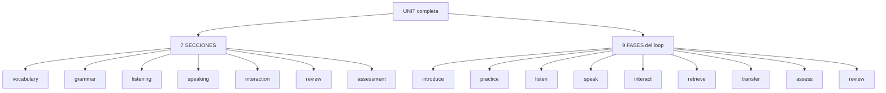

# Unit Architecture — plantilla obligatoria de unidad (V2.7)

Este documento fija la **plantilla obligatoria** que toda unidad del currículo debe
cumplir para considerarse "profunda" (no solo "cubierta"). Es la referencia que
siguen los briefings de autoría (`agentes/curriculum/v27-depth-*.md`) y la que el
**Curriculum Quality Dashboard** mide en tres granos: secciones por unidad, fases
del Unit Learning Loop y CEFR Depth Score.

> La distinción central de V2.6/V2.7: **cobertura ≠ profundidad**. Tener *algo* en
> cada celda nivel×sección (cobertura 85,7%) no significa que cada unidad sea un
> bucle pedagógico completo. Esta plantilla define qué significa "unidad completa".

## 1. Las dos rejillas de una unidad

Toda unidad debe poblar las **7 secciones** canónicas y cerrar las **9 fases** del
bucle de aprendizaje. Son dos vistas del mismo contenido, medidas por separado en
`services/curriculum_coverage.py`:



## 2. Evidencia por sección

| Sección | Cómo se cuenta (fuente de verdad: `course.unit_sections`) |
|---|---|
| `vocabulary` | objetivos con `skills` que incluyen `vocabulary` + checks `vocabulary` |
| `grammar` | objetivos con `skills` `grammar` + checks `grammar` |
| `listening` | objetivos con `skills` `listening` + checks `listening` + `listening_items` (referencias al banco) |
| `speaking` | objetivos con `skills` `speaking` + checks `speaking` + `scenario_ids` |
| `interaction` | objetivos con subskills `interaction` / `turn_taking` / `repair` |
| `review` | módulo Final (repaso) **+** actividades con `phase: "review"` |
| `assessment` | módulo Final (checks) **+** actividades con `phase: "assess"` |

Regla de oro: **cada sección debe tener evidencia en cada unidad**, no solo en
alguna unidad del nivel. Una unidad con listening solo en el módulo "Final" es un
hueco, aunque el nivel global parezca "cubierto".

## 3. Evidencia por fase (Unit Learning Loop)

| Fase | Evidencia que la marca (fuente: `curriculum_coverage.unit_learning_loop`) |
|---|---|
| `introduce` | `concepts` + `vocabulary` del objetivo |
| `practice` | `activities` + `checks` (práctica controlada) |
| `listen` | `listening_items` + skill/check `listening` |
| `speak` | `scenario_ids` + skill/check `speaking` |
| `interact` | subskills `interaction` / `turn_taking` |
| `retrieve` | actividad con `phase: "retrieve"` |
| `transfer` | actividad con `phase: "transfer"` |
| `assess` | checks del módulo Final + actividad con `phase: "assess"` |
| `review` | objetivos del módulo Final + actividad con `phase: "review"` |

El marcador `phase` vive en `Activity.phase` (taxonomía `LEARNING_PHASES` en
`services/curriculum.py`). Una actividad sin `phase` cuenta como `practice`
(retrocompatibilidad).

## 4. Forma canónica de un objetivo

Un objetivo debe ser una **competencia real**, con evidencia completa, no un
enunciado suelto. Ejemplo real de la auditoría — "B1 — Express opinions":

```json
{
  "id": "b1-m01-u01-l02-o03",
  "can_do": "I can give and justify my opinions on everyday topics.",
  "title": "Giving opinions",
  "skills": ["vocabulary", "speaking", "writing"],
  "subskills": ["collocations", "coherence", "fluency"],
  "scenario_ids": ["telephone"],
  "concepts": ["In my opinion", "I think / I believe", "From my point of view"],
  "vocabulary": ["opinion", "believe", "agree", "disagree", "point of view"],
  "activities": [
    { "id": "...-a01", "type": "dialogue", "instruction": "Give and justify your opinion...", "target": "In my opinion ... because ..." },
    { "id": "...-a02", "type": "recall", "instruction": "Without looking, say...", "target": "...", "phase": "retrieve" },
    { "id": "...-a03", "type": "dialogue", "instruction": "...", "target": "...", "phase": "transfer" },
    { "id": "...-a04", "type": "recall", "instruction": "In one sentence, say what you learned...", "target": "...", "phase": "review" },
    { "id": "...-a05", "type": "dialogue", "instruction": "On your own, ...", "target": "...", "phase": "assess" }
  ],
  "checks": [
    { "id": "...-c01", "skill": "vocabulary", "prompt": "...", "options": ["...", "...", "..."], "correct_index": 0 }
  ]
}
```

Checklist de un objetivo completo:

1. `can_do` empieza por `"I can "` (contrato CEFR).
2. `skills` no vacías y canónicas (`CANONICAL_SKILLS`).
3. `subskills` pertenecen a las destrezas declaradas (`SUBSKILLS`).
4. `concepts` + `vocabulary` poblados (fase `introduce`).
5. Al menos un `check` por destreza auto-evaluable (`grammar`, `vocabulary`,
   `reading`, `listening`) — las performance-skills (`speaking`, `writing`,
   `pronunciation`) se evalúan por rúbrica, no por check.
6. Actividades que cierran el bucle con `phase`: `retrieve`, `transfer`, `review`,
   `assess`.
7. Cuando aplique, referencias por ID a los bancos: `listening_items` (nivel
   correcto) y `scenario_ids` (`cefr_target` correcto).

## 5. Anti-patrones (qué NO hacer)

- **No multiplicar objetivos para inflar el `depth_score`.** Cada objetivo debe
  representar una competencia real con evidencia completa. Un objetivo vacío
  (skills pero sin checks/actividades/concepts) sube el `objective_volume` sin
  aportar aprendizaje.
- **No dejar secciones "solo en el módulo Final".** review/assessment/listening
  deben aparecer en las unidades normales.
- **No declarar subskills sin que la destreza las respalde.** El validador rechaza
  subskills que no pertenezcan a una destreza declarada.
- **No referenciar bancos con desfase de nivel.** `listening_items` debe ser del
  nivel del curso y `scenario_ids` del `cefr_target` correcto.

## 6. Cómo se mide el cumplimiento

```powershell
cd backend
.venv\Scripts\python.exe -m scripts.curriculum_coverage --quality
```

Indicadores objetivo por unidad (V2.7):

- `unit_coverage[].covered_sections == 7` (las 7 secciones pobladas).
- `unit_learning_loop[].loop_pct == 100` (las 9 fases presentes).
- `depth_score[].score >= 80` por nivel.

El dashboard (`curriculum_quality_report`) y el delta (`quality_report_delta`)
muestran el antes/después de cada cambio de contenido.
