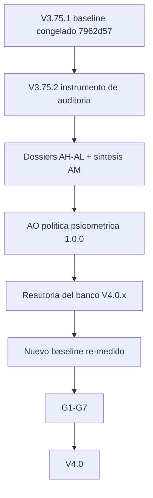

# AO · Política psicométrica del banco (diseño V4.0)

> **Tipo de documento:** **decisión de diseño**, no auditoría y no release. Este
> dossier **no mide nada nuevo**: convierte los hallazgos de la pausa pedagógica
> (`AH`–`AL`, sintetizados en `AM`) en una **política de autoría falsable** para
> que la reautoría de V4.0.x no sea una ronda de parches.
> **Baseline de referencia:** V3.75.1 · commit
> `7962d57de719ee8e4c62b0f3017c517b04714408` · tag `v3.75.1` ·
> `CURRICULUM_VERSION = 1.3.1` · `ASSESSMENT_VERSION = 1.0.0` ·
> `PLACEMENT_VERSION = 2.0.0` (`backend/services/curriculum.py:205,210,211`).
> **Instrumento de verificación:** `backend/scripts/audit_dossier.py` (solo
> lectura) y sus artefactos en `docs/audit/generated/`.
> **Regla de evidencia:** `[D]` declarado · `[A]` leído en el árbol · `[R]`
> reproducible. Aquí, además, `[POL]` **decisión de política** (no es un dato).
> **Regla dura:** este dossier **no modifica** ningún `.json` de banco, ningún
> servicio, el frontend, el launcher ni `docs/audit/generated/`. No es una
> release y no entra en `CHANGELOG.md`.

## Alcance

- **Se decide:** la **forma** y la **plausibilidad** de los ítems de opción
  múltiple de los cuatro bancos —**368** checks del currículum, **490** ítems del
  corpus de listening, **22** ítems de examen final y **24** de placement: **904
  ítems**— mediante cuatro reglas (`A` posición, `B` longitud, `C` número de
  opciones, `D` distractores) y sus invariantes verificables.
- **No se decide ni se toca:** el motor, los umbrales de dominio, el argmax del
  Planner ni la acreditación (ya auditados en `docs/audit/AG-AUDITORIA-MOTOR-V375.md`);
  la adecuación CEFR de contenido (auditada en `AA`–`AE`); la calibración con
  alumnos (sin cohortes no es medible, `docs/audit/PARKED.md`); los gates físicos
  `G1`–`G7`, que siguen `pending`.
- **No se corrige nada.** La política **ordena** la corrección de V4.0.x; no la
  ejecuta y **no añade ningún candado** que fije el estado actual.

## Procedencia: los 5 problemas que esta política debe resolver

La pausa pedagógica produjo **25 hallazgos que describen 5 problemas reales**
(la deduplicación está en `AM` §Cruces). `[D]`
`docs/audit/AM-SINTESIS-PSICOMETRIA-V3751.md:140-144`.

| # | Problema | Peor cifra medida | Ejes que lo describen |
|---|---|---|---|
| 1 | **Sesgo de longitud de la opción correcta** | Corpus C1/C2 **80 %** (16/20 en cada nivel) · checks C2 56,1 % · B1 checks 50,9 % · placement 50 % · estrategia «más larga» 46,5–61,1 % | `AH-1`…`AH-6`, `AL-1`…`AL-4` |
| 2 | **Sesgo posicional de los instrumentos de evaluación** | Exámenes 63,6 % en posición 0 (B1 75 %) y **posición 2 muerta en los 22** · placement **17/24 = 70,8 %** en posición 1; «marcar siempre 1» simula 6/8 y banda C2 | `AI-1`…`AI-4` |
| 3 | **Heterogeneidad de `k` (número de opciones)** | Corpus 100 % `k=4` · checks 97,3 % `k=3` con **10 fugas a `k=4`** (A1 listening) · exámenes/placement 100 % `k=3` · **0 ítems `k=2`** | `AJ-1`…`AJ-5`, `AL-6` |
| 4 | **Puntos ciegos del propio instrumento** | `quantity_literal` dispara **1/904** con **87** enunciados de cantidad (69 con ≥2 opciones numéricas); `prompt_keyword_echo` reporta 29/904 cuando el eco presente es **80/904** (51 suprimidos) | `AK-01`, `AK-02`, `AK-03` |
| 5 | **Gradiente por nivel no monótono** | Checks 25,7→36,4→50,9→42,9→36,5→56,1 (ρ=0,77) · corpus 29,5→39,5→60,0→40,0→80,0→80,0 (ρ=0,93); inversión B1→B2 en ambos | `AL-3`, `AL-4`, `AH-4` |

**Estado de partida que NO se reabre.** El P0 posicional de los 368 checks sigue
cerrado: `0:33,4 % · 1:33,2 % · 2:32,9 % · 3:0,5 %`, peor posición **33,5 %** bajo
el límite del 35 %, y `AL-5` verifica que **también se cumple por nivel**
(peor registro ≤34,5 %, sin posiciones muertas). `[D]`
`docs/audit/AM-SINTESIS-PSICOMETRIA-V3751.md:72-77`.

## Principios

1. **Neutralidad de forma.** Ningún rasgo formal del ítem —posición, longitud,
   `k`, puntuación, categoría— debe permitir acertar sin comprender. La forma es
   una propiedad del **banco**, no del alumno. `[POL]`
2. **El suelo de azar pertenece al instrumento que acredita.** Un ítem de
   práctica puede permitirse 4 opciones; un ítem que **gatea** el dominio no debe
   tener un suelo distinto del de sus pares. `[POL]`
3. **Un distractor plausible no es «algo que no es la respuesta».** Su función es
   discriminar: atraer al que aún no domina el concepto y resultar
   inequívocamente incorrecto para quien sí lo domina. `[POL]`
4. **`k` no escala con el CEFR.** La CEFR no exige un número de opciones; la
   sección §2 de `AJ` demuestra que `k` es propiedad del **banco**, no del nivel
   (checks `k=3` de A2 a C2; corpus `k=4` de A1 a C2). Cualquier regla que ate
   `k` al nivel sería inventada. `[D]`
5. **La política es una decisión, no una medición.** Un ítem con la correcta más
   larga **no** es por sí solo un ítem malo; lo medido es una **tasa**. La
   política fija techos y excepciones declaradas, no una prohibición ítem a
   ítem. `[D]` `docs/audit/AH-PSICO-LONGITUD.md:217-222`.
6. **Ningún candado antes de conocer el valor correcto.** Los invariantes se
   codifican **con** la corrección (acuerdo ya declarado en `AM` §Propuesta de
   fase de cierre). Fijar hoy las cifras del defecto repetiría el error del test
   de 329/368 de V3.70, que hubo que reescribir en V3.75.1. `[D]`

---

## Regla A — Posición

**Enunciado.** La posición de la opción correcta es uniforme en cada grupo de
igual `k`, en cada nivel y en cada destreza, y **ninguna posición queda muerta**.

| Parámetro | Valor | Procedencia |
|---|---|---|
| Techo por posición | **≤ 35 %** | límite que pidió la auditoría de V3.70 y que adoptó V3.75.1 |
| Estratificación | por **grupo de `k`**, por **nivel** y por **destreza** | hoy el reparto se mide por `k` y por nivel (`AL-5`); **por destreza no existe** |
| Posiciones muertas | **prohibidas** | `item-form` ya publica `dead_positions` como invariante |
| Regla de reautoría | `j % k` **dentro de cada destreza** (no solo global) | `backend/scripts/rebalance_mc_positions.py:88-103` aplica `j % k` global |
| Ámbito | los 368 checks **y** `assessments.json` (22 exámenes + 24 placement) | V3.75.1 no tocó `assessments.json` |

**Por qué.** En los checks el invariante ya se cumple (global y por nivel), pero
es **emergente y frágil**: la regla `j % k` es global y con `n`=20–35 un ítem
mueve 3–5 pp (`AL-5`). En los instrumentos de evaluación **no se cumple**: los
exámenes tienen la correcta en la posición 0 en 14/22 (B1 9/12) y la **posición 2
muerta en los 22**; el placement la concentra en la posición 1 en **17/24** y la
posición 2 aparece una sola vez (`pl-03`). `[R]`
`docs/audit/generated/item-form.md:27-30`, `docs/audit/AI-PSICO-ASSESSMENTS.md:70-96`.

**Extensión por destreza (el hallazgo `AI-3`).** La posición de los exámenes es
**función del bloque de destreza**, no aleatoria: en A1, `grammar` y `reading`
van a la posición 1 y `vocabulary`/`listening` a la 0; en B1, solo `grammar` va a
la 1. `[A]` `docs/audit/AI-PSICO-ASSESSMENTS.md:228-235`. Reposicionar solo en el
agregado dejaría bloques contiguos homogéneos, por eso la Regla A exige la regla
`j % k` **por destreza**.

**Qué NO dice la Regla A.** No exige que cada nivel use las tres posiciones con
la misma frecuencia *exacta* (con `n`=20 eso es ruido), y no obliga a barajar el
orden de servido: el barajado en cliente rompería la reproducibilidad y
`correct_index` se re-resuelve en servidor, así que el sesgo se corrige en el
**banco**, no en el transporte. `[D]` `docs/audit/AI-PSICO-ASSESSMENTS.md:257-260`.

**Cierra:** `AI-1` (P1), `AI-2`, `AI-3` (P2), `AI-4` (P3) y blinda `AL-5`.

---

## Regla B — Longitud

**Enunciado.** La longitud de la opción correcta no puede ser un predictor
explotable. No se impone «≤ 35 %» a la longitud —con `k` distinto el azar y la
varianza cambian—, sino un **techo relativo al azar** más una **excepción
justificada**.

Se distinguen **tres casos**:

**(B1) Diferencia pequeña (no es atajo).** En ítems estructurales de gramática o
vocabulario, una diferencia de 1–3 caracteres es incidental: la corrección es
sintáctica, no de longitud. Se acepta sin acción. `[R]` muestra cualitativa de
`AH` (`a2-m01-u01-l01-o02-c01` 21:19:20; `b2-m01-u01-l01-o02-c02` 42:39:41).

**(B2) Longitud artificialmente reveladora (techo).** Tasa de «correcta = más
larga única» por **lote** (nivel × banco) con techo:

| `k` | Azar `1/k` | Techo `≤ 1,5 ×` azar |
|---|---|---|
| 3 | 33,3 % | **≤ 50,0 %** |
| 4 | 25,0 % | **≤ 37,5 %** |

Aplicado a lo medido `[R]` `docs/audit/generated/item-form.md:35-56`:

| Lote | Tasa | ¿Cumple? |
|---|---|---|
| checks totales (368) | 39,1 % | Sí (límite 50,0 %) |
| checks A1 · A2 · C1 | 25,7 % · 36,4 % · 36,5 % | Sí |
| checks **B1** · **C2** | **50,9 %** · **56,1 %** | **No** |
| checks B2 | 42,9 % | Sí |
| corpus total (490) | 39,8 % | **No** (límite 37,5 %) |
| corpus A1 | 29,5 % | Sí |
| corpus A2 · B1 · B2 · **C1** · **C2** | 39,5 % · 60,0 % · 40,0 % · **80,0 %** · **80,0 %** | **No** (todos por encima de 37,5 %) |
| exámenes (22) | 36,4 % | Sí (límite 50,0 %) |
| placement (24) | 50,0 % | **En el límite exacto** → revisión obligatoria |

**(B3) Longitud justificada (excepción declarada).** La correcta **puede** ser
más larga si la longitud extra **aporta información necesaria** (paráfrasis,
glosa, *hedging*, cortesía) y el ítem **no es resoluble solo por longitud**. La
excepción no se auto-concede: se **enumera** y se revisa a mano. Criterio de
selección: ítems marcados por `shape_outlier` (ratio ≥ 1,5) en
`docs/audit/generated/distractor-signals.{md,json}` línea a línea, más la muestra
cualitativa de `AH` §5.

**Ejemplos que la política obliga a distinguir** `[D]` `AH` §5 y `AI` §6:

- **Justificada:** `pl-21` («most concise and formal version») tiene la correcta
  **más corta** por diseño: el ítem premia la concisión. Aquí «elegir la más
  larga» **falla**, y eso es correcto.
- **Justificada con matiz:** `b1-m01-u01-l02-o04-c01` («I see your point, but…»)
  es la única opción pragmáticamente correcta; la longitud **correlaciona** con
  la cortesía porque la cortesía **es** el constructo.
- **No justificada:** `c2-m01-u01-l01-o01-c03` (`understatement` 14 vs
  `hyperbole` 9 / `repetition` 10): es léxico puro; la correcta es la más larga
  por azar de autoría.
- **Contrapunto obligatorio:** `pl-18` (39 vs 21/17) es a la vez la más larga y
  la única de registro adecuado; sus distractores son de caricatura. La longitud
  y la **plausibilidad** (Regla D) apuntan al mismo defecto.

**Qué NO dice la Regla B.** No exige igualar longitudes carácter a carácter
(imposible en inglés sin degradar el ítem), y **no prohíbe** que la correcta sea
la más larga en un ítem concreto: regula la **tasa por lote** y obliga a
**declarar** las excepciones. `[POL]`

**Cierra:** `AH-1`…`AH-6`, `AL-1`…`AL-4` y la mitad de longitud de `AI-4`.

---

## Regla C — Número de opciones (`k`)

**Decisión.** El suelo de azar debe ser **uniforme en los instrumentos que
acreditan**. En consecuencia:

| Banco | `k` decidido | Azar | Motivo |
|---|---|---|---|
| Checks del currículum (368) | **3** | 33,3 % | gatea el mastery (`DEFAULT_THRESHOLD = 0.8`, `services/curriculum.py:190`) |
| Exámenes finales (22) | **3** | 33,3 % | gatea el nivel (`PASS_THRESHOLDS["level"]`) |
| Placement (24) | **3** | 33,3 % | instrumento de nivelación; mismo suelo que el resto de lo que mide el nivel |
| Corpus de listening (490) | **4** | 25,0 % | práctica deliberada (pipeline del generador); no gatea |

**Resolución del residuo `AJ-1`.** Los **10 checks de `k=4`** (todos A1,
`skill=listening`, objetivo `…-o03` de los módulos m03/m05/m06/m08/m09, checks
`c01`/`c02`; `[A]` `backend/curriculum/a1.json:982,994,1614,1626,1937,1949,2498,2510,2820,2832`)
se alinean a **`k=3`** para cumplir la decisión de que **todo lo que gatea**
tenga el mismo suelo. **No** se convierten los 358 restantes a `k=4`. `[D]`
`docs/audit/AJ-PSICO-FORMA.md:116-149`.

**Prohibiciones explícitas.**

- **`k=2` prohibido** en el banco (50 % de azar): hoy no existe ningún ítem
  `k=2` (0/904) y la política **mantiene** esa ausencia. `[R]` `AJ` §1.
- **`k` no escala con el nivel CEFR.** Rechazada la regla implícita «más nivel,
  más opciones»: la CEFR no la exige y `AJ` §2 demuestra que no existe hoy.
- **Rechazado «poner todo a `k=4`»**: subir el corpus a la práctica no debe
  trasladarse a la evaluación; el suelo de la evaluación subiría de 33,3 % a
  25 %, pero a costa de reautorar 46 ítems de instrumento para ganar 8,3 pp de
  exigencia, y `AM` §Propuesta lo veta expresamente.

**Efecto sobre el umbral.** Con `k=3` el suelo es 33,3 % y el umbral de dominio
0,8 sigue muy por encima: el cambio de `k` **no altera** por sí solo el veredicto
de maestría (`AJ` §7). `[D]`

**Cierra:** `AJ-1`, `AJ-2`, `AJ-3`, `AJ-4`, `AJ-5` y `AL-6`.

---

## Regla D — Distractores

**Definición operativa.** Un distractor es **plausible para quien todavía no
domina el concepto** e **inequívocamente incorrecto para quien sí lo domina**.

**Rúbrica (los 5 criterios, todos exigibles por ítem):**

| # | Criterio | Cómo se comprueba |
|---|---|---|
| D1 | Pertenece a la **misma categoría** semántica/gramatical que la correcta | revisión de autoría + `same_root`/solapamiento como pista, **nunca** como prueba |
| D2 | Es **recuperable** del enunciado o del audio (falso pero relacionado) | lectura del ítem; en listening, el distractor debe poder confundirse con lo oído |
| D3 | Al menos uno **codifica una misconception** concreta | declarar la misconception en la autoría del ítem |
| D4 | **Prohibido** el descartable solo por forma (longitud, mayúsculas, puntuación, artículo) | `shape_outlier` de `distractor-signals` + Regla B |
| D5 | El ítem debe **fallar** si el alumno solo usa forma o eco léxico | señales de `distractor-signals` + muestra cualitativa |

**Lo que la Regla D NO puede medir (declarado).** La plausibilidad semántica
exige **hablantes nativos o juicio experto**; ninguna heurística del repo la
mide. `AK` §AK-5 lo declara y se niega a inventar una métrica, y esta política
hereda esa honestidad: la rúbrica es **humana**, asistida por las señales. `[D]`
`docs/audit/AK-PSICO-DISTRACTORES.md:227-246`.

**Prerrequisitos del instrumento (no son parte de esta política, pero la
bloquean).** Antes de auditar D con las señales actuales hay que cerrar dos
puntos ciegos, ya propuestos como tarea de **bajo coste** en `AM`:

- `AK-01`: ampliar el léxico de `quantity_literal` (`how often`, `how early`,
  `what day`; plurales/ordinales) — hoy dispara **1/904** con **87** enunciados
  de cantidad. `[D]`
- `AK-02`: publicar el **eco no exclusivo** — hoy se reporta 29/904 cuando la
  correcta contiene una palabra del enunciado en **80/904**. `[D]`

Sin eso, un `0 %` de `quantity_literal` se leería como «sin problema» cuando es
un falso negativo. `[D]` `docs/audit/AM-SINTESIS-PSICOMETRIA-V3751.md:157-164`.

**Cierra:** parte de `AH` (dirección del outlier) y prepara el cierre de `AK-01`,
`AK-02`, `AK-03`.

---

## Tabla de invariantes

| Regla | Métrica | Umbral / condición | Grupo | Procedencia | Verificación |
|---|---|---|---|---|---|
| **A** | reparto de `correct_index` | **≤ 35 %** por posición y ninguna posición muerta | por `k`, por nivel y **por destreza**, en los 4 bancos | V3.75.1 (`AL-5`, `AI-2`), `rebalance_mc_positions.py` | `audit_dossier mc-bias` + `item-form` |
| **A** | regla de reautoría | `j % k` **por destreza** | checks y `assessments.json` | extensión de `rebalance_mc_positions.py:88-103` | mismo comando + `test_ped_content_cefr_v370.py` |
| **B** | `correct_is_longest` | **≤ 1,5 × azar** de su `k` (`k=3 ≤ 50,0 %` · `k=4 ≤ 37,5 %`) | por lote nivel × banco | `AH`, `AL` | `audit_dossier item-form` |
| **B** | ratio correcta/distractores | revisión de los `shape_outlier` (ratio ≥ 1,5) y **excepciones enumeradas** | ítem a ítem en la muestra | `AH` §5, `AI` §6 | `audit_dossier distractor-signals` |
| **C** | `k` por banco | **3** en checks/exámenes/placement · **4** en corpus · **0 ítems `k=2`** | los 4 bancos | `AJ-1`, `AJ-2` | `audit_dossier item-form` (`by_options_count`) |
| **D** | señales de distractor | rúbrica D1–D5 satisfecha; **sin** distractor descartable por forma | ítem a ítem | `AK`, `CEFR-REFERENCE.md:53` | `distractor-signals` + revisión humana |
| **D** | puntos ciegos del instrumento | `quantity_literal` y eco no exclusivo **declarados**; cifras leídas como **suelo** | instrumento | `AK-01`, `AK-02` | sondas de `AK` §Regenerar |
| **Decl. 5** | gradiente por nivel | **no se corrige**: se declara deriva de autoría | declaración | `AL-4` | `item-form` por nivel |

**Ningún candado/test se escribe ahora.** Todos los invariantes se codifican
**con** la corrección de V4.0.x, cuando el valor correcto sea conocido; el
registro de por qué está en `AM` §Propuesta de fase de cierre y en el principio 6.

## Aplicación por banco y orden

Orden por **riesgo de acreditación** (primero lo que gatea) y, dentro de él, por
magnitud medida. Posición y longitud se corrigen **en la misma pasada**: no son
ortogonales (`AH-5`: en checks, posición 0 concentra 44,7 % de «más larga» frente
a ~36,5 % en posiciones 1–2; `AH-3`/`AI-4`: 8/24 ítems de placement son *a la
vez* más largos y en posición 1). Corregir una sin la otra deja el atajo vivo.
`[D]` `AM` §Cruces 2.

| Orden | Lote | Qué se aplica | Por qué primero |
|---|---|---|---|
| 1 | **Checks B1 y C2** (53 + 57) + residuo `k=4` de A1 | A (por nivel y destreza, ya cumple) + B + C | alimentan el mastery; B1 50,9 % y C2 56,1 %/71,9 % son los peores lotes de checks |
| 2 | **Exámenes** (22) | A (incluida la **posición 2 muerta**) + B | gatean el nivel; B1 está a una destreza de ser explotable (`AI-2`) |
| 3 | **Placement** (24) | A + B, con `j % k` por destreza | exploit latente (6/8 → C2) que se activa **si** se publica la pantalla (`AE-04`) |
| 4 | **Corpus C1/C2 y B1** (40 + 25) | A (ya cumple) + B | el atajo **más fuerte** medido (80 %) pero es práctica, no acreditación |
| 5 | Resto de lotes + **re-medición** | A–D y nuevo baseline | cierre |

## Criterios de aceptación (Definition of Done de la reautoría V4.0.x)

Un lote se considera cerrado cuando, **medido con el instrumento versionado**:

1. Cumple la Regla A: ninguna posición > 35 % ni muerta, **por `k`, por nivel y
   por destreza**.
2. Cumple la Regla B: `correct_is_longest` ≤ 1,5 × azar de su `k` en el lote, y
   las excepciones (B3) están **enumeradas con su justificación**.
3. Cumple la Regla C: `k` es el decidido para su banco y no hay `k=2`.
4. Cumple la Regla D: rúbrica D1–D5 revisada; sin distractor descartable solo por
   forma.
5. El nuevo baseline se **re-mide completo** y sustituye como acta de deuda a la
   pausa de V3.75.1.

**Fuera de alcance del DoD:** la calibración con alumnos y los gates `G1`–`G7`,
que siguen `pending`.

## Protocolo de re-medición

Desde `backend` (PowerShell 5.1; sin `&&`). Los cinco subcomandos son de **solo
lectura** sobre el banco y **escriben** en `docs/audit/generated/`, que es el
artefacto de evidencia (`[D]` `backend/scripts/audit_dossier.py`):

```powershell
cd backend

# --- Forma: k, posición y longitud de la correcta ---
.\.venv\Scripts\python.exe -m scripts.audit_dossier item-form

# --- Señales de distractor inferible (con los puntos ciegos declarados) ---
.\.venv\Scripts\python.exe -m scripts.audit_dossier distractor-signals

# --- Sesgo posicional, con exámenes y placement separados ---
.\.venv\Scripts\python.exe -m scripts.audit_dossier mc-bias

# --- Instrumentos de evaluación (umbrales y aciertos) ---
.\.venv\Scripts\python.exe -m scripts.audit_dossier assessment-instruments

# --- Adecuación CEFR (se cita; no es el objeto de esta política) ---
.\.venv\Scripts\python.exe -m scripts.audit_dossier cefr-adequacy

# --- Contrato del instrumento y anti-deriva de los artefactos ---
.\.venv\Scripts\python.exe -m pytest -q tests/test_psy_item_form_v3751.py
.\.venv\Scripts\python.exe -m pytest -q tests/test_ped_content_cefr_v370.py
```

**Comparación:** cada cifra nueva se contrasta contra los artefactos de esta
pausa (`docs/audit/generated/`), que quedan como **línea base de la deuda**. Si
un invariante mejora, el test que lo fija (a escribir **con** la corrección)
debe actualizarse; si empeora, el lote vuelve a reautoría.

## Deuda del instrumento que esta política necesita

Declarada, **no implementada aquí** (coste bajo, tarea propia):

| Deuda | Estado | Efecto sobre la política |
|---|---|---|
| `AK-01` léxico de `quantity_literal` incompleto | 1/904 con 87 enunciados de cantidad | la Regla D no puede confiar en su `0 %` |
| `AK-02` eco no exclusivo no publicado | 29/904 reportado vs 80/904 real | la Regla D subestima el eco |
| `AK-03` `shape_outlier` solapa con `AH` | 167/172 (97,1 %) | la Regla B usa la señal de longitud, no una señal independiente |
| Reparto **por destreza** no medido en el instrumento | hoy solo global y por nivel | la Regla A lo exige; hoy se mide con corte auxiliar |

## Honestidad y límites

1. **Mide explotación, no aprendizaje.** Un ítem con la correcta más larga puede
   ser el más claro del banco; lo medido es la **tasa** de acierto explotable.
   `[D]` `AM` §Honestidad.
2. **La tasa real del atajo no se observa.** El motor guarda el acierto, no la
   posición marcada: las estrategias se **simulan**, no se miden en uso. `[D]`
3. **Los instrumentos de evaluación son 46 ítems, no 904.** El `17/24` del
   placement tiene IC95 % ≈ [52,6 %, 89,0 %]; las tasas por nivel (n=10, n=12) son
   aún más frágiles. `[D]`
4. **El placement es latente.** Ningún componente lo consume hoy; su P1 mide un
   riesgo **si** se publica la pantalla. `[D]` `PARKED.md`.
5. **La plausibilidad de distractores no está medida** (Regla D): es juicio
   humano. La política la exige, no la demuestra.
6. **La política no demuestra que el banco actual esté roto ítem a ítem.** Fija
   el **marco** para que la reautoría sea verificable.
7. **Los umbrales elegidos son decisiones, no hallazgos.** El 35 % viene de
   V3.75.1; el 1,5 × azar es nuevo y se adopta por coherencia con el anterior
   (`1,5 × 33,3 % ≈ 50 %`); el `k=3` de la evaluación es la convención vigente
   elevada a decisión. Si la calibración futura con alumnos sugiere otros
   valores, se versionan.

## Versionado de la política

- Se adopta el identificador conceptual **`POLITICA_PSICOMETRICA_VERSION = "1.0.0 (V4.0)"`**.
- **No se añade ninguna constante al código en esta fase.** El identificador se
  sella en la release de reautoría de V4.0.x, junto con los bumps de
  `CURRICULUM_VERSION` y `ASSESSMENT_VERSION` que la corrección exija.
- Cambiar una regla (umbral, `k`, criterio de distractor) **obliga a versionar**
  la política y a re-medir los cuatro bancos: es el equivalente de forma del
  contrato `frozen → medición → corrección` que ya rige el proyecto.

## Flujo



## Regenerar / Verificar

Este dossier **no produce artefacto propio**: sus cifras son las de los dossiers
`AH`–`AL` y de `docs/audit/generated/`, ya versionados. Para auditar la política:

```powershell
cd backend

# Los cinco subcomandos de medición (ver §Protocolo de re-medición).
.\.venv\Scripts\python.exe -m scripts.audit_dossier item-form
.\.venv\Scripts\python.exe -m scripts.audit_dossier distractor-signals
.\.venv\Scripts\python.exe -m scripts.audit_dossier mc-bias
.\.venv\Scripts\python.exe -m scripts.audit_dossier assessment-instruments

# Baseline de referencia.
git rev-parse HEAD          # 7962d57de719ee8e4c62b0f3017c517b04714408
git rev-list -n 1 v3.75.1   # el mismo commit
```

## Tests que respaldan

Este dossier **no añade ni modifica tests** (es decisión de diseño, no
implementación). Se apoya en el contrato del instrumento y en los candados
existentes:

| Fichero | Protege | Relación con AO |
|---|---|---|
| `backend/tests/test_psy_item_form_v3751.py` | Contrato del instrumento: bancos declarados, coherencia de `k`/posiciones, determinismo, solo lectura, anti-deriva de artefactos | Es el instrumento con el que se verificarán las Reglas A–C |
| `backend/tests/test_ped_content_cefr_v370.py` | Invariante de reparto `≤ 35 %` por grupo de `k` y estructura de los 368 checks | Es el candado vigente de la Regla A que la corrección deberá reexpresar por destreza |
| `backend/tests/test_ped_instruments_v370.py` | Placement, exámenes y umbrales de banda | Respalda las cifras de `AI` que la Regla A debe cerrar |

**Hueco de test declarado (a propósito):** no existe hoy ningún candado de forma
por destreza, ni de longitud por lote, ni de rúbrica de distractores. Esos tests
se escriben **con** la corrección de V4.0.x, no antes (principio 6).
