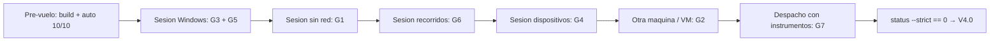
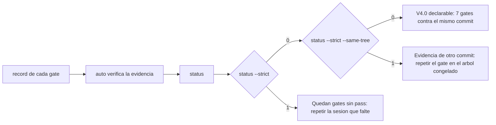

# Kit de validación — los 7 gates de la puerta de V4.0

> **Naturaleza:** planilla de **campo**. No es un protocolo nuevo ni sustituye a
> ninguno: **referencia** los protocolos existentes (RA, RB, `DEVICE_MATRIX`,
> `F-UX-JOURNEY`, `CONSTITUCION-PEDAGOGICA`) y añade lo único que faltaba para
> ejecutarlos: **pre-vuelo, orden por sesión y el comando `record` exacto de cada
> gate**.
> **Companion de:** `docs/audit/VALIDATION-RELEASE-V373.md` (el runbook, que
> define los 7 gates y cómo se usa el instrumento).
> **Puerta de V4.0:** `python scripts/validation_gate.py status --strict` debe
> salir **0** (los 7 gates en `pass`) y, con el árbol congelado,
> `status --strict --same-tree` debe salir **0** también: la puerta fuerte exige
> que la evidencia **sea de este mismo commit**.
> **Estado de partida (2026-09-17, `v3.73.2`):** `auto` **10/10** · 7 gates
> `pending`. Nada de esta planilla está ejecutado todavía.
> **Árbol congelado para la campaña (2026-09-20, `v3.75.8`):** pre-vuelo
> ejecutado — `auto` **10/10** con `--require-dist`, `runtime-audit` con
> **0 ausentes**, manifiesto offline completo y `llama3.1:8b` instalado. Los 7
> gates siguen `pending`: la campaña **no** se ha ejecutado (exige hardware, corte
> de red real y una máquina limpia).
> **RE-CONGELACIÓN (2026-09-21, `v3.76.0`):** el árbol que se certifica pasa a ser
> el de `v3.76.0` (Fase 3 del P0: PIN opcional por perfil), porque **no había
> ningún `record` grabado** y por tanto nada que invalidar. El pre-vuelo se
> repitió y también dio **10/10**. **Leer la sección «Re-congelación» en §A antes
> de empezar.** Los 7 gates siguen `pending`.
> **RE-CONGELACIÓN (2026-09-22, `v3.80.1`):** el árbol que se certifica pasa a ser
> el de **`v3.80.1`** (cierre de la auditoría de V3.80.0: la carrera generación ↔
> edición de la cara B, el badge al borrar, la `X` del diccionario, la semántica
> ARIA de los dos selectores y el `lang` de las tarjetas manuales, más las dos
> sondas visuales permanentes). V3.78.0, V3.79.0 y V3.80.0 **añadieron producto**
> después de `v3.75.8`, así que el ancla documental se había quedado atrás. La
> campaña sigue con **0 `record`** grabados: **no hay nada que invalidar**. Se
> ancla **por tag, sin fijar SHA a mano** (regla de V3.73.5). Los 7 gates siguen
> `pending`.
> **RE-CONGELACIÓN (2026-09-23, `v3.81.0`):** el árbol que se certifica pasa a ser
> el de **`v3.81.0`** —gestión de usuarios: cuentas con contraseña y email, alta y
> baja autoservicio, retirada del PIN y consola de Usuarios del lanzador—, que
> además publica el lote de estabilización que se iba a publicar como `v3.80.1`.
> La campaña sigue con **0 `record`** grabados (**no hay nada que invalidar**) y el
> ancla se mueve **por tag, sin fijar SHA a mano** (regla de V3.73.5). **Ojo: este
> salto sí cambia el contrato de la API de forma NO aditiva** —`PUT
> /api/session/pin` desaparece y `POST /api/session` exige contraseña si la cuenta
> la tiene—, así que los instrumentos de campo deben conocerlo. Los 7 gates siguen
> `pending`.

**Regla de oro:** un gate no se cierra con una opinión. Se cierra con `record`, y
**sin `--notes` el instrumento rechaza el registro**. Un `fail` o un `skip` son
resultados válidos y **se registran con su motivo**; lo prohibido es declarar
`pass` sin haberlo hecho.

---

## A · Pre-vuelo (una vez, antes de tocar hardware)

Se ejecuta en el **árbol congelado** que se va a validar. Si el árbol cambia
después, los gates quedan marcados como «grabado en vX» y hay que repetirlos.

```powershell
# 1. El artefacto de la UI y las comprobaciones estáticas (debe dar 10/10)
cd frontend
npm run build
cd ..
backend\.venv\Scripts\python.exe scripts\validation_gate.py auto --require-dist

# 2. Identidad del árbol que se sella en cada `record`
Select-String -Path backend\config.py -Pattern '^VERSION ='
git rev-parse HEAD
git status --short          # debe estar limpio

# 3. Manifiesto offline: nada ausente (RA-RUNTIME-OFFLINE.md §5, preparación)
cd backend
.venv\Scripts\python.exe -m scripts.audit_dossier runtime-audit   # E3: "Ausentes: 0"
.venv\Scripts\python.exe download_models.py --check
cd ..
```

**Anotar aquí** (rellenado en el pre-vuelo de la campaña de certificación V4.0; es
la identidad que debe quedar sellada en los **7** `record`):

**Campaña de certificación V4.0 · pre-vuelo del 2026-09-20:**

El árbol congelado es el que declara **`VERSION` `3.75.8`**. Sus tres commits y sus
runs de CI (los tres `success`, **12/12** jobs) son:

| Dato | Valor |
|---|---|
| Commit base (tag `v3.75.8`) | `c858e88ae8d66a0fdc93263c490eecd0651570f8` · run `35535445951` |
| Commit de congelación (test de la `X` + su declaración) | `f9567e6394fa2abed67d551553a3e18166f81cd8` · run `35536208082` |
| Árbol congelado con el pre-vuelo sellado (**el que se certifica**) | `6e4888f4ed45404f5c3054b8fa9da0fe9b98f937` · run `35540647216` |
| Fecha de la sesión | 2026-09-20 |
| Equipo / SO | PC del autor · Windows `10.0.26200` |
| Modelo de Ollama instalado (`ollama list`) | `llama3.1:8b` (`46e0c10c039e`) |

> **Qué se sella en los 7 `record`.** El `head_sha` **y** el `--ci-run` del `HEAD`
> real en el momento de grabar (`git rev-parse HEAD`), **no** una fila fija de esta
> tabla: el instrumento exige que los 7 `head_sha` sean el árbol validado
> (`status --strict --same-tree`), y cualquier commit posterior que solo toque
> documentación mueve el `HEAD` **sin** mover el artefacto. Estos tres commits
> **no** cambian producto entre sí: el diff de los dos últimos es **solo** el caso
> de test de la `X`, su declaración en `docs/UI_V3.1.md` y `docs/audit/PARKED.md`, y
> esta misma anotación del pre-vuelo.

### Re-congelación del 2026-09-21 — el árbol que se certifica pasa a ser `v3.76.0`

La Fase 3 del P0 (**PIN opcional por perfil**, `release-notes-v3.76.0.md`) abre el
contrato de `POST /api/session` y migra la BD, así que **es producto**, no
documentación. La regla de arriba («un commit documental mueve el `HEAD` sin mover
el artefacto») **no** la cubre, y por eso se declara aquí aparte.

**No invalida nada, y la razón es medible:** la campaña tenía **0 `record`** —los 7
gates en `pending`— cuando el árbol se movió. No había evidencia que desmentir. Si
se hubiera movido con `record` ya grabados, `--same-tree` los habría marcado como
de otro árbol, y ese es exactamente el motivo por el que el PIN entró **después**
de congelar y no en medio.

Lo que sí cambia, y hay que leerlo antes de empezar la campaña:

- **El árbol certificado es el de ahora**, no `6e4888f`: el `head_sha` de los 7
  `record` es el **`HEAD` real en el momento de grabar** y `--same-tree` exige que
  los siete coincidan. La identidad de `v3.75.8` de la tabla de arriba queda como
  **historia del pre-vuelo**, no como el árbol a validar.
- **El pre-vuelo se repitió sobre `v3.76.0`** (abajo), porque el árbol cambió de
  producto y el pre-vuelo anterior describía otro.
- **La matriz de los 9 ejes de G7 no se re-deriva**, y esto se comprobó en vez de
  argumentarse: los dossiers se regeneraron **después** del diff del PIN y
  `docs/audit/generated/` quedó **igual** (cero diferencia en los nueve). La
  release no toca currículum, corpus, evaluaciones ni banco de listening, y los
  instrumentos del dossier no leen identidad, sesión ni seguridad, así que las
  cifras son de este árbol.
- **El contrato de la API cambia respecto a `v3.75.8`**: `POST /api/session` puede
  responder `401 PIN_REQUIRED` / `401 PIN_INVALID` / `429 PIN_THROTTLED`, y existe
  `PUT /api/session/pin`. Cualquier protocolo de campo que abra sesión **debe**
  tenerlo en cuenta: un perfil **sin** PIN abre como siempre, que es el caso de
  todos los perfiles existentes salvo que alguien active la mitigación.

**Pre-vuelo de `v3.76.0` (2026-09-21):**

| Comprobación | Resultado |
|---|---|
| `npm run build` | correcto; el bundle publica `3.76.0` |
| `python scripts/validation_gate.py auto --require-dist` | **10/10** |
| `.venv\Scripts\python.exe -m scripts.audit_dossier runtime-audit` | **Ausentes: 0** |
| `.venv\Scripts\python.exe download_models.py --check` | todo lo que debe estar en disco, en disco |
| `ollama list` | `llama3.1:8b` (`46e0c10c039e`) instalado |
| Dossiers de G7 regenerados tras el diff del PIN | **cero diferencia** |
| 7 gates | **`pending`** (la campaña sigue sin ejecutarse: exige hardware, corte de red real y una máquina limpia) |


### Re-congelación del 2026-09-23 — el árbol que se certifica pasa a ser `v3.81.0`

`v3.75.8` fue el árbol que se congeló, y **desde entonces se publicó producto**:
V3.78.0 (diccionario en tres modos + Flashcards), V3.79.0 (el perfil), V3.80.0
(Flashcards a fondo), el lote de estabilización de `v3.80.1` y **V3.81.0**, que es
la **Fase 3 del P0 de identidad** —cuentas con contraseña y email—. Las notas
anteriores ya movieron el ancla dos veces; esta la vuelve a mover al árbol actual.

**No invalida nada, y la razón es la misma de siempre y es medible:** la campaña
tiene **0 `record`** —los 7 gates en `pending`— así que no hay evidencia que
desmentir.

Lo que cambia, y hay que leerlo antes de empezar la campaña:

- **El árbol certificado es el de `v3.81.0`**, identificado **por tag** y **sin
  fijar un SHA a mano** (regla de V3.73.5): el `head_sha` de los 7 `record` es el
  **`HEAD` real en el momento de grabar**. Las tablas de identidad anteriores
  (`v3.75.8`, `v3.76.0`) son **historia del pre-vuelo**, no el árbol a validar.
- **El pre-vuelo hay que repetirlo sobre `v3.81.0`** antes de la campaña (los
  comandos de §A). No se ha ejecutado aquí: esta release solo mueve el ancla
  documental y deja el pre-vuelo para la sesión de campo, que exige hardware.
- **V3.78.0–V3.81.0 no tocan currículum, corpus, evaluaciones ni banco de
  listening** (todos los bumpos de versión de motor están explícitamente fuera),
  así que los **9 dossiers de G7 no se re-derivan**: los instrumentos del dossier
  no leen mazos, tarjetas, traducción propia, cuentas ni correo.
- **⚠ El contrato de la API ya NO es solo aditivo.** Hasta `v3.80.0` todo lo
  añadido era aditivo; `v3.81.0` **retira** `PUT /api/session/pin` (el PIN de
  perfil desaparece) y **cambia** `POST /api/session`, que ahora exige `password`
  cuando la cuenta tiene credencial (`401 PASSWORD_REQUIRED` /
  `PASSWORD_INVALID`, `429 PASSWORD_THROTTLED`). Añade `/api/account/verify`,
  `/api/account/resend-verification`, `/api/account/unenroll` y
  `PUT /api/session/password`. Cualquier instrumento de campo que abriera sesión
  con un `user_id` a secas **debe** conocer el contrato nuevo antes de grabar: es
  la diferencia entre esta re-congelación y las dos anteriores.
- **Los 7 gates siguen `pending`.** Esta re-congelación **no** ejecuta ni cierra
  ninguno.

### Re-congelación del 2026-09-22 — el árbol que se certifica pasa a ser `v3.80.1`

`v3.75.8` fue el árbol que se congeló en septiembre, pero **desde entonces se
publicó producto**: V3.78.0 (diccionario en tres modos + Flashcards), V3.79.0
(el perfil) y V3.80.0 (Flashcards a fondo) y V3.80.1 (esta estabilización). La
nota de `v3.76.0` de arriba ya movió el ancla una vez; esta la vuelve a mover al
**cierre de la auditoría de V3.80.0**, que es el árbol actual.

**No invalida nada, y la razón es la misma de siempre y es medible:** la campaña
tiene **0 `record`** —los 7 gates en `pending`— así que no hay evidencia que
desmentir. `--same-tree` no puede marcar nada como «de otro árbol» porque no hay
grabaciones.

Lo que cambia, y hay que leerlo antes de empezar la campaña:

- **El árbol certificado es el de `v3.80.1`**, identificado **por tag** y **sin
  fijar un SHA a mano** (regla de V3.73.5): el `head_sha` de los 7 `record` es el
  **`HEAD` real en el momento de grabar**. Las tablas de identidad de `v3.75.8`
  (arriba) y `v3.76.0` son **historia del pre-vuelo**, no el árbol a validar.
- **El pre-vuelo hay que repetirlo sobre `v3.80.1`** antes de la campaña (los
  comandos de §A). No se ha ejecutado aquí: esta release solo mueve el ancla
  documental y deja el pre-vuelo para la sesión de campo, que exige hardware.
- **V3.78.0–V3.80.1 no tocan currículum, corpus, evaluaciones ni banco de
  listening** (todos los bumpos de versión de motor están explícitamente fuera),
  así que los **9 dossiers de G7 no se re-derivan** por estos cambios: los
  instrumentos del dossier no leen mazos, tarjetas, traducción propia ni
  accesibilidad de tabs. Si alguno se regenerara, debería salir sin diferencia.
- **El contrato de la API respecto a `v3.76.0` es aditivo:** se añadieron los
  endpoints de Flashcards (V3.78.0) y `PATCH /api/vocabulary/items` (V3.80.0).
  Cualquier protocolo de campo que recorra la superficie autenticada debe
  conocerlos; ninguno cambia el significado de los existentes.
- **Los 7 gates siguen `pending`.** Esta re-congelación **no** ejecuta ni cierra
  ninguno.

**Pre-vuelo de `v3.76.0` (2026-09-21) — es historia y no se reescribe:**

| Comprobación | Resultado |
|---|---|
| `npm run build` | correcto; el bundle publica `3.76.0` |
| `python scripts/validation_gate.py auto --require-dist` | **10/10** |
| `.venv\Scripts\python.exe -m scripts.audit_dossier runtime-audit` | **Ausentes: 0** |
| `.venv\Scripts\python.exe download_models.py --check` | todo lo que debe estar en disco, en disco |
| `ollama list` | `llama3.1:8b` (`46e0c10c039e`) instalado |
| Dossiers de G7 regenerados tras el diff del PIN | **cero diferencia** |
| 7 gates | **`pending`** (la campaña sigue sin ejecutarse: exige hardware, corte de red real y una máquina limpia) |


**Pre-vuelo histórico (`v3.73.2`, 2026-09-17) — es historia y no se reescribe:**

| Dato | Valor |
|---|---|
| `VERSION` | `3.73.6` |
| `HEAD` (SHA) | `13cc30bb6d30c61a0c04708703f60f838f89d82d` |
| Run de CI que publicó ese commit (id numérico) | `35268213802` (`success`, **11/11** jobs) |
| Fecha de la sesión | 2026-09-17 |
| Equipo / SO | PC del autor · Windows `10.0.26200` |
| Modelo de Ollama instalado (`ollama list`) | `llama3.1:8b` (`46e0c10c039e`) |

**URLs de producto** (desde V3.72 solo hay **un** origen; el puerto `5173` es el
dev server de Vite y **no** forma parte del runtime de producto):

- Local: `https://localhost:8000`
- LAN: `https://<ip>:8000` (la muestra el launcher; también sirve
  `https://<hostname>.local:8000` si `local_url_available` es `true`)

**Recordatorio del instrumento:** `record` sella estado, notas, fecha UTC, la
`VERSION` del árbol, **el commit validado (`head_sha`)** y, con `--ci-run <id>`,
la run de CI que lo publicó: la cadena `commit → run → gates` queda dentro de la
evidencia. Un **`pass` sin commit no se registra** (sin git en el árbol, el
registro se rechaza); `fail`/`skip`/`pending` sí se pueden registrar sin SHA,
porque declaran un no-cierre. El `<run>` de los comandos de esta planilla es el id
anotado en la tabla de arriba. La comprobación 10 de `auto` valida después que la
evidencia no tenga gates ni estados inventados ni notas vacías, y que el `pass`
traiga `head_sha` con formato de commit.

---

## B · Orden de ejecución recomendado

Cada sesión cierra **varios** gates: se agrupan por lo que exigen (hardware,
red, tiempo), no por número.



| Sesión | Gates | Por qué van juntos |
|---|---|---|
| 1 · Windows real | G3 + G5 | La misma sesión con launcher, micrófono y altavoces reales cubre los tres |
| 2 · Sin red | G1 | Exige cortar Wi-Fi **y** Ethernet: no se puede combinar con nada que necesite red |
| 3 · Recorridos | G6 | Recorrido largo por la UI; necesita la app estable y un perfil con datos |
| 4 · Dispositivos | G4 | Móvil/tablet sobre la LAN: mismo servidor, otro hardware |
| 5 · Otra máquina/VM | G2 | Es la única que exige un sistema **físicamente limpio** |
| 6 · Despacho | G7 | Es lectura de contenido e instrumentos; no necesita la app arrancada |

---

## C · Hoja por gate

### G1 · `offline-fisico` — los 12 flujos con la red cortada

- **Protocolo:** `docs/audit/RA-RUNTIME-OFFLINE.md` §5 (tabla E5).
- **Precondiciones:** pre-vuelo completo; manifiesto de modelos **sin ausentes**;
  Ollama con el modelo por defecto descargado.
- **Pasos:**
  1. Anotar el manifiesto (`runtime-audit` + `download_models.py --check`).
  2. **Desconectar Wi-Fi y Ethernet** (no basta desactivar el DNS: se buscan
     dependencias de Internet, no resolución de nombres).
  3. Arrancar con el launcher y abrir `https://localhost:8000`.
  4. Ejecutar los 12 flujos y anotar ✅/⚠️/❌ en la tabla E5 del dossier:
     `frontend`, `backend`, `SQLite`, `Ollama`, `Whisper`, `Piper`, `dictionary`,
     `TTS`, `STT`, `course`, `practice`, `review`.
  5. `backend`: `GET /api/health` y `GET /api/health/ready` (5xx o timeout =
     FALLO).
- **FALLO:** un flujo que no funciona y **no se declara**. Un solo FALLO no
  declarado invalida el gate. Si falta una voz/modelo, anotar el **tiempo de
  espera** (RA-03/RD-01 lo acotan, pero se mide).
- **Evidencia a capturar:** los 12 veredictos con fecha y `VERSION`; los logs de
  los flujos degradados.
- **Registro:**

```powershell
backend\.venv\Scripts\python.exe scripts\validation_gate.py record offline-fisico pass --ci-run <run> `
  --notes "12/12 flujos OK con Wi-Fi y Ethernet desconectados (v3.73.2); Whisper/Piper desde disco, dictionary no cacheada degrada sin colgarse"
```

### G2 · `maquina-limpia` — instalación desde cero

- **Protocolo:** runbook de `README.md` · `docs/audit/RB-INSTALACION.md`.
- **Precondiciones:** un **clon o sistema recién instalado** (otra máquina o VM),
  sin `backend/models/` ni `frontend/dist/` (no se versionan).
- **Pasos:**
  1. Python + `requirements.txt` + `requirements-dev.txt`.
  2. Ollama instalado y `ollama pull llama3.1:8b` (**paso manual**: el proyecto no
     lo verifica).
  3. `download_models.py --check` **antes** de descargar, y después
     `download_models.py` (~1,1 GB: Piper EN+ES ~120 MB + Whisper `small`
     927 MB).
  4. `npm run build` (**Node/npm son requisito de COMPILACIÓN**, no de ejecución:
     con el `dist` construido la app arranca sin Node — RC-01, V3.72).
  5. Arrancar desde el launcher y abrir `https://localhost:8000`.
- **FALLO:** cualquier paso tácito (algo que hubo que hacer a mano y el runbook no
  decía), o el arranque sin `dist` sin mensaje accionable.
- **Evidencia a capturar:** qué se instaló, qué falló, qué se hizo a mano y
  cuánto tardó la descarga.
- **Registro:**

```powershell
backend\.venv\Scripts\python.exe scripts\validation_gate.py record maquina-limpia pass --ci-run <run> `
  --notes "Clon limpio en VM Windows: Python+deps, ollama pull llama3.1:8b, download_models.py (~1,1 GB), npm run build y launcher OK; ningun paso tacito"
```

### G3 · `launcher-windows` — Windows real

- **Protocolo:** `release-notes-v3.73.0.md` §Verificación (bloque C).
- **Precondiciones:** `frontend/dist` construido (el launcher lo construye si
  falta, pero con Node instalado); firewall permitiendo **solo** el `:8000`.
- **Pasos:** `start → HTTPS en :8000 → abre el navegador → micrófono → TTS →
  STT → chat → persistencia` (cerrar y reabrir: el estado sigue).
- **Por qué no lo cubre el CI:** el job `launcher-windows` prueba el launcher y
  `product-origin-windows` el origen de producto sobre HTTPS, pero **ninguno**
  prueba un navegador real ni el micrófono.
- **FALLO:** arranque que no llega a servir la UI, o cualquiera de los pasos que
  no funcione con el navegador y el micrófono reales.
- **Evidencia a capturar:** capturas del arranque y de la URL LAN mostrada; el
  flujo completo en el orden indicado.
- **Registro:**

```powershell
backend\.venv\Scripts\python.exe scripts\validation_gate.py record launcher-windows pass --ci-run <run> `
  --notes "Launcher en Windows 11: start, HTTPS :8000, navegador, microfono, TTS, STT, chat y persistencia tras reinicio OK"
```

### G4 · `dispositivos` — móvil y tablet

- **Protocolo:** `docs/DEVICE_MATRIX.md` (matriz de hardware **y** matriz de
  interacción).
- **Precondiciones:** dispositivo en la **misma Wi-Fi**; certificado autofirmado
  aceptado (Android: Avanzado → Continuar; iPhone/iPad: ajustes de Safari).
- **Pasos:** cubrir las filas de la matriz de hardware (HTTPS, mDNS, micrófono,
  audio, listening, speaking, **recuperación de permiso sin recargar**) y la
  matriz de interacción (touch/tap targets, viewport y scroll, teclado en
  pantalla, orientación).
- **FALLO:** **no basta con capturas.** Un micrófono que no captura, una
  actividad que pierde estado al rotar o un permiso que no se refleja sin
  recargar son FALLO.
- **Evidencia a capturar:** qué dispositivos/navegadores se probaron, resultados
  y notas de cada celda; copiar el resultado a `DEVICE_MATRIX.md`.
- **Registro:**

```powershell
backend\.venv\Scripts\python.exe scripts\validation_gate.py record dispositivos skip --ci-run <run> `
  --notes "Pendiente: no hay dispositivo movil fisico disponible en esta sesion (accion humana)"
```

### G5 · `audio-stt-tts` — voz de verdad

- **Precondiciones:** micrófono y altavoces reales; voces Piper en disco.
- **Pasos:**
  1. Una grabación y transcripción reales (una actividad de speaking).
  2. Una reproducción real (TTS en inglés **y** español).
  3. Provocar/observar el **aviso de voz degradada** (`DegradedVoiceNotice`) y
     comprobar que muestra la voz **realmente usada**.
- **FALLO:** transcripción vacía, silencio, o degradación silenciosa (si la voz
  cae a una peor, el alumno **debe** enterarse: V3.72 lo hizo observable).
- **Evidencia a capturar:** el texto transcrito, el idioma/voz usada y la captura
  del aviso si aparece.
- **Registro:**

```powershell
backend\.venv\Scripts\python.exe scripts\validation_gate.py record audio-stt-tts pass --ci-run <run> `
  --notes "Grabacion+transcripcion reales OK; TTS en EN y ES OK; aviso de voz degradada mostro la voz realmente usada"
```

### G6 · `journeys` — todos los recorridos

- **Protocolo:** `docs/audit/F-UX-JOURNEY.md` (incluye el protocolo de «usuario
  real» de ~25 min como referencia de observación).
- **Precondiciones:** perfil con datos (al menos una semana de uso idealmente).
- **Pasos:** recorrer de principio a fin Home, Today, Curso, Aprender, Listening,
  Vocabulary, Grammar, Reading, Speaking, Conversation, Review y Progress.
- **FALLO:** un recorrido que no se puede completar, o el «por qué esta
  actividad» (`WhyThisActivity`) ausente donde el motor lo declara.
- **Evidencia a capturar:** recorrido, incidencia y si el «por qué» aparece.
- **Registro:**

```powershell
backend\.venv\Scripts\python.exe scripts\validation_gate.py record journeys pass --ci-run <run> `
  --notes "12 recorridos completos sin bloqueo; el porque de la actividad aparece en Home, NextStep y cola de repaso"
```

### G7 · `pedagogia` — auditoría final del contenido

- **Protocolo:** `docs/CONSTITUCION-PEDAGOGICA.md` ·
  `docs/audit/AF-SINTESIS-PEDAGOGICA-V370.md`.
- **Matriz de lectura (V3.76, atajo de la revisión):**
  `docs/audit/G7-MATRIZ-LECTURA.md` — los 9 ejes con su cifra de cabecera, las
  cuatro cosas que hay que leer antes de firmar y la decisión que le toca a quien
  firma. Está **escrita sobre este árbol** (`v3.76.0` · `d7fbfabb`) y se comprobó
  que el diff del PIN no mueve ninguno de los nueve dossiers, así que las cifras
  **no** hay que re-derivarlas: los comandos de abajo son para verificar, no para
  empezar de cero.
- **Pasos:** regenerar los instrumentos de solo lectura y revisar la matriz de
  hallazgos:

```powershell
cd backend
.venv\Scripts\python.exe -m scripts.audit_dossier corpus-stats
.venv\Scripts\python.exe -m scripts.audit_dossier curriculum-stats
.venv\Scripts\python.exe -m scripts.audit_dossier speaking-stats
.venv\Scripts\python.exe -m scripts.audit_dossier mc-bias
.venv\Scripts\python.exe -m scripts.audit_dossier cefr-adequacy
.venv\Scripts\python.exe -m scripts.audit_dossier skill-coverage
.venv\Scripts\python.exe -m scripts.audit_dossier feedback-coverage
.venv\Scripts\python.exe -m scripts.audit_dossier mastery-claims
.venv\Scripts\python.exe -m scripts.audit_dossier assessment-instruments
```

- **Qué se mide:** léxico (frecuencia, utilidad, CEFR, colocaciones, phrasal
  verbs, chunks), gramática (progresión, errores frecuentes, contrastes,
  transferencia), listening (bottom-up/top-down, connected speech, cloze,
  dictation, shadowing, acentos, velocidad) y speaking (inteligibilidad,
  pronunciación, fluidez, interacción, reparación).
- **Candado conceptual:** **no** convertir «número de palabras conocidas» en
  «nivel CEFR» (regla **R3** de la constitución). El nivel estimado es interno y
  se declara como tal.
- **FALLO:** una afirmación de maestría sin evidencia que la respalde (reglas
  R1–R7), o una propiedad declarada que los instrumentos desmientan.
- **Evidencia a capturar:** veredicto por eje con las cifras regeneradas; lo que
  la medición **no demuestra** se anota como tal (no como incumplimiento).
- **Registro:**

```powershell
backend\.venv\Scripts\python.exe scripts\validation_gate.py record pedagogia pass --ci-run <run> `
  --notes "9 instrumentos regenerados; contenido en banda, sin afirmaciones sin evidencia; vocabulario NO se presenta como nivel CEFR"
```

---

## D · Cierre

```powershell
# Estado legible (informa siempre)
backend\.venv\Scripts\python.exe scripts\validation_gate.py status

# La puerta real de V4.0: sale 0 solo con los 7 gates en `pass`
backend\.venv\Scripts\python.exe scripts\validation_gate.py status --strict

# La puerta fuerte: además, la evidencia tiene que ser de ESTE commit
backend\.venv\Scripts\python.exe scripts\validation_gate.py status --strict --same-tree
```

- **7/7 en `pass`** → V4.0 puede declararse (y `auto` debe seguir en 10/10). Si
  además `--same-tree` sale **0**, los siete gates se probaron contra el **mismo
  commit**: es la forma de cierre que exige la certificación de V4.0.
- **Algún `fail`** → se **deja registrado con su motivo** y se abre incidencia;
  no se reescribe a `pass`. El gate se puede volver a registrar cuando se
  corrija.
- **Algún `skip`** → el gate **no está cerrado**; `status --strict` seguirá
  saliendo 1. Un `skip` es honesto, no un cierre.



---

## E · Lo que este kit NO es

- **No ejecuta** ningún flujo de la app: los ejecuta una persona.
- **No puede** simular el corte de red, Windows real, un móvil real ni un
  micrófono real.
- **No sustituye** a los protocolos: si un protocolo cambia, manda el protocolo
  (este kit solo lo ordena y lo registra).
- **No cierra** ningún gate por sí mismo: la verdad es la que registra el
  instrumento en `docs/audit/validation-evidence.json`.
