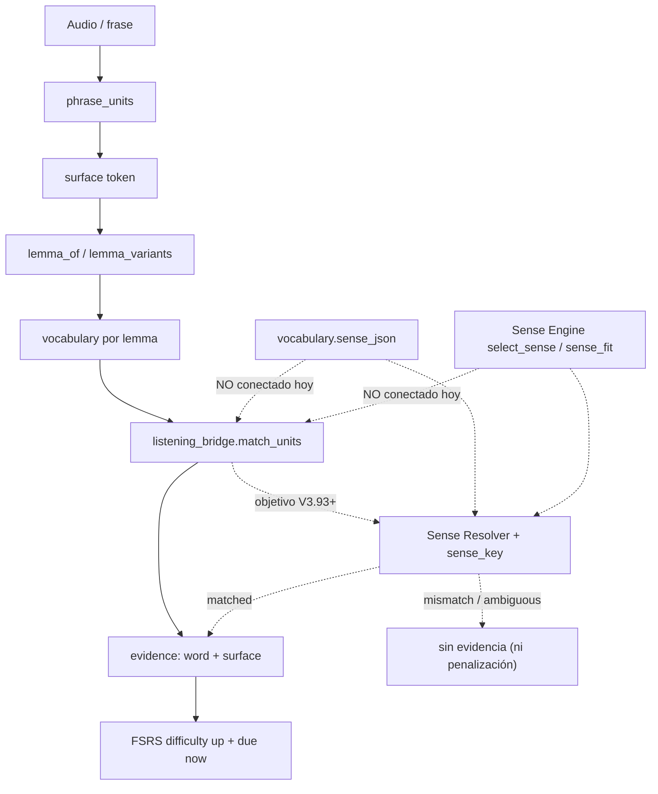

# SENSE-CONTEXT-01 — Auditoría de V3.92 y diseño de evidencia sense-aware

> **Naturaleza:** dossier de **auditoría + diseño**. No cambia comportamiento de
> producción: V3.92 sigue siendo exactamente lo que se publicó. Lo que añade es
> (a) la verificación reproducible de que el circuito Listening → FSRS es
> **lemma-based**, (b) el **diseño ejecutable** de la evidencia sense-aware
> (`sense_key`, Sense Resolver y matriz `matched`/`mismatch`/`ambiguous`) fijado con
> tests de aceptación, y (c) el registro honesto de lo que queda **deferido** a
> V3.93+.
> **Estado:** **APROBADO el 2026-09-30** y fusionado a `main` (`87f463c`). El
> diseño de §6–§9 es el contrato de **V3.93+**: su implementación ya está
> desbloqueada. Los ocho gates humanos siguen `pending`;
> `docs/audit/validation-evidence.json` sigue sin existir.
>
> **Aprobación (2026-09-30):** el gerente aprueba el diseño y autoriza arrancar
> **V3.93**. Lo deferido en §11 deja de estar bloqueado; el orden de ejecución lo
> fija el plan de V3.93.

---

## 0 · Veredicto

V3.92 es **sólida** y su QA declarado se reproduce en este árbol. La acepción
**se persiste** (`vocabulary.sense_json`) y se **sirve** en solo lectura en el
léxico. Pero el circuito **Listening → FSRS sigue siendo lemma-based**: la
acepción se guarda y **no se usa** para decidir qué evidencia se genera. Es una
**frontera declarada** (las propias notas de release de V3.92 lo dicen: «el
emparejamiento es morfológico y por lemma, no semántico»), no un defecto oculto.

La capacidad de resolver el sentido **ya existe** (`services.semantics`:
`select_sense`/`sense_fit`) y resuelve bien el caso de manual —lo demuestra la
evidencia de §4—, pero **nadie la llama desde el puente**. Este dossier convierte
esa distancia en un diseño aprobable: **identidad de acepción + resolver
conservador + contrato del borde + robustez del ledger + runbook de gates**.
Aprobar este documento es aprobar el contrato de V3.93+, no una release.

---

## 1 · Alcance y método

**Se audita:** `backend/services/listening_bridge.py`, `backend/services/fsrs.py`
(`apply_difficulty_evidence`), `backend/domain/listening.py`
(`_apply_difficulty_evidence`), `backend/repositories/listening.py`,
`backend/repositories/vocabulary.py`, `backend/services/semantics.py` (Sense
Engine 2.0), `backend/services/daily_plan.py` (`day_metrics`), el borde
`backend/schemas/listening.py` ↔ `frontend/src/api/listening.ts`, y los ocho gates
de `scripts/validation_gate.py`.

**No se audita:** el scoring del diccionario (V3.91), la generación de acepciones
(V3.88–V3.91), la cola de repaso de Listening (V3.89) ni el objetivo diario
(V3.90). Tampoco se re-derivan los dossiers de G7: esta fase no toca contenido.

**Método:** lectura del código de producción + ejecución de las suites completas
(§2) + **pruebas de caracterización** que fijan el comportamiento actual (§9, §12)
y **pruebas de aceptación** que fijan el diseño (§6–§8). Toda cifra de este
dossier es reproducible con los comandos de §13.

---

## 2 · QA real ejecutado en este árbol (V3.92.0)

| Suite | Comando | Resultado |
|---|---|---|
| Backend | `pytest tests/ -q` | **3443/3443** (3408 base + **35 nuevos** de esta fase) |
| Frontend | `vitest run` | **1106/1106** en **112** ficheros (1103 base + **3 nuevos**) |
| Tipos | `npx tsc --noEmit` | **0** errores |
| Build | `npm run build` | correcto (`vite` 2,67 s; bundle publica `3.92.0`) |
| Lint backend | `ruff check .` | limpio |
| i18n | `check_i18n_coverage.py --strict` | sin cambios (esta fase no añade cadenas de UI) |
| Consistencia | `check_release_consistency.py` | `3.92.0` en los 6 orígenes |
| Playwright | `npx playwright test` | **no se re-ejecuta**: cero cambios de superficie de producto (solo tests, docs y helpers puros). Se conserva el baseline de la auditoría de V3.92: **127 passed · 32 skipped · 0 failed** |
| Revisión externa (Bugbot) | diff sin commitear | **sin hallazgos** |
| Revisión externa (Security Review) | diff sin commitear | **sin hallazgos de seguridad**; una nota no-bloqueante de identidad, atendida |

> Los **35 tests nuevos** son: 19 de identidad/resolver
> (`test_sense_context_v392.py`), 8 de caracterización del puente
> (`test_listening_bridge_characterization_v392.py`), 3 de robustez
> (`test_listening_evidence_robustness_v392.py`) y 5 de contrato E2E
> (`test_contract_v392.py`). Los **3 de frontend** son el contrato del borde
> (`frontend/src/api/contract.test.ts`).

---

## 3 · Hallazgos

| # | Sev. | Hallazgo | Evidencia | Recomendación | Estado |
|---|---|---|---|---|---|
| **H1** | crítica | El puente ignora el sentido: `unit_index()`/`match_units()` solo leen `word`/`lemma` | §4 · `match_units` devuelve `bank` para la frase de orilla | conectar el resolver (deferido) | **confirmado** |
| **H2** | alta | La capacidad existe pero no está conectada: `select_sense`/`sense_fit` resuelven el sentido correcto y nadie los llama desde el puente | §4 · `sense_fit` → `sense_index:1` «The side of a river» | Sense Resolver (§7) | **confirmado** |
| **H3** | alta | Los datos ya están en la fila: `get_vocabulary()` devuelve `sense` deserializado y el puente lo descarta | `repositories/vocabulary.py` | recibir `sense` en el resolver | **confirmado** |
| **H4** | alta | No hay identidad de sentido estable en `sense_json` | `{term,pos,gloss,lemma,source,domain}` sin `sense_id` | `sense_key` (§6) | **diseñado** |
| **H5** | media | FSRS y el ledger no tienen dimensión de sentido | `fsrs_cards`, `listening_difficulty_evidence` | columnas aditivas de sentido (deferido) | **diseñado** |
| **H6** | media | Consumidores de `sense`: solo `DictionaryLookup.tsx`/`LexiconInventory.tsx`; ningún camino de repaso lo usa | grep de `sense` | cablear en V3.93+ | **confirmado** |
| **H7** | media | *Lost update* posible: `_apply_difficulty_evidence` es read-compute-write y `upsert_fsrs_card` reemplaza a ciegas | §9 · dos cálculos desde la misma base → `5.6` en vez de `6.2` | escritura atómica/`WHERE expected` (deferido) | **caracterizado** |
| **H8** | media | Sin dedup: `record_difficulty_evidence()` no deduplica; el mismo fallo repetido suma `+0.6` cada vez | §9 · 2 fallos → 2 filas y `difficulty 6.2` | `evidence_key` idempotente (deferido) | **caracterizado** |
| **H9** | baja | `MAX_MATCHES = 8` prioriza por orden de aparición, no por relevancia | §9 · el 9.º conocido queda fuera | priorizar por relevancia (deferido) | **caracterizado** |
| **H10** | baja | Corte discontinuo en `WEAK_DIFFICULTY = 6.0` (5.9 no recibe, 6.0 sí) | §9 · `is_weak_card` | declarar el umbral o suavizarlo (deferido) | **caracterizado** |
| **H11** | media | Los 8 gates humanos siguen `pending`; `validation-evidence.json` no existe | `validation_gate.py status` | runbook (§10) | **abierto** |
| **H12** | info | **Nuevo (diseño):** dos sentidos del **mismo POS** sin pistas léxicas son **irresolubles** con la señal actual → el resolver debe devolver `ambiguous`, no `matched` | §7 · «The bank was closed.» → `ambiguous` | documentar y no inventar | **aceptado** |
| **H13** | info | **Nuevo (diseño):** `sense_key` es *content-addressed* (incluye la glosa), así que un bump de `GENERATOR_VERSION` que reescriba la glosa produce clave nueva | §6 | `sense_id` emitido por el generador (deferido) | **aceptado** |

---

## 4 · Evidencia reproducible: el caso `bank`

Ejecutado sobre este árbol (los tres bloques salen del mismo intérprete):

```text
bridge.match_units(FIN only): [{'word': 'bank', 'surface': 'bank'}]
sense_fit(river): {'adequacy': 'fit', 'sense_index': 1, 'sense_pos': 'noun',
                   'sense_gloss': 'The side of a river', 'sense_score': 1,
                   'reasons': ('role:noun/weak', 'sense:noun', 'gloss:1')}
resolver(river):  match=mismatch  declared_overlap=0  best_other_overlap=1  reason=gloss:other
resolver(no alt): match=ambiguous declared_overlap=0  best_other_overlap=0  reason=alternatives:none
resolver(fin):    match=matched   declared_overlap=1  best_other_overlap=0  reason=gloss:declared
sense_key(FIN):   bank|noun|finance|a place where money is kept
```

Lectura: con la acepción **financiera** declarada y la frase «We sat on the bank
of the river»,

- el **puente actual** empareja `bank` por lema y genera evidencia (**H1**);
- el **Sense Engine** ya sabe que el uso es el de «orilla» (**H2**);
- el **resolver de diseño** lo clasifica como `mismatch` (**no** penalizaría), y
  sin alternativas conocidas cae a `ambiguous` en vez de inventar.

---

## 5 · Circuito actual vs. objetivo



---

## 6 · Diseño A — Lexical Sense Identity (`sense_key`)

**Forma:** `lemma + '|' + familia_pos + '|' + dominio + '|' + glosa_normalizada`.

- `lemma` cae a `term` si no se declaró; `pos` se normaliza a **familia** con el
  mismo `pos_family` del Sense Engine (`phrasal verb` → `verb`); glosa y dominio
  van en minúsculas y con espacios colapsados.
- Una acepción **sin ningún campo útil** devuelve `''`: «no consta» ≠ «consta
  vacío», igual que en el alta de V3.92.
- Es **pura**, determinista y **total** (no lanza con entradas raras).
- El separador `|` se **neutraliza** en cada campo (`_sense_field`): un valor que
  contuviera `|` no puede fingir ser otro campo (`lemma="bank|noun"` ≠
  `lemma="bank", pos="noun"`). Cierra la nota no-bloqueante de la revisión de
  seguridad; no cambia ninguna clave con entradas normales.

Implementada en [backend/services/semantics.py](backend/services/semantics.py):

```python
def sense_key(sense: object) -> str:
    lemma = normalize_sense_text(sense.get("lemma")) or normalize_sense_text(sense.get("term"))
    family = pos_family(sense.get("pos"))
    domain = normalize_sense_text(sense.get("domain"))
    gloss = normalize_sense_text(sense.get("gloss"))
    if not (lemma or family or domain or gloss):
        return ""
    return "|".join((lemma, family, domain, gloss))
```

**Compatibilidad:** una fila V3.92 con `sense_key` nulo/'' se lee como «no
consta» y cae a `ambiguous` (nunca penaliza). El campo es **aditivo**: no cambia
el scoring, ni la cara B, ni el alta.

**Límite declarado (H13):** la clave incluye la glosa, así que un bump de
`GENERATOR_VERSION` que reescriba la glosa produce una clave distinta. Resolverlo
exige un `sense_id` **emitido por el generador y persistido**, que no existe hoy;
queda para V3.93+.

---

## 7 · Diseño B — Sense Resolver

**Módulo:** [backend/services/sense_context.py](backend/services/sense_context.py)
—**puro y NO cableado**—. No se mete el Sense Engine dentro de
`listening_bridge.py`: el puente sigue siendo una frontera mínima y **recibe un
veredicto**, no un motor. Sin BD, sin reloj, sin FastAPI y sin LLM.

**Firma:** `classify_sense_evidence(word, text, declared, *, senses=(), pos="")`.

**Reutilización del Sense Engine:** el resolver compone **las mismas primitivas**
que `sense_fit` (`context_window`, `sense_overlap`, `occurrence_role`,
`pos_family`, `unit_positions`), pero **no** llama a `sense_fit` directamente: el
veredicto de tres vías necesita comparar la glosa **declarada** contra la **mejor
alternativa** ocurrencia a ocurrencia, y `sense_fit` devuelve un único ganador con
su `sense_index`. La decisión semántica es, por tanto, la misma (mismo
tokenizador, mismo solapamiento y misma noción de rol) con la información extra
que exige distinguir «coincide» de «no se puede saber».

**Taxonomía:**

| Resultado | Significado | Efecto (V3.93+) |
|---|---|---|
| `matched` | hay evidencia de que el contexto expresa la acepción aprendida | evidencia de dificultad normal |
| `mismatch` | hay evidencia de un sentido **distinto** | **no** penaliza; base de `new_sense_exposure` |
| `ambiguous` | no se puede decidir | **no** genera evidencia |

**Reglas (conservadoras), en orden:**

1. sin acepción declarada (`sense_key == ''`) → `ambiguous`;
2. la palabra no aparece en la frase → `ambiguous`;
3. para cada ocurrencia se mide el **solapamiento léxico** de la glosa declarada
   contra la ventana de contexto, y el de la **mejor alternativa** conocida;
   - declarada > alternativa → `matched` (`gloss:declared`);
   - alternativa > declarada → `mismatch` (`gloss:other`);
   - empate **sin alternativas** → `ambiguous` (`alternatives:none`);
   - empate **con alternativas**: la gramática desempata solo si las familias POS
     son distintas (una sola encaja) → `matched`/`mismatch`; si no, `ambiguous`.

**Regla dura:** `matched` **exige** solapamiento léxico positivo o un desempate
gramatical entre familias distintas. Nunca se fabrica un «coincide» por defecto.
Por eso dos sentidos del **mismo POS** sin pistas léxicas son `ambiguous` (H12) —
es la decisión honesta: con la señal actual, «The bank was closed.» **no** se
puede resolver, y el sistema no debe fingir que sí.

**Nota de aceptación (desviación consciente del plan):** el caso «contexto
financiero» solo es `matched` si hay solapamiento léxico (p. ej. «the bank keeps
my **money**»). Un contexto financiero sin esas palabras —«the bank approved my
loan»— cae a `ambiguous`, **no** a `matched`: preferimos **perder evidencia** a
**inventarla**. Es la misma filosofía que `semantics.py` («unknown» no bloquea).

**Candado de fase:** un test (`test_sense_context_is_not_wired_into_production`)
recorre el backend y **falla si algún camino de producción importa
`sense_context`**: el cableado tendrá que llegar con su propia release.

---

## 8 · Diseño C — Contrato del borde (categoría Contract E2E)

V3.92 encontró un fallo real que llevaba versiones oculto: el backend servía
`transcript_policy`/`sentence_timings`/`word_timings` en **snake_case** y el
cliente los leía en **camelCase**; llegaban `undefined` y se caían la tarjeta de
fallo (V3.89) y el karaoke por palabra (V3.29). Los tests de unidad de cada lado
no lo veían porque **cada lado probaba su propia forma**. Se crea la categoría
**Contract E2E** como guardia permanente:

- **Backend** [backend/tests/test_contract_v392.py](backend/tests/test_contract_v392.py):
  fija la forma exacta de las cuatro superficies que V3.92 tocó —
  `GET /api/listening/question`, `POST /api/listening/answer`
  (`difficulty_evidence: {words,count}`), `POST /api/vocabulary/items` +
  `GET /api/vocabulary/lexicon` (`sense` con sus seis campos exactos) y
  `GET /api/academy/daily-plan` (`metrics.difficulty_evidence`/`words_flagged`)—
  y la **cadena E2E** Listening → FSRS → Plan diario → `retention/due`.
- **Boundary** [frontend/src/api/contract.test.ts](frontend/src/api/contract.test.ts):
  consume el **mismo** payload snake_case y exige que `getListeningQuestion` lo
  traduzca y que `addVocabularyItem` mande `sense` tal cual (y **no** lo mande
  cuando no consta).

Regla: si el backend renombra una clave, cae el test de backend; si el cliente
deja de traducirla, cae el de frontend. El desacuerdo entre ambos es exactamente
lo que se vigila.

---

## 9 · Diseño D — Robustez y frontera `WEAK_DIFFICULTY`

**Caracterizado (no arreglado) en**
[backend/tests/test_listening_evidence_robustness_v392.py](backend/tests/test_listening_evidence_robustness_v392.py):

- **H8 (sin dedup):** dos fallos de la misma frase → **dos** filas en
  `listening_difficulty_evidence` y `difficulty 5.0 → 5.6 → 6.2`; `reps` sigue a
  `0` (la evidencia nunca finge una recuperación). El ledger es **append-only y
  correcto como registro**; el problema es de **política**, no de forma.
- **H7 (lost update):** dos actualizaciones calculadas desde la **misma** carta
  base valen `5.6` las dos y la segunda **pisa** a la primera → `5.6` en vez de
  `6.2`, porque `upsert_fsrs_card` es reemplazo ciego.
- **H10 (frontera 6.0):** `is_weak_card` corta en `difficulty >= 6.0`; 5.9 no
  recibe evidencia y 6.0 sí.
- **Migración:** desde un árbol sin `sense_json` ni el ledger, `init_db()`
  reañade ambas piezas de forma **aditiva e idempotente**.

**Arreglo propuesto (deferido a V3.93+):** añadir un `evidence_key` idempotente
por `(user_id, question_id, word, attempt_number)` —un reintento del **mismo**
intento no vuelve a sumar— y sustituir el *read-compute-write* por una escritura
condicional (`UPDATE ... WHERE difficulty = :expected`, o `difficulty =
MIN(10.0, difficulty + delta)` en SQL), de modo que dos fallos **simultáneos**
sumen `+0.6` dos veces en vez de perder uno. El umbral `WEAK_DIFFICULTY` se
**declarará** en el contrato (o se suavizará), no se dejará como número mágico.

---

## 10 · Gates humanos — runbook y formato de `validation-evidence.json`

Los **ocho** gates siguen `pending` y **no se declara ningún `pass` sin
evidencia**. El runbook de campo ya existe y es la autoridad:
[`docs/audit/KIT-VALIDACION-GATES.md`](KIT-VALIDACION-GATES.md) (§A pre-vuelo, §B
orden por sesión, §C hoja por gate, §D cierre). Gates: `identidad-cuentas`,
`offline-fisico`, `maquina-limpia`, `launcher-windows`, `dispositivos`,
`audio-stt-tts`, `journeys`, `pedagogia`.

**Formato del fichero** (`docs/audit/validation-evidence.json`, escrito por
`scripts/validation_gate.py record` con `indent=1`):

```json
{
 "gates": {
  "offline-fisico": {
   "status": "pass",
   "notes": "12/12 flujos OK con Wi-Fi y Ethernet desconectados",
   "recorded_at": "2026-09-29T20:00:00+00:00",
   "tree_version": "3.92.0",
   "head_sha": "<commit validado>",
   "ci_run": "<id de la run>"
  }
 }
}
```

Reglas del instrumento (ya implementadas):

- `record` **exige `--notes`** (un gate no se cierra sin decir qué se observó);
- un **`pass` exige `head_sha`**: sin git en el árbol, se rechaza;
- `fail`/`skip`/`pending` se registran **con su motivo** y **no cierran** el gate;
- `status --strict` sale **0** solo con **8/8 en `pass`**, y `--strict --same-tree`
  exige además que la evidencia sea del **mismo commit**.

**Lo que esta fase NO hace:** no ejecuta ni cierra ningún gate (exigen hardware,
corte de red real y una máquina limpia) ni crea el fichero. Solo fija que la
puerta de V4.0 es `8/8` con evidencia del mismo árbol.

---

## 11 · Deferido (V3.93+ — **desbloqueado el 2026-09-30 tras aprobar este diseño**)

- Cablear el Sense Resolver en `listening_bridge` y en el ledger (romper
  deliberadamente los tests de caracterización de §9).
- Persistir `sense_key` en `sense_json` en el alta y columnas aditivas de sentido
  en `listening_difficulty_evidence` (y, opcionalmente, `evidence_sense` en la carta).
- `new_sense_exposure`: detectar polisemia a partir de `mismatch`.
- Idempotencia/dedup del ledger y prioridad de `MAX_MATCHES` por relevancia.
- `sense_id` emitido por el generador (resuelve H13).
- Cartas FSRS por acepción (hoy `target_id = palabra`, sin partir).

---

## 12 · Tests que respaldan

| Fichero | Qué protege |
|---|---|
| `backend/tests/test_sense_context_v392.py` | `sense_key` (determinismo, normalización, vacío) y la **matriz de aceptación** del resolver; el candado de «no cableado» |
| `backend/tests/test_listening_bridge_characterization_v392.py` | comportamiento **lemma-only** actual (H1, H9) y la frontera `WEAK_DIFFICULTY` (H10) |
| `backend/tests/test_listening_evidence_robustness_v392.py` | sin dedup (H8), *lost update* (H7) y migración aditiva |
| `backend/tests/test_contract_v392.py` | forma exacta de los 4 endpoints + cadena E2E Listening → FSRS → Plan diario |
| `frontend/src/api/contract.test.ts` | borde exacto backend → `getListeningQuestion`/`addVocabularyItem` |

---

## 13 · Revisión externa (SENSE-CONTEXT-01)

Antes de commitear, el diff completo se pasó por dos revisores externos sobre el
árbol real (no sobre un mock):

| Revisor | Alcance | Resultado |
|---|---|---|
| **Bugbot** | diff sin commitear | **sin hallazgos** |
| **Security Review** | diff sin commitear | **sin hallazgos de seguridad** |

La revisión de seguridad verificó que los cambios son **puros y no cableados**
(sin I/O, red, auth ni sinks), y dejó **una nota no-bloqueante**: `sense_key` une
campos con `|`, así que un valor que contuviera `|` podría colisionar entre
campos. **Atendida** en el propio helper (separador neutralizado por campo, §6) y
fijada con un test (`test_sense_key_neutralizes_the_field_separator`). No hay
hallazgos pendientes.

---

## 14 · Regenerar / verificar

```powershell
# Backend: suites completas + los ficheros de esta fase
cd backend
.\.venv\Scripts\python.exe -m ruff check services/semantics.py services/sense_context.py tests/
.\.venv\Scripts\python.exe -m pytest tests/ -q
.\.venv\Scripts\python.exe -m pytest tests/test_sense_context_v392.py tests/test_contract_v392.py -q

# Evidencia del caso `bank` (los cuatro bloques de §4)
.\.venv\Scripts\python.exe -c "from services import listening_bridge as b; from services import semantics as s; from services import sense_context as sc; FIN={'lemma':'bank','pos':'noun','gloss':'A place where money is kept','domain':'finance'}; RIV={'lemma':'bank','pos':'noun','gloss':'The side of a river','domain':'geography'}; print(b.match_units('We sat on the bank of the river',[{'word':'bank','lemma':'bank','sense':FIN}])); print(s.sense_fit('bank','We sat on the bank of the river',senses=[FIN,RIV])); print(sc.classify_sense_evidence('bank','We sat on the bank of the river',FIN,senses=[FIN,RIV])); print(sc.classify_sense_evidence('bank','We sat on the bank of the river',FIN,senses=[]))"

# Frontend
cd ..\frontend
npx vitest run
npx tsc --noEmit
npm run build

# Gates (no se cierran aquí; informa del estado honesto)
cd ..
backend\.venv\Scripts\python.exe scripts\validation_gate.py status
```
