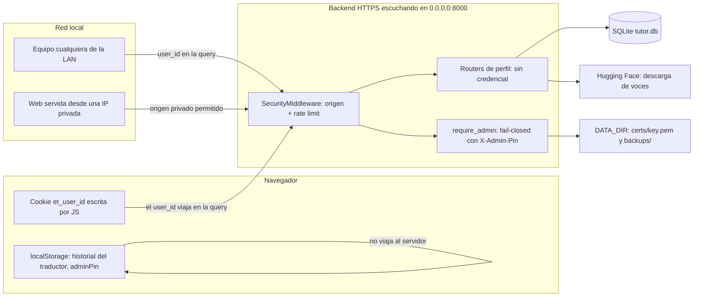

# Verificación (triage) de la auditoría de seguridad — V3.73.6

> **Tipo:** dossier de **verificación interna** (no es un informe de auditoría
> externa). Por eso **no lleva letra**: las letras están reservadas a los informes
> externos y `AI` ya está asignada al informe de cierre
> (`docs/audit/AI-AUDITORIA-CIERRE-V373.md`, pendiente de recibir) del punto de
> entrada `agentes/auditoria-total-externa-v373.md`.
> **Qué es:** la contra-verificación, hallazgo a hallazgo, de la **sección de
> seguridad** de un informe externo recibido sobre `v3.73.6`. Se separa lo
> **confirmado** de lo **matizado** y de lo **refutado**, y se añaden los hallazgos
> que el informe **no** traía.
> **Qué NO es:** no sustituye al informe `AI` (que cubre las **15 áreas** de la
> matriz de cierre), no cierra ningún gate de validación física y **no modifica
> código**: es lectura de fuente, lectura de tests y comandos de solo lectura.
> **Punto de partida:** `v3.73.6` · `13cc30b` · árbol con un solo fichero
> modificado sin commitear (`docs/audit/KIT-VALIDACION-GATES.md`).
> **Autor:** el propio proyecto.
> **Fecha:** 2026-09-18.

## Alcance

- **Se verifica:** identidad y autorización de perfiles, frontera de red (CORS,
  bind, TLS), rate limiting, coste de rutas sin credencial, backup/restore,
  privacidad en el cliente (almacenamiento local del navegador), errores de
  persistencia silenciados, cabeceras HTTP defensivas y cadena de suministro
  Python.
- **No se verifica:** pedagogía, contenido, Adaptive Engine, listening, GUI,
  accesibilidad ni instalación limpia. Esas áreas pertenecen a la matriz de cierre
  del informe `AI`.
- **Método:** cada afirmación se comprueba **contra el código publicado**, no
  contra la prosa del informe. La severidad se re-calcula con la escala del
  proyecto (**P0–P3**, briefing §6.3) y se **corrige** cuando el informe la
  exagera o se queda corto.

## Método

1. **Medir antes de creer.** Toda fila lleva `archivo:línea` del árbol publicado y
   el comando que la reproduce.
2. **Una afirmación por hallazgo.** Si un hallazgo mezcla dos hechos con
   veredictos distintos, se parte en dos filas.
3. **Tres estados, sin ambigüedad:** **DEMOSTRADO** (reproducible aquí),
   **DECLARADO** (el proyecto lo afirma y no se puede reproducir sin hardware o
   sin persona) y **NO COMPROBABLE** (con el motivo).
4. **Nada de «podría» ni «convendría» sin dato.** Lo que no se pueda refutar con
   un comando no es un hallazgo.
5. **Lo positivo también se dictamina.** Un control que el informe no acredita se
   acredita aquí.

## Evidencia

### Frontera de confianza real (lo que el informe describe en prosa)



El eslabón que sostiene el riesgo: la **identidad viaja en la query** y el
servidor **no la verifica contra ninguna credencial**. Todo lo demás (CORS de
redes privadas, bind a `0.0.0.0`, rutas caras sin cupo específico) amplifica ese
eslabón; no lo crea.

### E1 — Identidad suministrada por el cliente (confirmado)

```python
# backend/dependencies.py
   30|async def current_user(user_id: str = Query(...)) -> dict:
   31|    """Resuelve y valida el perfil activo. 404 si no existe."""
   32|    user = await user_service.get_user(user_id)
```

No hay cabecera de sesión, ni cookie de servidor, ni token. El cliente elige el
perfil y el servidor lo acepta si existe. En el navegador, la cookie que recuerda
la elección la escribe **JavaScript** (`frontend/src/utils/cookie.ts:27-31`, con
`document.cookie` en `:19`), así que no es `HttpOnly` y **no** es una credencial.

**Matiz que corrige al informe (y lo hace más preciso, no menos grave):** el
**scoping por propietario sí existe** en la capa de datos. `conversations`,
`learning_profile`, `vocabulary`, `grammar_errors`, `academy_*` y el resto se
consultan filtrando por `user_id` (`backend/routers/conversations.py:20-68`,
`backend/routers/profile.py:13-15`, y el patrón se repite en `academy.py`,
`vocabulary.py`, `listening.py`, `speaking_routes.py`). Lo que falta es
**autenticación** (que el `user_id` sea *quien dice ser*), **no autorización por
dueño**. La diferencia importa para priorizar el arreglo: no hay que tocar los
repositorios, hay que derivar el `user_id` de una credencial.

Y `POST/PATCH/DELETE /api/users` (`backend/routers/users.py:12-41`) **no exigen
nada**: cualquier cliente enumera, crea, renombra y cambia avatares de cualquier
perfil. Es la superficie más expuesta del hallazgo, porque el binario
`EnglishTutor.exe` escucha en `0.0.0.0`
(`launcher/core.py:84-104`) y cualquiera de la LAN es un cliente.

**Severidad corregida: P0, condicionada al alcance del despliegue.** En
`127.0.0.1` con un único usuario de confianza es un P3 de diseño; en LAN —el modo
que el launcher usa por defecto— es **P0**, porque un equipo de la red lee,
modifica y borra el progreso de otro con un `curl`.

### E2 — CORS de redes privadas y bind a `0.0.0.0` (confirmado, con la ruta de ataque precisada)

```python
# backend/config.py
   37|ALLOWED_ORIGINS = [
   ...
   49|ALLOWED_ORIGIN_REGEX = (
   50|    r"^https?://(localhost|127\.0\.0\.1|"
   51|    r"(10\.\d{1,3}\.\d{1,3}\.\d{1,3})|"
   52|    r"(192\.168\.\d{1,3}\.\d{1,3})|"
   53|    r"(172\.(1[6-9]|2\d|3[01])\.\d{1,3}\.\d{1,3})"
   54|    r")(:\d+)?$"
   55|)
```

```python
# backend/main.py
  127|app.add_middleware(
  128|    CORSMiddleware,
  129|    allow_origins=ALLOWED_ORIGINS,
  130|    allow_origin_regex=ALLOWED_ORIGIN_REGEX,
  131|    allow_credentials=False,
```

La regex acepta **cualquier puerto** de cualquier IP privada. La ruta de ataque
que el informe describe es correcta en el mecanismo y hay que precisar el porqué:
`allow_credentials=False` **no mitiga nada aquí**, porque la identidad no viaja en
cookie sino en la **query** (`E1`); basta que la víctima abra una página servida
desde `http://192.168.1.50:8080` (origen «privado legítimo» para esta regex) para
que el JavaScript de esa página hable con la API de la app desde el navegador de
la víctima. La protección de origen (`backend/security.py:134-148`) **sí** rechaza
métodos no seguros con `Origin` no permitido, pero ese mismo filtro es el que deja
pasar la IP privada.

**Severidad corregida: P1.** El compromiso es real, pero el escenario exige que la
víctima visite una web servida desde su propia red, no desde Internet; y el
objetivo es un servidor de un solo alumno. Es un P1 de endurecimiento, no el P0
de `E1`.

### E3 — El límite reforzado de transcripción apunta a una ruta inexistente (confirmado)

```python
# backend/security.py
   42|_DEFAULT_LIMIT = 1200
   43|_PATH_LIMITS: dict[str, int] = {
   44|    "/api/audio-library/upload": 60,
   45|    "/api/system/restore": 20,
   46|    "/api/system/backup": 60,
   47|    "/api/chat": 240,
   48|    "/api/voz/transcribe": 180,
   49|}
```

```python
# backend/routers/voz.py
   21|@router.post("/api/transcribe", response_model=TranscribeResponse)
```

La clave es `/api/voz/transcribe`; la ruta montada es `/api/transcribe`
(`_rate_limit_ok` compara con `path.startswith(prefix)`, `security.py:87-89`).
Consecuencia medida: Whisper queda con el cupo **general** (1200/min por IP) y no
con el reforzado (180/min) que el propio código declara. Con `MAX_AUDIO_BYTES =
25 MB` (`backend/config.py:61`) y 1200 peticiones/minuto, la CPU del equipo que da
clase es el recurso que se agota.

**Causa raíz (esto es lo que hay que arreglar, no la línea):** las claves de
`_PATH_LIMITS` son **cadenas sueltas sin candado**. No existe ningún test que las
confronte con las rutas reales de la app: la búsqueda de `_PATH_LIMITS` en
`backend/tests/` **no devuelve ninguna coincidencia**. Un test que recorriera
`app.routes` habría cazado la errata el día que se introdujo.

**Severidad corregida: P1.**

### E4 — Rutas de coste alto sin credencial ni cupo específico (confirmado, con el impacto acotado)

| Ruta | Coste por petición | Credencial | Cupo propio |
|---|---|---|---|
| `POST /api/transcribe` (`routers/voz.py:21-32`) | Whisper en CPU, hasta 25 MB | ninguna | no (ver `E3`) |
| `POST /api/tts` (`routers/voz.py:36-59`) | Piper + **posible descarga** en caliente (`:59`) | ninguna (`current_user_optional`) | no |
| `POST /api/translate` (`routers/translate.py:17-31`) | turno completo de LLM local | ninguna | no |
| `POST /api/voices/download` (`routers/voices.py:63-75`) | ~63 MB por voz desde Hugging Face | ninguna | no |
| `POST /api/chat` (`routers/chat.py:49-65`) | LLM local | ninguna (`current_user_optional`) | sí, 240/min |

**Matiz que corrige al informe:** el informe cifra el abuso de voces en «aprox.
1,4 GB». El catálogo tiene **11 voces** (`backend/services/voice_downloads.py:51-114`)
y `size_mb` es **63** para todas (`:47-49`): el techo real es **≈ 0,69 GB**, y
`download_voice` **salta** la descarga si el fichero ya existe con tamaño > 0
(`:181-182`), con lo que peticiones repetidas de una voz instalada **no** consumen
red ni disco. El abuso está **acotado por diseño** al catálogo. Lo que no está
acotado es la **posibilidad de dispararlo sin credencial** y el consumo de CPU de
las otras tres rutas (transcribe/tts/translate), que es el impacto real.

**Severidad corregida: P1** por el conjunto (transcribe + tts + translate sin
credencial y sin cupo propio); **P2** si se evalúa solo la descarga de voces.

### E5 — Backup con la clave privada TLS, en claro (confirmado)

```python
# backend/services/backup.py
   54|def _write_zip(dest: Path) -> None:
   ...
   58|        for p in sorted(DATA_DIR.iterdir()):
   59|            if p.name == "backups":
   60|                continue
```

```python
# backend/config.py
  100|CERTS_DIR = DATA_DIR / "certs"
  101|TLS_CERT_PATH = CERTS_DIR / "cert.pem"
  102|TLS_KEY_PATH = CERTS_DIR / "key.pem"
```

El ZIP recorre **todo** `DATA_DIR` menos `backups/`, así que incluye
`data/certs/key.pem`: la clave privada del certificado con el que el producto
sirve HTTPS en la LAN. La exportación (`backend/routers/system.py:89-107`) entrega
el ZIP en claro por HTTPS con certificado **autofirmado**, y el auto-backup crea
hasta `KEEP_BACKUPS = 7` copias por hora-comprobada
(`backend/main.py:53-64`, `services/backup.py:28`), cada una con una copia de la
clave. Restaurar también **revierte** `certs/`
(`services/backup.py:233-235`, `_replace_tree(data_src, DATA_DIR, …)`).

**Severidad corregida: P2.** Está detrás de `require_admin` (fail-closed con
`ADMIN_PIN` vacío, `backend/dependencies.py:21-27`) y el atacante ya necesita el
PIN; el daño es **exfiltración por copia de seguridad** (la clave viaja a donde
viaje el ZIP) y la imposibilidad de rotarla sin regenerar certificados en todos
los clientes.

### E6 — Restauración ZIP sin cota de expansión (confirmado en el impacto, refutado en el mecanismo)

```python
# backend/services/backup.py
  224|            zf.extractall(tmp)
```

```python
# backend/routers/system.py
  119|    data = bytearray()
  120|    while chunk := await file.read(1024 * 1024):
  121|        data.extend(chunk)
  122|        if len(data) > 512 * 1024 * 1024:  # 512 MB, holgado para audio local
```

**Confirmado:** el tope de 512 MB es del ZIP **comprimido**. No hay cota del
tamaño **expandido**, ni del número de entradas, ni del ratio de compresión: un
ZIP de unos pocos MB con alta compresión puede escribir cientos de GB en
`%TEMP%` antes de que el proceso muera por disco lleno (`TemporaryDirectory`, en
el disco del sistema). Está detrás del PIN admin.

**Refutado:** el informe sugiere (al citar `extractall()` como tal) un riesgo de
*Zip Slip*. En el intérprete de este proyecto —**Python 3.13**, `.github/workflows/ci.yml`—
`zipfile.ZipFile.extractall` **sanea** los nombres de miembro (normaliza, descarta
componentes `..` y rutas absolutas), así que no hay escritura fuera del
directorio temporal. El hallazgo que queda es **agotamiento de disco/tiempo**, no
traversal.

**Severidad corregida: P2.**

### E7 — Sin borrado ni exportación de datos de perfiles reales (confirmado)

```python
# backend/routers/users.py
   32|@router.delete("/api/users/{user_id}")
   33|async def delete_test_user(user_id: str) -> dict:
   34|    """Borra un perfil de PRUEBA y sus datos (V3.52.1, teardown de tests).
   35|
   36|    Solo elimina perfiles con `is_test = 1`: un id real devuelve 404 y no se
   37|    toca.
```

La única vía de borrado **comprueba** `is_test` (`backend/repositories/users.py:82-125`)
y devuelve `False` si el perfil es real. No hay endpoint de exportación de datos de
un perfil ni política de retención: las copias se podan **por número** (7), no por
antigüedad, y cada una contiene los datos de **todos** los perfiles. Es un hueco de
privacidad, no una vulnerabilidad de confidencialidad frente a terceros.

**Severidad corregida: P2.**

### E8 — Almacenamiento local del navegador compartido entre perfiles (confirmado, con el alcance acotado al traductor)

```ts
// frontend/src/features/translator/TranslatorScreen.tsx
   14|export const HISTORY_STORAGE_KEY = "english-tutor.translator-history";
```

```ts
// frontend/src/features/translator/ConversationTranslator.tsx
   27|export const CONVERSATION_STORAGE_KEY = "english-tutor.translator-conversation";
```

Ambas claves son **globales del navegador** (`readHistory` en
`TranslatorScreen.tsx:45-57`, `readTurns` en `ConversationTranslator.tsx:46-57`) y
el historial contiene **texto traducido por el alumno**; al cambiar de perfil en
el mismo equipo, el siguiente ve hasta 8 frases y 12 turnos del anterior en claro.

**Matiz que acota el informe:** hay más claves globales en el navegador
(`useI18n.tsx:55`, `useSelectedRoute.ts:16`, `useDictionaryView.ts:15`,
`useAppearance.ts:22,40`, `client.ts:6`), pero **son preferencias**, no contenido:
la única que filtra **contenido del alumno** es la del traductor. `adminPin`
(`frontend/src/api/audioLibrary.ts:9`) es un caso distinto y se trata como
hallazgo nuevo (VG-N1).

**Severidad corregida: P2.**

### E9 — Fallos de persistencia silenciados (confirmado, con la frontera medida)

```ts
// frontend/src/hooks/useChat.ts
  334|  const persist = useCallback(
  335|    async (id: string, history: Message[]) => {
  336|      if (!currentUserId) return;
  337|      try {
  338|        await saveConversation(id, currentUserId, deriveTitle(history), history);
  339|        await refreshConversations();
  340|      } catch {
  341|        /* backend no disponible */
  342|      }
```

El mismo patrón (`try/except` que descarta el error) está en `completeLesson`
(`:306-313`), `persistSettings` (`:347-352`), `analyzeText` (`:528-534`) y
`completeActiveStep` (`frontend/src/App.tsx:246-253`). Consecuencia: la UI puede
dar por hecho un turno o una lección completada **sin** que se haya escrito el
progreso ni el análisis, y sin opción de reintento visible.

**Matiz que acota el informe:** los errores del **streaming** del chat **sí** se
muestran al alumno (`useChat.ts:495-511`, texto «Error al hablar con el modelo…»)
y `saveConversation` solo se invoca cuando la respuesta llegó completa
(`:519-524`). Lo invisible no es «el chat falló», es **«el chat funcionó pero no
se guardó»**.

**Severidad corregida: P2.**

### E10 — Cabeceras HTTP defensivas (confirmado, con una advertencia sobre HSTS)

No hay middleware de cabeceras en `backend/main.py` (solo CORS en `:127-137` y
`SecurityMiddleware` en `:140`) ni en el servido de la UI
(`backend/services/frontend_dist.py:90-133`, que devuelve `FileResponse` sin
cabeceras extra). Lo que aporta: `Content-Security-Policy`,
`X-Content-Type-Options: nosniff`, `frame-ancestors`/`X-Frame-Options`,
`Referrer-Policy` y `Permissions-Policy` (micrófono restringido a `self`).

**Advertencia que el informe no hace y hay que hacer antes de tocar esto:**
**HSTS no debe añadirse** mientras el producto use certificado **autofirmado**
(`backend/config.py:98-102`), porque `includeSubDomains`/`max-age` sobre un
certificado no confiable deja el origen inutilizable hasta limpiar el estado del
navegador. Las demás cabeceras son aditivas y seguras.

**Severidad corregida: P3.**

### E11 — Cadena de suministro Python (refutado parcialmente)

```text
# backend/requirements.txt  (7 dependencias, TODAS con == exacto)
fastapi==0.128.0
uvicorn[standard]==0.40.0
ollama==0.6.2
python-multipart==0.0.32
faster-whisper==1.2.1
piper-tts==1.7.0
cryptography==50.0.1
```

El informe dice «dependencias Python sin bloqueo criptográfico completo». Las
**directas están fijadas exactas**; lo que falta es el **lock de las transitivas
con hashes** (`pip-compile --generate-hashes` o `uv.lock`) y un escaneo en CI. El
riesgo es de **reproducibilidad y verificación de origen**, no de versiones
flotantes.

**Severidad corregida: P3.**

## Matriz de hallazgos externos verificados

| ID | Hallazgo del informe | Sev. informe | Veredicto | Evidencia | Sev. corregida |
|---|---|---|---|---|---|
| **VG-01** | Cualquier cliente suplanta un perfil usando su `user_id`; sin autenticación real | Crítica / Alta | **Confirmado** (matizado: el scoping por dueño sí existe; falta autenticación) | `backend/dependencies.py:30-35` · `backend/routers/users.py:12-41` · `frontend/src/utils/cookie.ts:19,27-31` · `launcher/core.py:84-104` | **P0** (condicionada a LAN) |
| **VG-02** | CORS confía en cualquier origen de red privada + bind a `0.0.0.0` | Alta | **Confirmado** (matizado: `allow_credentials=False` no mitiga porque la identidad va en query) | `backend/config.py:37-55` · `backend/main.py:127-137` · `backend/security.py:134-148` | **P1** |
| **VG-03** | El límite reforzado de transcripción apunta a otra URL | Alta | **Confirmado** (causa raíz: sin test anti-deriva de `_PATH_LIMITS`) | `backend/security.py:42-49` · `backend/routers/voz.py:21` | **P1** |
| **VG-04** | Descarga de voces sin autenticar ni cuota estricta | Alta | **Confirmado** en el hecho, **corregido** en la cifra y el alcance | `backend/routers/voices.py:63-75` · `backend/services/voice_downloads.py:47-49,51-114,181-182` | **P1** (conjunto) / **P2** (voces) |
| **VG-05** | Restaurar backups ZIP agota recursos | Media | **Confirmado** en el impacto; **refutado** el mecanismo (no hay Zip Slip en 3.13) | `backend/services/backup.py:224` · `backend/routers/system.py:119-122` | **P2** |
| **VG-06** | Los backups contienen la clave privada TLS y no se cifran | Media | **Confirmado** | `backend/services/backup.py:54-66` · `backend/config.py:100-102` · `backend/main.py:53-64` | **P2** |
| **VG-07** | No hay borrado ni exportación de datos para perfiles reales | Media | **Confirmado** | `backend/routers/users.py:32-41` · `backend/repositories/users.py:82-125` | **P2** |
| **VG-08** | Historiales de traducción en claro y compartidos entre perfiles | Media | **Confirmado** (único contenido de alumno en `localStorage`; el resto son preferencias) | `TranslatorScreen.tsx:14,45-57` · `ConversationTranslator.tsx:27,46-57` | **P2** |
| **VG-09** | Fallos de persistencia se descartan sin avisar ni reintentar | Media | **Confirmado** (el error del streaming sí se muestra; lo mudo es la persistencia) | `useChat.ts:333-345,306-313,347-352,528-534` · `App.tsx:246-253` | **P2** |
| **VG-10** | Faltan cabeceras defensivas HTTP | Baja | **Confirmado**; **advertencia nueva**: HSTS sería contraproducente con certificado autofirmado | `backend/main.py:127-140` · `backend/services/frontend_dist.py:90-133` | **P3** |
| **VG-11** | Dependencias Python sin bloqueo criptográfico completo | Baja | **Refutado parcialmente**: las 7 directas van con `==`; falta lock transitivo con hashes | `backend/requirements.txt` · `backend/requirements-dev.txt` | **P3** |
| **VG-12** | «Aprox. 1,4 GB» de voces descargables | — | **Refutado**: 11 voces × ~63 MB ≈ 0,69 GB, y las ya instaladas no se re-descargan | `backend/services/voice_downloads.py:47-49,51-114,181-182` | — |
| **VG-13** | Insinuación de path traversal en `extractall()` | — | **Refutado**: Python 3.13 sanea los nombres de miembro | `backend/services/backup.py:224` · `ci.yml` (`python-version: "3.13"`) | — |

## Hallazgos nuevos (no están en el informe recibido)

| ID | Sev. | Hallazgo | Evidencia | Por qué importa |
|---|---|---|---|---|
| **VG-N1** | P2 | El **PIN de administración** se guarda en claro y **global** en `localStorage` | `frontend/src/api/audioLibrary.ts:9,19-27` | Sobrevive al cierre de sesión y al cambio de perfil, viaja en cada export/import del navegador y no está namespaced por usuario. Es la única credencial de la app y vive donde cualquiera la lee |
| **VG-N2** | P3 | `UserCreate.name` **sin `max_length`**, mientras `UserUpdate.name` sí lo tiene (`max_length=80`) | `backend/schemas/users.py:23-25` vs `:30` | `POST /api/users` **sin credencial** (`VG-01`) acepta nombres de tamaño arbitrario: crecimiento de BD trivial de disparar |
| **VG-N3** | P3 | La cookie de perfil no lleva `Secure` (y no puede llevar `HttpOnly` porque la escribe JS) | `frontend/src/utils/cookie.ts:19-20` | Con el producto ya sirviéndose por HTTPS, `Secure` es gratis; sin él la cookie puede viajar en claro si algún día se sirve HTTP. Bloqueado de raíz por `VG-01` |
| **VG-N4** | P3 | **Sin test anti-deriva de `_PATH_LIMITS`**: ninguna coincidencia de `_PATH_LIMITS` en `backend/tests/` | `backend/tests/` | Es la **causa raíz** de `VG-03`: mientras no exista un candado que confronte las claves con `app.routes`, la próxima errata vuelve |
| **VG-N5** | P3 | **Sin escaneo de dependencias en CI ni Dependabot**, y las Actions van fijadas por etiqueta mayor (`@v4`/`@v5`), no por SHA | `.github/workflows/ci.yml` | `npm audit` se ejecutó a mano en esta verificación y dio 0 vulnerabilidades; no hay ningún job que lo repita. `@v4` es una referencia móvil: es el vector clásico de cadena de suministro en CI |
| **VG-N6** | P3 | `/api/system/status`, `/api/network` y `/api/models` **sin credencial** | `backend/routers/system.py:26-64` · `backend/routers/network.py:18-30` · `backend/routers/models.py:32-52` | Exponen trabajos de generación en curso, rechazos 429, IP/hostname de LAN y los modelos instalados. Es información de reconocimiento barata para quien ya está en la LAN. Declararlo **aceptado** de forma explícita o restringirlo |

## Controles positivos reproducidos

El informe no los acredita y sostienen el dictamen igual que los hallazgos:

1. **`npm audit --omit=dev` → 0 vulnerabilidades.** Ejecutado en esta verificación
   (`frontend/`, exit code 0). Confirma la segunda mitad de `VG-11`: el árbol de
   producción del frontend está limpio **hoy**.
2. **Sin sumideros de inyección HTML/React.** Búsqueda de
   `dangerouslySetInnerHTML` / `innerHTML` / `srcDoc` en `frontend/src`: **0
   coincidencias**.
3. **SQL parametrizado.** Todo acceso a SQLite usa marcadores `?`
   (`backend/repositories/*.py`); no hay concatenación de valores en consultas.
4. **Filtros de propietario a nivel de repositorio.** El `user_id` no se acepta
   del cliente en las consultas: los servicios lo reciben ya derivado del perfil
   resuelto y lo pasan al `WHERE`. Es la mitad del control que hace que `VG-01`
   sea un fallo de **autenticación**, no de aislamiento.
5. **Catálogo de voces cerrado: sin SSRF.** `_HF_BASE` es una constante y la ruta
   la aporta el catálogo (`voice_downloads.py:26,131`), no el cliente. El id se
   valida contra `_BY_ID` (`routers/voices.py:72-73`).
6. **`require_admin` fail-closed.** Con `ADMIN_PIN` vacío
   (`backend/config.py:69`) los endpoints de administración devuelven 401 en vez
   de abrirse (`backend/dependencies.py:21-27`). Auditado y auditado de nuevo en
   `docs/audit/RF-SINTESIS-RUNTIME-V371.md`; aquí se reproduce leyendo el código.
7. **Previsualización de audio de biblioteca también protegida.**
   `GET /api/audio-library/{audio_id}/audio` exige `require_admin`
   (`backend/routers/audio_library.py:192-194`), no solo la escritura.
8. **Prevención de traversal en el servido del `dist`.** `resolve_static_file`
   rechaza rutas que escapan del artefacto
   (`backend/services/frontend_dist.py:74-89`).

## Honestidad: lo que este dossier NO demuestra

1. **No es un pentest.** No se ha atacado el servicio: no se han enviado
   peticiones maliciosas contra una instancia en marcha, ni se ha reproducido el
   escenario de LAN con un segundo equipo. Todo `VG-0x` es **lectura de fuente +
   lectura de tests + comandos de solo lectura**. Un fallo de explotación que solo
   se manifieste en runtime no está cubierto aquí.
2. **Los 7 gates siguen `pending`.** Nada de este dossier los mueve. Un dossier no
   es una validación (regla dura del briefing §6.7).
3. **No hay análisis de la cadena de suministro transitiva.** `VG-11` se resuelve
   con lo que declara `requirements.txt`; no se ha instalado en un entorno limpio
   ni se han verificado hashes.
4. **No hay auditoría de accesibilidad** y no se ha evaluado el impacto de las
   cabeceras propuestas sobre el resto de la app.
5. **La severidad de `VG-01` depende de una decisión de producto**, no de código:
   si el despliegue objetivo es «un PC, un alumno», es P3; si es la LAN que el
   launcher arranca por defecto, es P0. Este dossier **no decide** el alcance; lo
   declara condicionado.
6. **No se ha verificado el PIN de administración más allá de la lectura**: no se
   ha probado a adivinarlo ni se ha medido su entropía, porque lo configura el
   usuario en `config.py`.

## Recomendaciones priorizadas

Cada una con el **endurecimiento mínimo** y el **test que falla sin el cambio**.

| Pr. | Cambio mínimo | Test que lo fija |
|---|---|---|
| **P0** | Derivar el `user_id` de una **credencial de servidor** (cookie `HttpOnly` + `Secure` + `SameSite` emitida por `POST /api/session` tras validar la selección de perfil) y **eliminar** el parámetro `user_id` de `current_user`/`current_user_optional` | `test_conversations_reject_client_supplied_user_id` (pasar `?user_id=` de otro perfil → 401/403) · `test_users_endpoints_require_session` (GET/POST/PATCH/DELETE `/api/users` sin sesión → 401) |
| **P0** | Exigir sesión (o el PIN admin) en `POST /api/users` y en `PATCH/DELETE /api/users/{id}`; el `GET /api/users` pasa a devolver solo el perfil de la sesión salvo admin | `test_profile_mutation_requires_session` |
| **P1** | Sustituir `ALLOWED_ORIGIN_REGEX` por la lista exacta de orígenes que el launcher anuncia (su propia IP/hostname y puerto), en vez de «cualquier IP privada, cualquier puerto» | `test_private_origin_with_foreign_port_rejected` (debe fallar con `https://192.168.1.20:9999`) |
| **P1** | Escuchar en `127.0.0.1` por defecto; `0.0.0.0` solo con `ENGLISH_TUTOR_LAN=1` explícito del launcher | `test_launcher_binds_loopback_without_lan_flag` (`launcher/tests/`) |
| **P1** | Corregir `/api/voz/transcribe` → `/api/transcribe` y añadir `/api/tts`, `/api/translate`, `/api/voices/download` a `_PATH_LIMITS` | `test_path_limits_match_real_routes`: recorrer `app.routes` y exigir que **cada** clave de `_PATH_LIMITS` sea prefijo de una ruta real (**este test es el que habría cazado `VG-03`**) |
| **P2** | Excluir `certs/` del ZIP en `_write_zip` y documentar que el backup va **sin cifrar** | `test_backup_excludes_tls_private_key` |
| **P2** | Antes de `extractall`, validar `sum(i.file_size for i in zf.infolist()) <= LIMITE` y `len(zf.infolist()) <= N`; rechazar miembros con `..` o ruta absoluta de forma **explícita** aunque el intérprete sane | `test_restore_rejects_zip_bomb` |
| **P2** | Endpoint de borrado de perfil **real** con confirmación (y exportación de sus datos); poda de backups por antigüedad además de por número | `test_delete_real_user_removes_all_rows` |
| **P2** | Namespacing de las claves del traductor por `user_id` y limpieza al cambiar de perfil | `TranslatorScreen.test.tsx` con dos perfiles sobre el mismo `localStorage` |
| **P2** | Aviso visible de **persistencia fallida** con reintento en `useChat.persist`/`completeLesson` | Test de `useChat` con `saveConversation` rechazando → aparece el aviso |
| **P2** | Tratar `adminPin` como credencial: no persistirlo en claro (o ámbito por usuario + limpieza explícita) | `audioLibrary.test.ts` |
| **P3** | Middleware de cabeceras defensivas **sin HSTS** (CSP, `nosniff`, `frame-ancestors`, `Referrer-Policy`, `Permissions-Policy`) | Test de middleware que falle sin cada cabecera |
| **P3** | `UserCreate.name` con `max_length=80`; `Secure` en la cookie | Test 422 con nombre de 10 000 chars |
| **P3** | `pip-audit` + `npm audit` como job de CI; Actions fijadas por SHA | Job nuevo en `.github/workflows/ci.yml` |
| **P3** | Declarar **aceptados** (o restringir) `/api/system/status`, `/api/network` y `/api/models` | Test que documente el estado esperado (401 o contrato abierto declarado) |

## Regenerar / Verificar

```powershell
# Ancla del árbol verificado
git rev-parse HEAD                              # 13cc30bb6d30c61a0c04708703f60f838f89d82d
Select-String -Path backend\config.py -Pattern '^VERSION ='   # VERSION = "3.73.6"
git status --short                              # solo docs/audit/KIT-VALIDACION-GATES.md

# Cadena de suministro del frontend (producción)
cd frontend; npm audit --omit=dev --audit-level=low; cd ..

# VG-01: la identidad llega por query y no hay credencial
rg -n "user_id: str = Query" backend/dependencies.py
rg -n "@router" backend/routers/users.py

# VG-03: la clave de _PATH_LIMITS no corresponde a ninguna ruta montada
rg -n "_PATH_LIMITS" -A 7 backend/security.py
rg -n '"/api/transcribe"' backend/routers/voz.py

# VG-N4: no hay candado que confronte _PATH_LIMITS con app.routes
rg -n "_PATH_LIMITS" backend/tests/            # sin coincidencias

# VG-06: el backup recorre DATA_DIR y por tanto incluye certs/
rg -n "DATA_DIR.iterdir|CERTS_DIR|TLS_KEY_PATH" backend/services/backup.py backend/config.py

# VG-05: extractall sin cota de expansión
rg -n "extractall|512 \* 1024 \* 1024" backend/services/backup.py backend/routers/system.py

# VG-08: almacenamiento del navegador con clave global
rg -n "HISTORY_STORAGE_KEY|CONVERSATION_STORAGE_KEY" frontend/src

# Controles positivos
rg -n "dangerouslySetInnerHTML|innerHTML|srcDoc" frontend/src    # sin coincidencias
rg -n "require_admin" backend/routers/audio_library.py backend/dependencies.py
```

## Tests que respaldan

- `backend/tests/test_security.py` — protección de origen y rate limiting
  (`test_origin_allowed`, `test_rate_limit_rejects_after_limit`,
  `test_health_exempt_never_rate_limited`, `test_rate_limit_snapshot_*`). **No**
  cubre la correspondencia entre `_PATH_LIMITS` y las rutas reales: ese es el
  hueco de `VG-N4`.
- `backend/tests/test_api_security.py` — aislamiento por propietario
  (`test_cannot_read_other_user_conversation`,
  `test_cannot_update_other_user_conversation`,
  `test_pronunciation_records_only_for_declared_user`). Fija el **scoping**, y su
  propia forma (pasar `user_id` en `params`) demuestra que la autenticación no
  existe.
- `backend/tests/test_backup.py` — round-trip de backup/restore y rechazo de ZIP
  inválidos. No cubre ni la cota de expansión (`VG-05`) ni la exclusión de
  `certs/` (`VG-06`).
- `backend/tests/test_robustness.py` — límites de `/api/transcribe`
  (413 por tamaño, 415 por MIME): el endurecimiento de **payload**, no el de
  **frecuencia**.
- `frontend/src/features/translator/TranslatorScreen.test.tsx` — historial en
  `localStorage`; fija el comportamiento actual, que es exactamente el que `VG-08`
  señala.

## Relación con los demás documentos

- **No sustituye** a `docs/audit/AI-AUDITORIA-CIERRE-V373.md` (informe externo de
  cierre, 15 áreas, pendiente de recibir). Si sus conclusiones de seguridad
  difieren de las de aquí, la discrepancia debe resolverse con evidencia, no por
  jerarquía de documento.
- **No mueve** `docs/audit/PARKED.md`, `docs/RELEVO.md` ni los gates de
  `docs/audit/KIT-VALIDACION-GATES.md`.
- **Se apoya** en el mismo estilo de evidencia que
  `docs/audit/RF-SINTESIS-RUNTIME-V371.md` y `docs/audit/RD-DEPENDENCIAS-OCULTAS.md`:
  medir, endurecer con el test que falla sin el cambio, y **declarar** lo que no
  se cierra en lugar de cerrarlo en falso.
