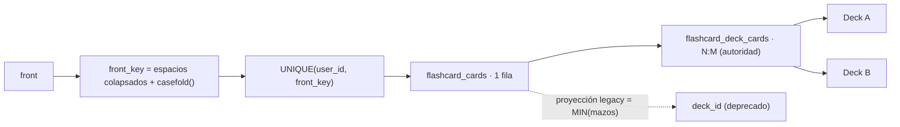

# Release notes — English Tutor v3.86.1

**Fecha:** 2026-09-26 · **Tipo:** release **DE ROBUSTEZ** (patch) · **Versión de app:**
`3.86.0 → 3.86.1`

**Con backend y frontend, CON migración de BD ADITIVA e idempotente, SIN endpoints nuevos y SIN
bump** de `GENERATOR_VERSION` / `DECISION_POLICY_VERSION` (`CURRICULUM_VERSION` sigue `1.3.1`) /
`LISTENING_BANK_VERSION` ni de las evaluaciones. **Un único cambio de contrato de error**: el
`PATCH` de ficha puede responder **`409 CARD_FRONT_TAKEN`** (antes ese caso duplicaba en silencio).
**Un campo nuevo aditivo** en la superficie pública: `flashcards.cards_without_deck` en
`GET /api/system/status`. **No se añade ni se retira gate** —siguen los **ocho**, todos en
`pending`— y `docs/audit/validation-evidence.json` **sigue sin existir**. El tag **`v3.86.1` es
propio y se publica** (no se repite la absorción de `v3.85.1`).

**En una frase.** La regla «un anverso, una ficha» deja de depender del código y pasa a la **BD**
(columna `front_key` + índice único), el `PATCH` de una ficha deja de poder aplicarse **a medias**,
una ficha **sin mazo** se detecta y se repara, y el diccionario deja de poder leer un nombre propio
de un booleano que no lo era.

---

## 1. Los ocho puntos, y por qué no son cosmética

La auditoría externa de `v3.86.0` dejó **ocho hallazgos**. Ninguno rompía la app hoy; todos eran
agujeros que se cobran caros **cuando llegue la fase 2** (estudio configurable), porque la fase 2
va a tocar justo esa superficie —fichas, mazos, edición y significados—.

| # | Hallazgo | Aquí |
|---|----------|------|
| 1 | Identidad de ficha solo en código, no en BD | §2 |
| 2 | `update_card` podía duplicar al editar el anverso | §2 |
| 3 | `PATCH` ficha + mazos no atómico | §3 |
| 4 | Sin chequeo de integridad ni reparación de fichas huérfanas | §4 |
| 5 | `proper_noun` no estrictamente booleano | §5 |
| 6 | Docstring de dedupe desalineado con el código | §5 |
| 7 | 34 skips de Playwright sin clasificar | §7 |
| 8 | `deck_id` sin declarar como proyección legacy | §2.3 |

## 2. Identidad fuerte de la ficha (puntos 1, 2 y 8)

### 2.1 El defecto

`create_card` evitaba duplicados con un **`SELECT` … y si no existe, `INSERT`**. Dos peticiones
concurrentes del mismo anverso (un doble clic, la misma palabra desde dos pantallas) hacen el
`SELECT` **antes** de que la otra escriba y acaban creando **dos filas**. Y `update_card` podía
**editar** el anverso de una ficha hasta el de otra **sin comprobar nada**: dos fichas gemelas.
La pertenencia real, además, vivía en **dos sitios** (`flashcard_cards.deck_id` y la tabla puente
`flashcard_deck_cards`) sin decir cuál mandaba.

### 2.2 La identidad, ahora en el esquema



- La política de normalización es una **sola función**, `db.front_key()`, en
  `backend/repositories/db.py`: el **esquema** la necesita para construir el índice y el
  repositorio la usa para buscar, así que no puede haber dos criterios que se desalineen.
- Columna aditiva `front_key TEXT NOT NULL DEFAULT ''` en `flashcard_cards` (mismo patrón que
  `mnemonic`: una BD anterior abre sin migrar nada).
- **`CREATE UNIQUE INDEX IF NOT EXISTS idx_flashcard_cards_identity ON
  flashcard_cards(user_id, front_key)`**: la garantía pasa a la BD.
- `_find_card_by_front()` consulta `WHERE user_id = ? AND front_key = ?` (usa el índice) en vez
  de **escanear todas las fichas en Python**.
- `create_card` / `create_cards` escriben `front_key` y usan **`ON CONFLICT(user_id, front_key) DO
  NOTHING`**: si otra petición ganó la carrera entre el `SELECT` y el `INSERT`, no falla ni
  duplica — **reutiliza la ficha ganadora** y le añade las pertenencias que falten. Dos `POST`
  concurrentes del mismo anverso → **1 fila y N pertenencias**.
- `update_card` / `update_card_with_decks` detectan la colisión y lanzan
  **`CardFrontConflictError`**, que el router traduce a **`409 CARD_FRONT_TAKEN`** en vez de
  reventar con un `IntegrityError` opaco o duplicar.

### 2.3 Migración: qué le pasa a una BD que ya tiene duplicados

La migración corre **dentro de la transacción de `init_db()`** y es idempotente:

1. Añade `front_key` si falta.
2. **Rellega** la clave de cada ficha con `front_key = ''` (una ficha sin anverso —estado que el
   modelo actual no produce— recibe `(legacy:<id>)` para que el índice no choque por dos vacíos).
3. **Funde los duplicados** por `(user_id, front_key)`: conserva el **`id` menor**, **suma** las
   pertenencias de sus gemelas (`INSERT OR IGNORE` de sus filas de `flashcard_deck_cards`) y
   borra las perdedoras. Así **no se pierde el mazo** al que solo apuntaba la copia. Si hay
   fusiones, quedan en el log de arranque.
4. Crea el índice único.
5. **Repara las fichas huérfanas** (ver §4).

**`deck_id` queda declarado como proyección legacy** en el esquema y el repositorio: la autoridad
de pertenencia es `flashcard_deck_cards`; `deck_id` es el «mazo principal» (`MIN(mazos)`), un
único escritor, mantenido **solo** para que el esquema viejo siga abriendo. Candidato a retirarse.

## 3. `PATCH` ficha + mazos atómico (punto 3)

Antes, `update_vocabulary_card` encadenaba `update_card` y `set_card_decks`:

```
PATCH { mnemonic: "…", deck_ids: [999999] }
   ├── update_card()        → escribe el mnemónico  ✔
   └── set_card_decks()     → ningún mazo válido   ✘  → 400
                              cliente ve ERROR, pero el mnemónico YA se guardó
```

Ahora hay **una sola función de repositorio**, `update_card_with_decks(user_id, card_id, *, front,
back, mnemonic, deck_ids)`, que en **UNA transacción** valida la ficha, valida los mazos (si
llegan), detecta el conflicto de anverso, actualiza los campos, reemplaza
`flashcard_deck_cards` y repunta `deck_id` a `MIN(mazos)`. Si los mazos no son válidos lanza
**`NoValidDecksError`** y **no se escribe nada** (rollback) → `400`. `_owned_deck_ids_in()` valida
los mazos **dentro** de la transacción, sin abrir una segunda conexión (que sería un interbloqueo
de escritura) ni dejar una ventana entre validar y escribir. Se usa en el endpoint nuevo y en el
envoltorio legacy; `update_card` y `set_card_decks` se conservan para otros llamadores.

`deck_ids = None` significa «no toques los mazos»; una lista —aunque venga vacía— significa «este
es el conjunto nuevo» y exige al menos un mazo válido (mismo contrato que antes).

## 4. Salud de la BD: `cards_without_deck` (punto 4)

- `flashcards_repo.cards_without_deck(user_id=None)` cuenta las fichas **sin ninguna fila en la
  tabla puente** (`NOT EXISTS`).
- La reparación de arranque **sustituye** el viejo backfill condicionado a `deck_cards_existed`
  por una reparación **idempotente que se ejecuta siempre**, y que **solo** inserta la pertenencia
  de fichas que **no tienen ninguna**: una ficha a la que el alumno le retiró un mazo conserva su
  otro mazo y no se resucita. El dominio nunca deja una ficha sin mazo (o la repunta o la borra),
  así que una huérfana **solo** puede venir de una migración a medias. Se exige además que el
  `deck_id` apunte a un mazo existente, para que un dato colgante de una BD vieja no tumbe el
  arranque por la FK.
- `GET /api/system/status` publica `flashcards.cards_without_deck` (un **contador**, sin datos
  personales). Tras `init_db()` es 0; el endpoint lo delata si una BD **restaurada** llega
  incoherente con el proceso ya en marcha.

## 5. Parser hostil y contrato de dedupe (puntos 5 y 6)

- **`proper_noun` estrictamente booleano.** `normalize_meanings` hacía `bool(item.get("proper_noun"))`,
  y **`bool("false")` es `True` en Python**: el modelo devuelve a veces el booleano como string y
  una negación explícita se convertía en **nombre propio**, que además **reordena la acepción al
  final** y la deja fuera del defecto. Ahora **solo `is True`** cuenta; `"false"`, `"true"`, `1` y
  `None` → `False`.
- **Dedupe por término, declarado.** El docstring decía `(term normalizado, pos)` pero el código
  deduplicaba por término (y con `lower()`). El contrato se fija **por término** —en `meanings` el
  término **es** el significado—, el tipo pasa a `seen: set[str]` y se usa **`casefold()`**, la
  misma clave que el índice único de las fichas (mejor que `lower()` fuera de ASCII).

## 6. Pruebas

### 6.1 Backend (`test_multi_deck_v386.py`, sección V3.86.1)

| Caso | Qué fija |
|---|---|
| **Concurrencia** (hilos + `TestClient`) | dos altas simultáneas del mismo anverso → **1** fila, **2** pertenencias y **la misma** ficha en las dos respuestas |
| **Conflicto al editar** | `PATCH` que cambia `front` al de otra ficha → **`409 CARD_FRONT_TAKEN`** y la BD no cambia |
| **Atomicidad** | `PATCH` con `mnemonic` válido + `deck_ids` inválido → **`400`** y el `mnemonic` **intacto** |
| **Migración con duplicados** | dos fichas sembradas a mano (sin índice) → `init_db()` deja **1** ficha, **funde** las pertenencias y crea `idx_flashcard_cards_identity` |
| **Integridad** | ficha huérfana sembrada a mano → `cards_without_deck() == 1`; `init_db()` lo deja en **0** |

### 6.2 Parser (`test_dictionary_reverse_v339.py`)

- `proper_noun` con `"false"`, `"true"`, `1` y `None` → `False`; solo `True` de verdad marca, y el
  único nombre propio real queda **el último**.
- `file/noun` + `FILE/verb` colapsa a **una** acepción y conserva la primera metadata.

### 6.3 Sistema (`test_system_status.py`)

`flashcards.cards_without_deck == 0` en una BD sana.

## 7. Los 34 skips de Playwright, clasificados (punto 7)

`docs/audit/PLAYWRIGHT-SKIPS-V386.md` inventaría **las 19 llamadas a `test.skip`** (todas en
runtime; no hay `fixme` ni `describe.skip`), su condición, su proyecto y su justificación, con la
aritmética de los **34 skipped** de V3.86.0 (18 + 10 + 4 + 2).

- Se **retira la guarda de proyecto** del test del **diccionario polisémico**
  (`vocabularyRoutesReview.spec.ts`), que es la superficie modificada de V3.86.0 y no toma
  captura: debe pasar en los tres anchos. **34 → 32 skipped.**
- Al retirarla se destapó un **defecto real**: los CTA «Consult» y «My dictionary» del panel
  incrustado ocultaban el texto en móvil (`hidden sm:inline`) y quedaban **sin nombre accesible**
  (solo icono). Se corrigió con `aria-label` en `features/routes/QuizRoutePage.tsx` — no era un
  problema del test, era un botón mudo para lectores de pantalla.
- Los otros 32 se **declaran intencionales** en el informe: ~12 son específicos de breakpoint por
  diseño (con su cobertura en el ancho complementario) y ~20 son **política de un solo breakpoint**
  en las revisiones de ruta (`capturar … (mock)`). **La superficie de V3.86.0 (Flashcards,
  multi-mazo, recordatorio) tiene cero skips.**

## 8. Documentación y release

- `deck_id` declarado como **proyección legacy** en los comentarios de
  `backend/repositories/db.py` / `flashcards.py` y en `docs/audit/PARKED.md §V3.86.1`.
- Bump de las **6 fuentes** (`backend/config.py`, `frontend/package.json`,
  `frontend/package-lock.json`, `README.md`, `CHANGELOG.md`, `PLAN.md`).
- Nueva sección `## V3.86.1` en el log de `docs/audit/PARKED.md` y nota en `docs/RELEVO.md`.
- Este fichero, `release-notes-v3.86.1.md`.
- **No se repite el patrón de absorción de `v3.85.1`:** `v3.86.1` se etiqueta y se publica, con
  commit `release(v3.86.1): …`.

---

## 9. Verificación

| Comprobación | Resultado |
|---|---|
| `npx tsc --noEmit` | limpio |
| `npm run test` (vitest) | **1055/1055** (109 ficheros) |
| `python -m pytest -q` (backend) | **3165/3165** |
| `python -m ruff check .` (backend y lanzador) | limpio |
| `python scripts/check_i18n_coverage.py --strict` | **1797** cadenas, 0 huérfanas / 0 sin definir / 0 duplicadas |
| `node scripts/contrast_audit.mjs --strict` | **480 pares + 6 guardas / 0 bloqueantes** (`audit: V3.86.1-contraste-wcag`) |
| `npm run build` | OK |
| `python scripts/validation_gate.py auto --require-dist` | **10/10** (8 gates) |
| `npx playwright test` (barrido **completo**) | **118 passed · 0 failed · 32 skipped** |
| `python scripts/check_release_consistency.py` | OK en los **6 orígenes** (`3.86.1`) |

> Nota de honestidad sobre `ruff`: un `python -m ruff check .` **desde la raíz** señala **1
> hallazgo preexistente** ajeno a esta release —`DTZ005` en `scripts/purge_virtual_testers.py:198`—
> idéntico al de los tags `v3.85.1` y `v3.86.0`. Los árboles que la release modifica (`backend/` y
> `lanzador/`) quedan **limpios**.

---

## 10. Honestidad

1. **`deck_id` sigue existiendo.** No se retira: se **declara** proyección legacy. Retirarlo es una
   migración de esquema que esta release no aborda.
2. **El índice único es por alumno y anverso normalizado**, no una identidad global de contenido:
   dos alumnos pueden tener la misma ficha (correcto) y `house`/`House` son la misma ficha (por
   diseño).
3. **La fusión de duplicados conserva el `id` menor** y **descarta** el reverso y el recordatorio
   de las copias perdedoras (la pertenencia sí se suma). Es la política elegida: el `id` menor es
   el que el alumno vio primero.
4. **No se toca FSRS** ni el mazo automático: la identidad fuerte es de las fichas manuales.
5. **El `409` es un cambio de contrato.** Un cliente que antes recibía un `200` duplicando ahora
   recibe `409 CARD_FRONT_TAKEN`; es justamente el objetivo, pero se declara.
6. **`flashcards.cards_without_deck` es un campo nuevo** en la superficie pública
   `/api/system/status` (aditivo; sigue sin exigir sesión, decisión ya declarada en `ARQUITECTURA.md`).
7. **El parser no reniega de los nombres propios**: siguen pudiendo ser una acepción, pero **solo
   si el modelo manda un `true` de verdad**, y nunca son el significado por defecto si hay uno
   común.
8. **La fase 2 (estudio configurable) no está.** Este patch es el cierre técnico **previo** a
   diseñarla.
9. **Los 8 gates humanos siguen `pending`** y `validation-evidence.json` **no existe**; el ancla de
   certificación sigue en `v3.83.1`.

---

## Para auditar esta release

- **Ancla:** el tag **`v3.86.1`**, sobre `v3.86.0` (`929c684`).
- **Alcance:**
  - `backend/repositories/db.py` (migración `front_key`, dedupe, índice único, reparación de
    huérfanas, `front_key()`);
  - `backend/repositories/flashcards.py` (excepciones nuevas, `_find_card_by_front`,
    `create_card`, `create_cards`, `update_card`, `update_card_with_decks`, `cards_without_deck`,
    `_owned_deck_ids_in`);
  - `backend/domain/flashcards.py` (`update_card_with_decks`);
  - `backend/routers/vocabulary.py` (traducción de `409`/`400`), `backend/routers/system.py`
    (contador);
  - `backend/services/dictionary_content.py` (parser) y `backend/schemas/vocabulary.py` (sin
    cambios);
  - `backend/tests/test_multi_deck_v386.py`, `test_dictionary_reverse_v339.py`,
    `test_system_status.py`;
  - `frontend/src/features/routes/QuizRoutePage.tsx` (`aria-label` de los CTA),
    `frontend/tests/visual/vocabularyRoutesReview.spec.ts` (guarda retirada);
  - `docs/audit/PLAYWRIGHT-SKIPS-V386.md`, `docs/audit/PARKED.md`, `docs/RELEVO.md`,
    `docs/audit/generated/release-validation.{json,md}`, `docs/audit/generated/contrast-report.{json,md}`,
    `CHANGELOG.md`, `PLAN.md`, `README.md`, este fichero.
- **Lo que NO toca:** `GENERATOR_VERSION`, `DECISION_POLICY_VERSION`, `CURRICULUM_VERSION`,
  `LISTENING_BANK_VERSION`, evaluaciones, el número o la definición de los gates, el mazo
  automático y FSRS.
- **Punto de entrada al detalle:** `docs/audit/PARKED.md §V3.86.1` y `docs/RELEVO.md`.
