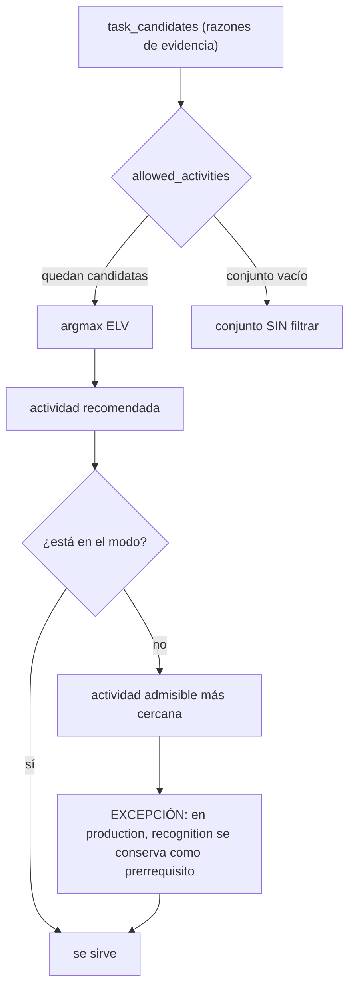

# Release notes — English Tutor v3.87.1

**Fecha:** 2026-09-27 · **Tipo:** release **DE ROBUSTEZ** (patch) · **Versión de app:**
`3.87.0 → 3.87.1`

**Con backend y frontend, SIN migración de BD, SIN endpoints nuevos** (la cola de flashcards publica
dos campos **ADITIVOS**: `upcoming_count` y `queue_count`), **SIN cambio de comportamiento runtime
del Planner 3.0** y **CON un cambio de UX** (la configuración de estudio de V3.87.0 deja de ocupar la
pantalla y pasa a **desplegable** tras el disparador «...»). **SIN bump** de `GENERATOR_VERSION` /
`DECISION_POLICY_VERSION` (`CURRICULUM_VERSION` sigue `1.3.1`) / `LISTENING_BANK_VERSION` ni de las
evaluaciones. **No se añade ni se retira gate** —siguen los **ocho**, todos en `pending`— y
`docs/audit/validation-evidence.json` **sigue sin existir**. Cierra los **tres hallazgos** (1 P1 + 2
P2) de la auditoría de V3.87.0 y **pliega** la configuración de estudio en DICCIONARIO/Estudiar.

**En una frase.** No cambia lo que el motor hace; arregla lo que el proyecto **dice** que hace,
separa dos contadores que estaban mezclados y quita de en medio cuatro selectores que tapaban los
botones de estudiar.

> **Estado de publicación (2026-09-29).** Este patch **nunca se etiquetó por separado**: su delta
> quedó **absorbido y publicado dentro de `v3.88.0`** (commit único y tag anotado `v3.88.0`, sobre
> `v3.87.0`). Se conserva este fichero como nota de cambios de la etapa, pero **la puerta de entrada
> para auditar es `v3.88.0`** —que lo declara en su §7.7—, **no** un tag `v3.87.1` que no existe.

---

## 1. P1 — El contrato de `mode` es una preferencia pedagógica (Política B)

La redacción de V3.87.0 describía el fallback del modo como **una sola regla** («si el filtro deja el
conjunto vacío, se cae al conjunto sin filtrar»). El motor implementa **dos capas**, y no eran
equivalentes:

- **Capa 1 — conjunto vacío → conjunto sin filtrar.** `planner.task_candidates` sirve el conjunto
  completo antes que dejar la sesión sin tarea.
- **Capa 2 — recomendación fuera del modo → actividad admisible más cercana.**
  `study_config.fallback_activity` no descarta el ítem: lo traduce (`recognition` → `recall`;
  `recall` → `sentence`) y **conserva `recognition` como prerrequisito receptivo en `production`**
  (sin base receptiva no hay con qué producir).

**Consecuencia honesta:** `production` **puede** seguir sirviendo `recognition`. El modo **orienta**
la selección; **no garantiza** la exclusión absoluta.

**Qué se hace.** No se cambia el runtime (se eligió la Política B por ser la que el código ya
implementaba y la pedagógicamente defendible): se corrigen las **notas de V3.87.0** (con un bloque de
**errata** trazable), `CHANGELOG.md`, `PLAN.md`, `docs/RELEVO.md`, `docs/audit/PARKED.md` y los
**docstrings** de `services/study_config.py`, `services/planner.py` y `services/lexicon.py`; y se
añaden **tests contractuales** que congelan la política.

## 2. P1 — Tests de contrato que fijan la Política B

En `backend/tests/test_study_config_v387.py`:

- `recommend_review_activity` con hueco de producción: `mixed` → `sentence`; `production` →
  `sentence`; `recognition` → `recall` (nunca produce).
- Recuperado sin hueco de producción: `mixed` → `recall`; `production` → `sentence`.
- **Prerrequisito receptivo**: ítem **sin exposición** + `production` → `recognition`.
- **E2E HTTP** de `GET /api/learning/review`: fila léxica sin exposición (recall fallido) y
  `mode=production` guardado → `items[0].activity == "recognition"`.
- Conjunto filtrado vacío → conjunto sin filtrar (ya cubierto, ahora explícito para `production`).

## 3. P2 — La cola separa `due_count` de `upcoming_count`

En `intensive`, `deck_queue` servía `due + upcoming` y publicaba `due_count = len(due)`, así que la
UI podía presentar como «vencidas» tarjetas que aún vencen en **≤ 24 h**. Ahora:

| Campo | Significado |
|---|---|
| `due_count` | **Vencidas reales** (siempre) |
| `upcoming_count` | **Adelantos** de `intensive` (≤ 24 h); `0` en el resto |
| `queue_count` | **Lo servido** (vencidas + adelantos) |

El `due_at` **sigue sin reescribirse**: `intensive` solo adelanta la oportunidad, no toca el
calendario de FSRS. Campos **aditivos** en `FlashcardQueueOut`, en `FlashcardQueue` del frontend y en
`normalizeStudyQueue`. Nota: hoy **ninguna** UI pinta `deck_queue.due_count` (el contador de repasos
visible viene de `/api/learning/review`), así que no había un display engañoso; los campos quedan
disponibles para explotarlos.

## 4. P2 — El comparador de producción no es `casefold`

La documentación decía que la comparación de la respuesta escrita usaba `casefold`, pero el código
usa `value.trim().toLowerCase().replace(/\s+/g, " ")` (JS no tiene `String.casefold()`). Se corrige
la documentación a la verdad del código: **case-insensitive + espacios colapsados**. No se toca el
comparador: para el inglés cotidiano la diferencia práctica es nula.

## 5. UX — La configuración de estudio pasa a desplegable

V3.87.0 dejó el panel de configuración **siempre abierto** (cuatro `<select>` + la nota) entre el
selector de mazo y las dos acciones de estudio. En móvil eso empujaba **«Repasar hoy» y «Estudiar
tarjetas»** —lo único que el alumno viene a pulsar en esa pestaña— fuera de la primera pantalla.

Ahora el panel **arranca cerrado** y se despliega al pulsar el disparador **«...»**, que queda
alineado a la derecha justo encima de las dos acciones. Se reutiliza `InfoDisclosure` con
`content="options"` en lugar de inventar un segundo acordeón: en esta app el «...» **ya significa
«abre para configurar»** (convención declarada en V3.75.7), así que el disparador promete exactamente
lo que hay dentro. El botón expone `aria-expanded`/`aria-controls` y conserva su nombre accesible
(«Configuración de estudio»), y **no se añade ni una cadena nueva** de i18n.

- **Sin cambio de contrato ni de comportamiento:** sigue guardando por `PUT /api/study/config` y
  sigue recargando la cola igual.
- **Tests:** el contrato nuevo se fija en `FlashcardsScreen.test.tsx` —arranca plegado (el contenido
  **no** está montado), se despliega, se vuelve a plegar— y el caso de guardado se adapta a abrir el
  disparador antes de tocar el selector.

## 6. Verificación

| Comprobación | Resultado |
|---|---|
| `pytest` backend | **3182/3182** |
| `vitest run` | **1063/1063** |
| `tsc --noEmit` | limpio |
| `ruff check backend launcher` | limpio |
| `check_i18n_coverage.py --strict` | **1822** cadenas · 0 huérfanas / sin definir / duplicadas / vacías |
| `contrast_audit.mjs --strict` | **480 + 6 guardas / 0 bloqueantes** |
| `npm run build` | correcto |
| `check_release_consistency.py` | OK en los **6 orígenes** (`3.87.1`) |
| Playwright (barrido completo, 26 ficheros) | **118 passed · 0 failed · 32 skipped** |

## 7. Honestidad: lo que NO trae

1. **No cambia el comportamiento runtime del Planner**: `mode` ya funcionaba así; este patch fija el
   contrato.
2. **La persistencia de `study_config` sigue siendo un merge lectura-modificación-escritura no
   atómico** (P2 diferido para la etapa multi-dispositivo; dos pestañas podrían pisarse un campo).
3. **No se toca FSRS**, `fsrs_cards`, el diccionario ni las versiones de contenido.
4. **El desplegable es un cambio de UX en un patch.** No añade capacidad —los cuatro ajustes, el
   endpoint y el guardado son los mismos de V3.87.0—, solo quita de la primera pantalla lo que no se
   venía a pulsar; aun así se declara aquí porque un cambio visible entra en un patch, no en un
   minor.
5. **Plegado, la configuración activa no se ve de un vistazo.** El disparador no resume la elección
   (dirección/modo/ayudas/carga) en su etiqueta: para saber cómo está configurada la sesión hay que
   abrirlo. Es una consecuencia aceptada de plegar el panel; si molesta, el arreglo es un resumen en
   el disparador, no volver a desplegarlo.
6. **Los ocho gates humanos siguen `pending`** y el ancla de certificación sigue en `v3.83.1`.

## 8. Archivos tocados (resumen)

**Backend:** `config.py` · `services/study_config.py` · `services/planner.py` · `services/lexicon.py`
· `domain/flashcards.py` · `schemas/vocabulary.py` · `tests/test_study_config_v387.py`.

**Frontend:** `types/api.ts` · `api/normalize.ts` · `api/normalize.test.ts` ·
`features/vocabulary/FlashcardsScreen.tsx` (el desplegable) ·
`features/vocabulary/FlashcardsScreen.test.tsx` · `package.json` · `package-lock.json`.

**Docs y release:** `release-notes-v3.87.1.md` (este fichero) · `release-notes-v3.87.0.md` (errata)
· `CHANGELOG.md` · `PLAN.md` · `README.md` · `docs/RELEVO.md` · `docs/audit/PARKED.md`.

---

## Para auditar esta release

- **Ancla:** **no hay tag `v3.87.1`.** Este delta se publica **dentro de `v3.88.0`**; auditar aquí
  significa leer `git diff v3.87.0..v3.88.0` y usar este fichero como guía de la etapa.
- **Alcance:** la política de `mode` (docstrings + docs + tests), los contadores de la cola
  (`deck_queue`, `FlashcardQueueOut`, tipos/normalización frontend), la corrección del `casefold`
  documental y el **plegado de la configuración de estudio** en DICCIONARIO/Estudiar
  (`FlashcardsScreen.tsx`, reutilizando `InfoDisclosure`).
- **Lo que NO toca:** FSRS y su clave, `GENERATOR_VERSION` / `DECISION_POLICY_VERSION` /
  `CURRICULUM_VERSION` / `LISTENING_BANK_VERSION`, las evaluaciones, el esquema de BD y el número o
  la definición de los gates.
