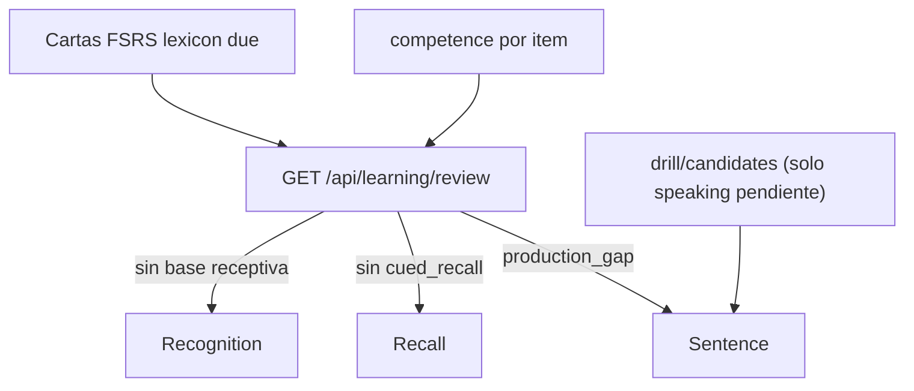

# v3.35.0 — Longitudinal Learning Evidence 1.0

**Cierra los dos P1 de la auditoría de V3.34.0 y convierte el Evidence Graph en
una verdadera historia longitudinal de aprendizaje, sin rehacer arquitectura.**

1. **P1-1 — Ancla encadenada.** La recuperación demorada deja de estar anclada a
   la primera exposición (`first_exposure → cada retrieval futuro`) y pasa a
   encadenarse: `evento_1 → intervalo_1 → evento_2 → intervalo_2 → …`. El ancla
   es la última recuperación válida y el intervalo exigido lo calcula FSRS.
2. **P1-2 — Cola de repaso propia.** El repaso espaciado del léxico deja de
   inyectarse dentro del speaking micro-drill y estrena su propio endpoint
   (`GET /api/learning/review`) con la actividad óptima por hueco de competencia.

Sobre esa base nace el **modelo de evidencia longitudinal**: ledger append-only
`learning_evidence` (attempts ≠ successes ≠ días ≠ intervalos), `event_role`
(evidence/telemetry/informative) en `learning_events` y
`interval_since_last_evidence`.

Versión de app `3.34.0 → 3.35.0`. Backend (migración aditiva + servicio puro de
evidencia + ancla encadenada + endpoint de repaso + schemas) + frontend (cola
«Repaso de hoy» + `initialStep` del drill + API + i18n + tests). Contrato HTTP
aditivo; migración idempotente y sin backfill.

## Qué cambia

### 1. Ancla longitudinal (P1-1)

`services/lexicon.py` gana dos funciones puras:

- `retrieval_anchor_at(row)` — el ancla es la ÚLTIMA recuperación válida:
  `max(last_retrieval_at, last_recall_at)` (recall por texto y micro-drill
  comparten la cadena longitudinal). Solo la PRIMERA recuperación de un ítem
  retrocede a su primera señal (`min(first_seen, first_exposed_at)`).
- `delayed_retrieval_decision(row, *, now, due_at="")` →
  `{anchor_at, interval_days, required_days, credited}`. El intervalo exigido es
  el del scheduler (`due_at` de la carta FSRS `lexicon`) cuando existe; sin
  carta, el suelo determinista `RETENTION_MIN_INTERVAL_DAYS`. Nunca por debajo
  del suelo: un intervalo diminuto (lapse) no es una recuperación demorada.

`repositories/vocabulary.py::record_retrievals(..., due_at="")` solo persiste: la
decisión es pura y el dominio (`domain/vocabulary.py::_retrieval_decision`) le
pasa el `due_at` de la carta. Al acreditarse, `last_retrieval_at` pasa a ser el
nuevo ancla.

Resultado: `D0 → D+3` acredita, pero `D+3 → D+4` ya no acredita automáticamente
si FSRS no ha vencido. La retención se mide como cadena, no como repeticiones
ancladas al día 0.

### 2. Cola de repaso propia (P1-2)

- `GET /api/learning/review` (`routers/learning.py`, esquemas en
  `schemas/learning.py`): cartas FSRS `lexicon` vencidas ordenadas por urgencia
  (`fsrs.due_queue`, retrievability ascendente), enriquecidas con la competencia
  del ítem y la actividad recomendada.
- `services/lexicon.py::recommend_review_activity(row, competence, now)` decide
  la actividad por hueco de competencia:
  - sin base receptiva (`exposure_count == 0`) → `recognition`;
  - reconocida pero sin recall por texto (`cued_recall == False`) → `recall`;
  - recuperada pero nunca producida (`production_gap`) → `sentence`;
  - el resto → `recall` de mantenimiento.
- Se retira el acople: `due_words` desaparece de `lexicon.drill_candidates` y
  `get_drill_candidates` deja de leer cartas FSRS. La cola de speaking vuelve a
  ser solo huecos de producción ORAL pendiente.

### 3. Modelo de evidencia longitudinal

- **Migración aditiva** (`repositories/db.py`): tabla append-only
  `learning_evidence` (`occurred_at`, `skill`, `target_type`, `target_id`,
  `surface_form`, `lexical_unit`, `task`, `activity`, `success`,
  `interval_since_last_evidence`, `event_role`) con índices
  `(user_id, target_id)` y `(user_id, occurred_at)`; columna `event_role` en
  `learning_events` (default `''` para legacy); columna `recall_attempts` en
  `vocabulary`.
- **Repositorio** (`repositories/evidence.py`): `record_evidence` (deriva el
  intervalo desde la evidencia anterior del mismo ítem), `record_evidence_bulk`
  (volcado de producción en una transacción), `summarize_by_target` (agregado
  SQL por ítem, sin N+1) y `list_evidence`.
- **Servicio puro** (`services/evidence.py`): `EVIDENCE_ROLES`,
  `classify_event_role`, `interval_days`, `summarize_evidence`
  (`attempts`/`successes`/`distinct_success_days`/`intervals`) y
  `empty_summary`.
- **Escrituras**: intento de recall (acierto y fallo), recuperación del
  micro-drill y producción (`record_production_text` / `analyze_text`). El fallo
  es evidencia negativa: `recall_attempts` separa el intento del éxito.
- **Exposición**: `LexicalCompetence.recall_attempts` +
  `LexicalItemOut.evidence` (`LexicalEvidence`) + `ReviewQueueItem.evidence`,
  derivados del ledger; los contadores de `vocabulary` siguen siendo el agregado
  rápido.

### 4. UI

- Nueva `frontend/src/features/vocabulary/ReviewQueueSection.tsx` («Repaso de
  hoy»), montada en `PersonalDictionary.tsx` junto al speaking drill: muestra
  cada ítem vencido con su actividad y razón, y abre el `WordDrill` directamente
  en el peldaño recomendado.
- `WordDrill` y `SpeakingDrillSection` ganan `initialStep?: DrillStep` (sin el
  refactor completo del componente, que queda para V3.36+).
- Nueva `frontend/src/api/learning.ts::getReviewQueue` y tipos en
  `types/api.ts`; claves i18n es/en nuevas.

## Fuera de alcance (P2 de la auditoría)

`response_time_ms`, clasificación de errores ortográficos, cues graduados,
`support_level`, `difficulty` en evidencia y el refactor completo de
`wordDrill.tsx`. Quedan como V3.36+.

## Tests y guards

- Backend: pytest **1764 passed** (+21). Nuevos `test_longitudinal_evidence_v335.py`
  (decisión pura del ancla, encadenado + gate FSRS en repositorio, `event_role`,
  `summarize_evidence`, derivación del intervalo, evidencia negativa del fallo,
  exposición en el léxico) y `test_review_queue_v335.py` (mapeo de actividad,
  orden por urgencia FSRS, aislamiento, retirada de la priorización FSRS del
  speaking drill). Actualizados `test_lexicon.py`, `test_vocabulary.py` y
  `test_recall_v334.py` a la semántica del ancla encadenada.
- Frontend: vitest **65 ficheros/557 tests** (+2 ficheros/+8 tests: API de la
  cola — restaura además los 3 casos preexistentes de
  `getProfile`/`analyzeText`/`getEvents` —, `WordDrill` con `initialStep` y
  `ReviewQueueSection`).
- `ruff check backend/` y `tsc --noEmit` limpios;
  `python scripts/check_release_consistency.py` → **3.35.0** exit 0.

## CI verificable

Commit `b304c257da1cffb408e127c80af1b43e12aa9955` con el run
[34467763326](https://github.com/jvelasca/english-tutor/actions/runs/34467763326)
en **success** (6/6 jobs: backend ruff+pytest, frontend tsc+vitest+build, release
consistency, Beta V3.0 gate, content validation, Playwright E2E).
