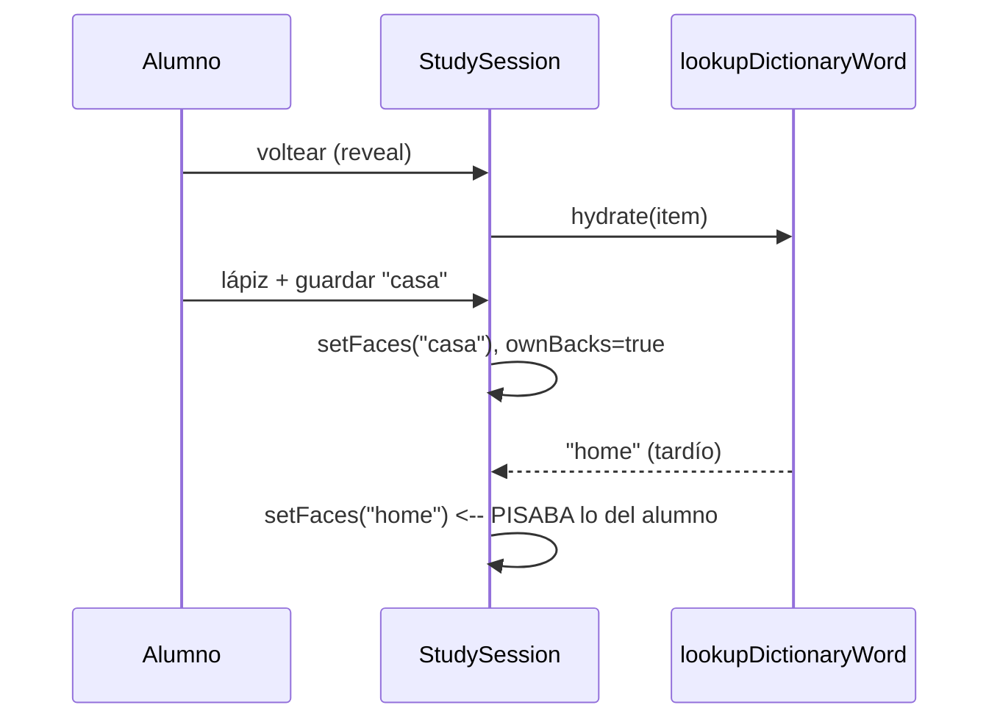
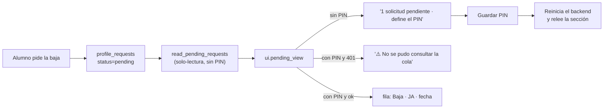

# Release notes — English Tutor v3.80.1

> **Estas notas NO describen una release publicada.** Este lote se implementó y
> verificó como `v3.80.1`, y el mismo día el gerente decidió repensar los perfiles
> como **cuentas de usuario**; publicar dos etiquetas con horas de diferencia
> habría duplicado el trabajo y el `CHANGELOG`. El lote se publica **dentro de
> `v3.81.0`** y esto se conserva como su **registro detallado**. Quien audite el
> rango `v3.80.0 → v3.81.0` debe leer **`release-notes-v3.81.0.md`** (mapa y
> contrato) **y** este fichero (detalle apartado por apartado del lote de
> estabilización). Los números de la sección «Verificación» de aquí son **de este
> lote**, medidos el 2026-09-22, y no los del árbol publicado.

**Fecha:** 2026-09-22 · **Tipo:** release **DE PRODUCTO** (patch) de
**ESTABILIZACIÓN** · **Versión de app:** `3.80.0 → 3.80.1`

**SIN migración de BD, SIN endpoints nuevos, SIN funcionalidad nueva y SIN bump**
de `GENERATOR_VERSION` / `DECISION_POLICY_VERSION` / `CURRICULUM_VERSION` (sigue
`1.3.1`) / `LISTENING_BANK_VERSION`. No añade ni retira un gate: **G1–G7 siguen
`pending`**. Lo único que cambia **fuera** del producto es a qué árbol apuntan los
gates: la base de certificación se re-ancla de `v3.75.8` a **`v3.80.1`**.

Es la release que cierra los hallazgos de la **auditoría externa de V3.80.0**
antes de congelar. La auditoría dio V3.80.0 por **aprobada funcionalmente** —la
arquitectura de Flashcards y la precedencia de la traducción están bien
planteadas— y pidió **no congelar todavía** por un P1 real en la UI y tres P2 de
pulido. Ninguno de los arreglos añade capacidad: todos hacen que lo que ya
existe **no mienta**. A ellos se suma **(G)**, un hallazgo reportado en uso
real —una baja de perfil que no aparecía en el lanzador— que resultó ser una
promesa incumplida del propio lanzador, no del flujo del alumno.

---

## 1. Qué arregla

### (A) P1 — La carrera entre generar la cara B y editarla a mano

`StudySession` lanzaba `hydrate()` al voltear (una promesa que puede tardar hasta
120 s, modelo local mediante) y `saveOwnBack()` escribía después. Si el alumno
usaba el lápiz mientras el modelo pensaba y su respuesta llegaba tarde, **la
respuesta del modelo pisaba la traducción recién guardada** y la pantalla
contradecía la fuente de verdad que el propio alumno acababa de escribir.

El arreglo es un **token por tarjeta** (`hydrationEpoch`) más un espejo síncrono
del estado de traducción propia (`ownBacksRef`, porque dentro del closure async
el estado de React puede estar desfasado). `hydrate()` captura el token antes del
`await` y **descarta su resultado** —el `setFaces` y también el `setLookupStates`
de error— si el token cambió o si la tarjeta ya tiene traducción propia. Guardar
o borrar **incrementa el token** e **invalida la hidratación en vuelo**. Además,
guardar retira el «Generando el reverso con el modelo local…» de esa tarjeta:
mientras el turno era del modelo, su propia versión ya guardada quedaba tapada
por el spinner.

Candado: `StudySession.test.tsx` usa una **promesa diferida** (`lookupDictionaryWord`
que no resuelve hasta que el test lo decide), voltea, guarda «casa», resuelve el
lookup tarde y exige que se siga viendo «casa» con el badge «Tu versión» y **que
no aparezca** el «home» generado.

### (B) P2 — El badge «Tu versión» sobre una traducción borrada

`saveOwnBack()` marcaba `ownBacks[key] = true` **también con `translation === ""`**,
así que borrar la traducción propia dejaba el badge puesto sobre un texto que ya
no existía. Ahora:

- con texto → se escribe la cara propia y se marca como propia (como antes);
- **al borrar** (`""`, que la API acepta para devolver la precedencia al pack) →
  se **desmarca** como propia, se olvida el resultado de hidratación y se
  **restaura la cara efectiva que sirvió el backend** (`item.back`); si no la
  había, se borra la cara y se **reintenta la caché** (`hydrate(..., force)`).

El badge solo se pinta con `ownBacks[key]`, así que desaparece.

Candado: guardar una traducción propia, borrarla y exigir que vuelva el valor del
pack y **no** quede ni el texto propio ni el badge.

### (C) P2 — La X del diccionario limpiaba el campo pero no el resultado

`clearQuery()` solo hacía `setQuery("")` y `setInvalidError(false)`, así que un
campo vacío convivía con la tarjeta de la consulta anterior: un estado que
**miente** (parece que la búsqueda sigue viva). Ahora limpia **todo** lo que
depende de la consulta —`entry`, `practiceWord`, `invalidError`, `networkError`,
`addStatus`, `lastQuery`— y vuelven a verse los ejemplos, que es el estado
honesto de «nueva consulta». No dispara ninguna petición nueva.

Candado: buscar, ver el resultado, pulsar `X` y exigir que el resultado
desaparezca y reaparezca «Prueba con un ejemplo».

### (D) P2 — Accesibilidad: los selectores tipo pestaña son pestañas ARIA reales

Los tres modos del diccionario y las cuatro vistas de Flashcards eran grupos de
botones (`role="group"` + `aria-pressed`) **pintados** como pestañas. Si parecen
pestañas, lo son también para un lector de pantalla: ahora hay
`role="tablist"` con etiqueta, botones `role="tab"` con `aria-selected`,
`id` y `aria-controls`, y un `role="tabpanel"` con `id`/`aria-labelledby` por
vista. Se añade el hook reutilizable `useTabList` (`frontend/src/hooks/useTabList.ts`)
con el **roving tabindex** (solo la activa es tabulable) y las teclas
`ArrowLeft`/`ArrowRight`/`Home`/`End`, con activación automática al mover el foco
—lo que espera quien navega con flechas—.

Candados: en `DictionaryScreen` y `FlashcardsScreen` se actualizan los que leían
`aria-pressed` a `aria-selected`/`role="tab"`, y se añaden un test de estructura
(`tablist`/`tab`/`tabpanel` asociados y roving tabindex) y otro de teclado
(ArrowRight mueve selección y foco).

### (E) P2 — El `lang` de las tarjetas manuales

`StudySession` y el navegador de Tarjetas marcaban **todo** con `lang="en"` (y el
reverso con `lang="es"`). En una tarjeta de **léxico** eso es cierto por
construcción (EN→ES); en una **manual** puede haber cualquier idioma, así que
declararlo era mentir. Ahora `lang` se aplica **solo cuando el idioma se conoce**
—tarjetas de léxico— y se **omite** en las manuales, tanto en la sesión de
estudio como en la lista de Tarjetas y en los inputs del anverso.

Candados: una tarjeta manual no declara `lang` en anverso ni reverso; una de
léxico declara `en` en el anverso y `es` en el reverso.

### (F) Sonda visual permanente de Diccionario y Flashcards

V3.80.0 declaró que la autoridad visual estaba solo en CI y **no había spec
permanente del diccionario** (el de V3.75.8 se borró). Esta release añade dos
specs **permanentes** que corren en los **tres breakpoints** (390 / 768 / 1280)
sin `skip`:

- `frontend/tests/visual/dictionarySmoke.spec.ts`: los tres modos, la consulta,
  el resultado y el borrado, con la asociación `tab`/`tabpanel` verificada.
- `frontend/tests/visual/flashcardsSmoke.spec.ts`: las cuatro vistas, el arranque
  de una sesión con su volteo, la guía de mazo vacío y los mazos listos.

Ambos usan mocks deterministas de `/api/**` (diccionario, léxico, ajustes, mazos,
cola, tarjetas, estadísticas, colecciones) sobre `ensureProfile`, y dejan
screenshots por breakpoint en `tests/visual/screenshots/<project>/`.

**Y aprenden la lección que ya estaba escrita en el repo.** La primera versión de
estos mocks usaba globs por endpoint —`**/api/settings*`, `**/api/voices*`— y eso
**casa también con los módulos de la propia app** (`/src/api/settings.ts`,
`/src/api/voices.ts`): el navegador pedía un módulo y recibía JSON, así que
**la aplicación no arrancaba** y la spec no encontraba ni las pestañas. Es
exactamente la trampa que `drillProvenance.spec.ts` ya documenta. Los dos specs
usan ahora **un único `page.route` anclado al origen**
(`/^https?:\/\/[^/]+\/api\//`), que deja fuera `/src/api/**` y no puede colisionar
con nada. Los endpoints de identidad (`/api/users`, `/api/session`) se ceden a la
cadena con `route.fallback()` para que siga mandando `ensureProfile`.

### (G) La cola de perfiles que el lanzador no podía ver

Hallazgo de uso real, no de la auditoría: una solicitud de **baja** de perfil
«no aparecía en el lanzador». Se reprodujo y **el flujo del alumno estaba bien**
—la petición estaba registrada en `profile_requests` (`kind='delete'`,
`status='pending'`)—; el fallo estaba entero en el lanzador, y tenía tres capas:

1. **Sin PIN, el contador no existía.** `launcher/config.json` tenía
   `admin_pin: ""` y `_load_profiles` **no consulta al backend sin PIN**
   (fail-closed deliberado). Hasta aquí, coherente; el problema es que el
   lanzador **no tenía ninguna otra forma de enterarse**, aunque
   `repositories/profile_requests.py` llevaba desde V3.77 afirmando que podía
   «contar las pendientes sin depender de que el backend conteste». Era una
   capacidad **declarada y no implementada**: no había ninguna función que leyera
   la cola de la BD.
2. **La consulta fallida se pintaba como cola vacía.** `_apply_profiles` no
   miraba `result.ok`: un **401** («Administración deshabilitada»), un **403**
   (fuera del equipo) o un servidor caído acababan en **«Sin solicitudes
   pendientes»** con la lista vacía — indistinguible de una cola realmente vacía,
   y sin un solo test que cubriera esos dos métodos.
3. **Guardar el PIN no llegaba al backend.** El PIN vive en el entorno del
   backend, que `backend_env()` copia **al arrancar**: con el servidor ya en
   marcha, `/api/admin/*` seguía respondiendo 401 aunque el lanzador tuviera el
   PIN guardado. La GUI solo lo pedía por texto («Reinicia el servidor…»).

El arreglo, capa por capa:

- **Contador honesto desde la BD** (`launcher/status.py::read_pending_requests`):
  se lee **siempre**, con PIN o sin él, en solo-lectura. Devuelve `0` cuando la
  cola está vacía (o la tabla no existe aún) y **`None` cuando no se pudo leer**:
  confundir ambas es justo lo que permitía afirmar un cero sin haber preguntado.
- **Vista pura de la cola** (`launcher/ui.py::pending_view`): los estados dejan de
  poder confundirse. Sin PIN y con pendientes, la frase **dice cuántas hay** y que
  hace falta el PIN para verlas y resolverlas; sin PIN y sin poder leer la BD, lo
  admite; con PIN y fallo, **dice el motivo**; con PIN y éxito, el contador de las
  filas que se pintan (el número y la lista no se contradicen) y las filas con la
  baja traducida de `user_id` a nombre.
- **El PIN se aplica de verdad** (`launcher.py::_apply_admin_pin_change`): guardarlo
  o retirarlo **reinicia el servidor** cuando está en marcha —igual que ya hacía el
  cambio de modo LAN— y avisa de que se aplicará al arrancar cuando no lo está; en
  la rama `started` se relee la sección para que deje de mostrar datos del backend
  viejo.

**Candados:** `read_pending_requests` cuenta solo `pending` (con la tabla
sembrada con `approved`/`rejected`), da `0` sin tabla y `None` sin BD;
`pending_view` se prueba en sus cuatro estados, y los de fallo **no pueden decir
«Sin solicitudes pendientes»**; y se fija el contrato del que depende el reinicio
—que el PIN declarado viaja al backend por `backend_env()` y que retirarlo también
viaja—, que es lo que hace que reiniciar sirva de algo.

---

## 2. Re-anclaje de la base de certificación: `v3.75.8` → `v3.80.1`

Los documentos seguían diciendo que el árbol que se certifica era `v3.75.8`, pero
V3.78.0, V3.79.0 y V3.80.0 **añadieron producto**. Como la campaña de los 7 gates
tenía **0 `record`** —nada que invalidar—, el ancla se mueve al árbol actual por
**tag** (`v3.80.1`), sin fijar un SHA a mano (regla de V3.73.5). Queda declarado en
`docs/audit/KIT-VALIDACION-GATES.md` (sección «Re-congelación»),
`docs/audit/G7-MATRIZ-LECTURA.md`, `docs/audit/PARKED.md` y la cabecera de
`docs/RELEVO.md`. **G1–G7 siguen `pending`**: lo único que cambia es sobre qué
árbol se correrán.

---

## 3. El test no demuestra lo que el motor no cumple

Conviene separarlo, porque son dos afirmaciones distintas:

- **Lo que el test demuestra** es que la UI **ya no miente**: que una respuesta
  tardía del modelo no pisa la traducción del alumno, que el badge no se queda
  puesto sobre un texto borrado, que la `X` deja el diccionario en «nueva
  consulta», que los selectores son pestañas ARIA navegables con teclado y que
  una tarjeta manual no declara un idioma que no consta.
- **Lo que el test NO demuestra** es que la generación del reverso sea rápida o
  que exista siempre: sigue dependiendo del **modelo local**. Si el modelo no
  está o tarda, la tarjeta se queda sin reverso —a propósito— y la sesión sigue
  pudiéndose calificar. Es una mejora **condicional**, no una garantía.

---

## 4. Verificación

| Instrumento | Resultado |
| --- | --- |
| `ruff check .` (backend) | limpio |
| `pytest` (backend) | **3008/3008** |
| `tsc --noEmit` | limpio |
| `vitest run` | **972/972** (108 ficheros) |
| `npm run build` | correcto (`package.json` en `3.80.1`) |
| i18n `--strict` | **1706** cadenas · **0 huérfanas / 0 usadas sin definir / 0 duplicadas** |
| contraste `--strict` | 480 pares (+6 guardas) · **0 bloqueantes** |
| `check_release_consistency` | OK en los **6 orígenes** (`3.80.1`) |
| `validation_gate.py auto` | **10/10** |
| `pytest` (launcher) | **216/216** + `ruff` limpio |
| `Playwright` (visual) | `dictionarySmoke` y `flashcardsSmoke`: **6/6** en los tres proyectos (390/768/1280) |

Tests nuevos: `StudySession.test.tsx` (**3**: la carrera con promesa diferida, el
badge al borrar, el `lang`), `DictionaryLookup.test.tsx` (**1** reformado en
sitio: la `X` limpia búsqueda y resultado), `DictionaryScreen.test.tsx` (**2**:
estructura ARIA y teclado), `FlashcardsScreen.test.tsx` (**1** de teclado), los
dos specs visuales permanentes, y —en (G)— `test_status.py` (**3**:
`read_pending_requests` cuenta solo las pendientes, tabla ausente y BD ilegible),
`test_ui.py` (**7** sobre `pending_view`, con los dos candados de «un fallo no es
un cero») y `test_admin_pin.py` (**1**: el PIN declarado viaja al backend por
`backend_env()`, que es lo que justifica el reinicio).

---

## 5. Lo declarado y NO cerrado

1. **El timeout de hidratación sigue siendo el global de 120 s.** Un timeout corto
   específico para la cara B de Flashcards (para no dejar el spinner eterno si el
   modelo está lento, en vez de caído) queda **aparcado y declarado** en
   `docs/audit/PARKED.md`; cambiar el timeout global afecta a toda la app y no es
   una estabilización.
2. **No hay idioma por mazo.** El `lang` de una tarjeta manual se omite porque no
   se conoce; añadir una configuración de idioma por mazo es **funcionalidad
   nueva** y queda aparcada.
3. **El mismo pack sigue listado en dos sitios** (PERSONAL para añadir, Mazos para
   estudiar). Es una duplicación **declarada** desde V3.80.0 y consolidarla queda
   aparcada; no se toca aquí.
4. **El barrido visual completo sigue teniendo flakiness local, y la autoridad
   sigue siendo el CI.** Medido aquí: la tanda completa en paralelo sobre esta
   máquina da **54 pasan / 2 fallan / 28 omiten**, y los dos que fallan
   —`keyboard.spec.ts` (las tarjetas del hub de `/#/aprender`) y `resize.spec.ts`
   (el asa del panel de conversaciones)— **no tocan nada de esta release y pasan
   en aislamiento con estos cambios aplicados y con ellos revertidos**; además, al
   repetir la tanda, el conjunto que falla se mueve. La causa es del entorno: el
   Vite local proxea `/api` a un `:8000` que aquí sirve **HTTPS**, así que bajo
   carga las pantallas que dependen de datos reales (hub y chat) llegan a pintar
   sin ellos. Las dos specs nuevas son deterministas porque mockean todo su
   `/api`, y dan **6/6 en los tres breakpoints**.
5. **La cola sigue exigiendo PIN para leerse en detalle y resolverse.** Sin PIN,
   el lanzador ahora **cuenta y anuncia** las pendientes leyendo la BD, pero ver
   la fila y aprobar/rechazar sigue detrás del doble candado (PIN + loopback). Es
   deliberado y se declara aquí: **contar no es decidir**. Lo que se cierra en (G)
   es la mentira («sin solicitudes» cuando había una), no el candado.
6. **G1–G7 siguen `pending`** y esta release no los toca: solo re-ancla el árbol
   sobre el que se correrán.
