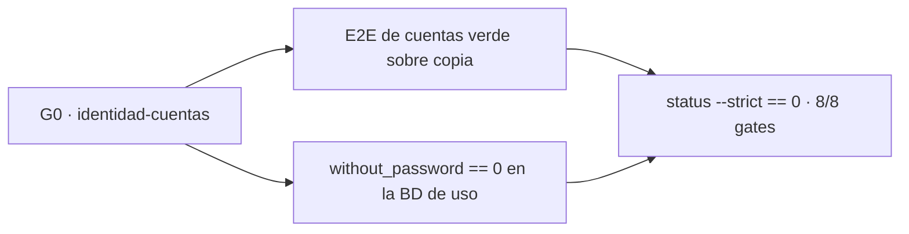

# Release notes — English Tutor v3.81.2

**Fecha:** 2026-09-23 · **Tipo:** release **DE PRODUCTO** (patch) — parche de
**PRIVACIDAD** y de **cierre de fase** ·
**Versión de app:** `3.81.1 → 3.81.2`

**SIN migración de BD, SIN endpoints nuevos y SIN cambio de contrato de API.**
Todo lo que toca la base de datos es **aditivo y no destructivo**: una BD de
`V3.81.1` se abre intacta. `GENERATOR_VERSION`, `DECISION_POLICY_VERSION`
(`CURRICULUM_VERSION` sigue `1.3.1`), `LISTENING_BANK_VERSION` y las evaluaciones
**no se tocan**.

**Lo que cambia de verdad:** el historial `user_events` deja de guardar correos,
el `EVENT_PURGED` deja de poder registrar una purga que no ocurrió, y la
transición de las cuentas heredadas sin credencial —la deuda que `V3.81.0`
declaró— pasa a ser **candado de la puerta de V4.0** en lugar de una nota al pie.

---

## 1. El hallazgo: PII que sobrevive al borrado

La purga de una cuenta (`purge_profile` → `users_repo.purge_user`) borra las filas
de todas las tablas con `user_id`, pero **`user_events` no entra ahí a propósito**:
su columna es `subject_id` y es el registro que responde después «¿quién borró
esta cuenta y por qué?». Esa decisión es correcta y no se toca.

El problema era **qué** se estaba metiendo dentro de ese historial superviviente:

```bash
git grep -n 'note=email\|note=f"email\|email={"\|email →' v3.81.1 -- backend
```

Cuatro sitios escribían el **correo en claro** en la nota:

| Dónde | Acción | Nota que escribía |
|---|---|---|
| `routers/users.py` (alta) | `EVENT_CREATED` | el email del alumno |
| `routers/session.py` (cambio de email) | `EVENT_EDITED` | `email → <correo>` |
| `routers/account.py` (verificación por enlace) | `EVENT_EMAIL_VERIFIED` | el email |
| `domain/profile_requests.py` (credenciales) | `EVENT_CREDENTIALS` | el email + `· temporal` |

Como `user_events` **sobrevive a la purga**, el correo de una cuenta borrada podía
quedarse atrás: «borrar toda la evidencia de la cuenta» era cierto para las filas
del alumno y **falso** para su correo.

**Clasificación honesta:** es un hallazgo de **privacidad/retención**, no de
autenticación. Nadie podía entrar sin credencial por esto. Lo que estaba mal era
la promesa del borrado.

---

## 2. El arreglo: el hecho administrativo, no el dato personal

### 2.1 Se deja de escribir el correo

Las cuatro notas pasan a registrar **qué pasó**, que es lo que una auditoría
necesita, y no **a quién**:

```python
# backend/domain/profile_requests.py
note="credencial asignada" + (" · temporal" if must_change else "")
```

```python
# backend/routers/session.py
note="email actualizado"
```

El valor sigue leyéndose de la fila de `users`, que es justo lo que la purga **sí**
borra. No se pierde ninguna capacidad: el webmaster ve el correo actual de la
cuenta en la consola, y el historial sigue diciendo cuándo y quién lo cambió.

### 2.2 Se redacta lo ya guardado (migración de arranque)

Una instalación que venía de `V3.81.0`/`V3.81.1` **sí** puede tener correos
guardados en el historial. `backend/repositories/db.py` gana:

```python
_EMAIL_RE = re.compile(r"[A-Za-z0-9._%+\-]+@[A-Za-z0-9.\-]+\.[A-Za-z]{2,}")

def redact_emails(text: str) -> str:
    return _EMAIL_RE.sub("(email)", text or "")
```

y `_scrub_user_event_emails(conn)` recorre `SELECT id, note FROM user_events WHERE
note LIKE '%@%'`, redacta y hace `UPDATE` **solo cuando el texto cambia**. Se llama
**dentro del bloque de `init_db()`**, tras crear `user_events`:

- **Idempotente por construcción:** `(email)` no casa con el patrón de correo, así
  que una segunda pasada no encuentra nada que cambiar.
- **Acotada:** solo mira filas con `@`; no reescribe la tabla ni toca ninguna otra.
- **No destructiva:** conserva el resto de la nota (p. ej. `credencial asignada ·
  temporal`), y si el correo estaba dentro de una frase, la frase sigue ahí.

### 2.3 Defensa en profundidad: la purga también redacta

`purge_user` llama a `redact_subject_notes(conn, uid)` **antes** de borrar la fila
de `users`:

```python
with closing(_conn(foreign_keys=False)) as conn, conn:
    _purge_user_rows(conn, uid)
    redact_subject_notes(conn, uid)
    conn.execute("DELETE FROM users WHERE id = ?", (uid,))
```

Con esto, la garantía «después de la purga no queda PII en el historial» **no
depende** de que la migración de arranque haya corrido: es una propiedad de la
propia purga.

---

## 3. El orden de `EVENT_PURGED` estaba invertido

El flujo era:

```
create backup → record EVENT_PURGED → purge_user
```

La copia previa y el borrado **no son una transacción**: si la purga fallaba, el
historial quedaba con «datos purgados» y la cuenta seguía existiendo. Es la peor
clase de evidencia —la que afirma lo que no ocurrió— y contradecía el motivo por el
que el evento vive donde vive.

Invertido:

```
create backup → purge_user → si OK → record EVENT_PURGED
```

El nombre del sujeto se captura **en memoria** antes de borrar (`user`, ya leído
para validar `confirm_name`), así que el evento se puede escribir después sin la
fila de `users`: `user_events` sobrevive por su columna `subject_id`, no por la
cuenta. Y si `purge_user` devuelve `False`, la función devuelve `None` y **no se
registra nada**.

---

## 4. La deuda de `V3.81.0` deja de ser una nota al pie: el gate `G0`

`V3.81.0` declaró que una cuenta con `password_hash == ''` (anterior a la gestión
de usuarios) **sigue entrando nombrando**, para no dejar a nadie fuera de sus
datos, y que eso mantenía el P0 de identidad **abierto para esas cuentas**. Se
mantuvo la compatibilidad y se declaró la deuda.

Lo que cambia aquí es **la naturaleza de la deuda**: pasa de prosa a
**condición de la puerta de V4.0**.



- `scripts/validation_gate.py` registra el **octavo gate**, `G0 ·
  identidad-cuentas` (`human=True`), y `check_gates_declared()` exige
  **`len(GATES) == 8`**.
- `status --strict` pasa de exigir **7/7** a exigir **8/8**: con
  `without_password > 0` el P0 de identidad **no** está cerrado y **V4.0 no puede
  declararse**.
- La evidencia del gate es el **E2E de cuentas verde** más el **contador a cero**
  en la BD de uso. Llevarlo a cero es trabajo de uso —asignar credenciales a cada
  cuenta heredada desde la consola de Usuarios—, no de código: por eso el gate es
  humano y por eso se puede quedar `pending` sin que la release esté incompleta.

### 4.1 El E2E recorre la migración heredada entera

`backend/scripts/e2e_accounts_v381.py` **siembra** una cuenta heredada
determinista en la **copia** de la BD (no depende de la BD de entrada, así que el
escenario se puede reproducir en cualquier equipo) y recorre:

| Paso | Qué comprueba |
|---|---|
| 8.1–8.2 | La cuenta heredada entra **sin contraseña** (compatibilidad declarada) |
| 8.3 | Y antes de migrar ve sus datos de siempre |
| 8.4–8.5 | La consola le asigna credenciales y devuelve una **temporal** (`must_change_password=True`) |
| 8.6 | El contador `without_password` **baja exactamente en uno** |
| 8.7–8.8 | Entra con la temporal, y el resto de la app responde `403 PASSWORD_CHANGE_REQUIRED` |
| 8.9 | Consultar la propia sesión sí está permitido (dice qué pedir) |
| 8.10 | `PUT /api/session/password` completa el cambio obligatorio |
| 8.11 | La cookie de la temporal deja de valer: **`401 SESSION_STALE`** |
| 8.12–8.13 | Con la definitiva vuelve a entrar; la temporal ya no abre |
| 8.14 | **Sus datos siguen intactos** tras la migración |
| 8.15–8.16 | El historial lo registra y **no guarda el correo** |

Y en la sección de purga se añade la comprobación de que el historial que
sobrevive **no contiene ningún patrón de correo** (paso 7.6c).

---

## 5. Verificación

| Comprobación | Resultado |
|---|---|
| `ruff check .` | limpio |
| `pytest -q` | **3089/3089** |
| E2E de cuentas sobre **copia** de la BD real | **77 pasos · 0 fallos** |
| `check_release_consistency.py` | OK en los **6 orígenes** (`3.81.2`) |
| `validation_gate.py auto` | **10/10** · **8 gates declarados** |
| `validation_gate.py status` | 8 gates, **`G0 · identidad-cuentas`** incluido |

Tests nuevos en `backend/tests/test_accounts_v381.py` (**4**):

1. Las notas del historial (alta, credenciales, edición y verificación) **no
   guardan el email**.
2. `EVENT_PURGED` **no** se registra cuando la purga falla (nombre que no coincide)
   y **sí** cuando ocurre.
3. Un evento histórico con email insertado a mano queda **redactado** al purgar.
4. La migración de `init_db()` redacta los correos existentes y es **idempotente**.

Y los candados de recuento pasan a ocho: `backend/tests/test_validation_gate_v373.py`
(`EXPECTED_GATES`) y `backend/tests/test_docs_drift_v373.py` (`GATES` + `len == 8`).

**La prueba se hizo sobre una COPIA de la BD** (`backend/data/tutor.db` → temporal),
como en `V3.81.0`: el guion comprueba al final que el fichero original conserva el
mismo `sha256` y los mismos recuentos.

---

## 6. Honestidad

1. **G0 queda `pending`, y esta release no lo cierra.** La BD de uso de este equipo
   tiene hoy **3 cuentas heredadas sin credencial** (`J.A` ×2 y `Paz`), así que el
   gate **no** puede declararse en `pass`. Ese es exactamente su cometido: que
   nadie declare cerrado el P0 de identidad mientras exista el camino «entrar sin
   contraseña». Lo que esta release garantiza es que **no se puede olvidar**.
2. **En la BD de uso no había PII que limpiar.** `user_events` tiene **0 filas**,
   así que el hallazgo era un **riesgo de código**, no un dato ya expuesto. La
   migración de arranque existe para las instalaciones que **sí** grabaron correos;
   declararlo evita vender como «limpieza de datos» lo que aquí fue «cierre de una
   vía».
3. **El regex de redacción es un patrón, no un analizador.** Un correo escrito con
   formas exóticas (comentarios RFC, direcciones entre corchetes, un correo partido
   por saltos de línea) podría no casar. Se acepta a propósito: la limpieza es
   defensa en profundidad, y la garantía fuerte es **dejar de escribir el correo**
   (§2.1), no la redacción.
4. **El historial sigue guardando el nombre del sujeto** (`subject_name`), y eso no
   cambia. Es deliberado: sin él, la pregunta «¿a quién se purgó?» no tendría
   respuesta; y un nombre no es, por sí solo, un identificador de contacto. Si el
   gerente quiere un borrado aún más estricto (seudonimizar también el nombre),
   es una decisión de producto y va en `PARKED.md`.
5. **No se han reescrito las notas históricas** de `v3.81.0` ni `v3.81.1`: su
   `PARKED.md` y sus release notes siguen diciendo lo que decían («la cuenta
   heredada entra sin contraseña», «G1–G7 siguen `pending`»), y esta release es la
   que explica el resto. Un tag publicado no se recrea.
6. **Fuera de alcance, declarado:** la **política de contraseña** (el mínimo corto
   y la afirmación de «miles de años» en la documentación siguen sin ser
   defendibles), el **freno de intentos en memoria** (un reinicio lo vacía) y la
   **terminología «perfil/usuario»**, que todavía convive en algunos textos. Los
   tres quedan declarados en `docs/audit/PARKED.md` §`V3.81.2`.
7. **No hay migración de columnas y no se toca el contrato de la API.** Ninguna
   llamada cambia de forma; lo único que cambia en las respuestas es que las notas
   del historial dejan de poder contener un correo.

---

## Para auditar esta release

- **Ancla:** el tag anotado **`v3.81.2`**. La run que **certifica** ese commit es la
  del **push a `main`**, porque **el CI no dispara en tags**
  (`.github/workflows/ci.yml` escucha `push: branches: [main]` y `pull_request`).
  Un tag no dispara nada: quien audite «el CI del tag» audita el CI del commit al
  que apunta el tag.

```bash
git rev-parse 'v3.81.2^{commit}'   # commit de release (el SHA exacto que se audita)
gh run list --commit <sha>
```

| Certificación | Valor |
|---|---|
| Workflow | `CI` · evento `push` · rama `main` |
| Run | **`35926727880`** — https://github.com/jvelasca/english-tutor/actions/runs/35926727880 |
| Resultado | **`conclusion = success`, 12/12 jobs** |

Los doce jobs verdes: `Release consistency`, `Backend (ruff + pytest)`,
`Frontend (tsc + vitest + build)`, `Launcher (ruff + pytest)`, `Launcher (Windows,
ruff + pytest)`, `Product origin (Windows, informativo)`, `Product origin (UI
served over HTTPS)`, `Content validation`, `Validation gate (checks automáticos)`,
`Beta V3.0 gate`, `Dependency audit (pip-audit + npm audit)` y `Playwright E2E
(visual)` —este último es el que estaba rojo en `v3.81.0` y el que `v3.81.1`
arregló—.

- **Errata declarada (patrón de `v3.81.1`, §0.2):** el id de la run **no puede ir
  dentro del propio commit que la dispara** (un commit no contiene el id del push
  que lo publica). Se añade en un **commit documental POSTERIOR al tag `v3.81.2`**
  que **no toca producto, pruebas ni versiones**, de modo que `main` va **un commit
  por delante** de `v3.81.2` y el invariante «`git diff --stat v3.81.2..main --
  backend frontend launcher scripts` sale **vacío**» se cumple **en ese commit**, no
  en el del tag. El tag **no se mueve** (regla de `docs/audit/KIT-VALIDACION-GATES.md`).
- **Lo que hay que mirar, en orden:**
  1. `git diff v3.81.1..v3.81.2 -- backend` → los cuatro sitios que escribían el
     correo, `redact_emails` + la migración de arranque, `redact_subject_notes` y
     el orden invertido de `EVENT_PURGED`.
  2. `scripts/validation_gate.py` → el gate `identidad-cuentas` y `len(GATES) == 8`.
  3. `backend/scripts/e2e_accounts_v381.py` → la sección 8 y el paso 7.6c.
  4. `backend/tests/test_accounts_v381.py` → los cuatro candados nuevos.
- **Invariante que esta release SUSTITUYE.** El punto de entrada de la auditoría
  anterior (`agentes/auditoria-total-externa-v381.md`) declara como invariante que
  `git diff --stat v3.81.1..main -- backend frontend launcher scripts` sale
  **vacío**. Ese invariante **deja de ser cierto a partir del tag `v3.81.2`**, y se
  declara aquí (y en una **errata en la cabecera de ese mismo documento**) para que
  nadie lo lea como un fallo: el documento sigue siendo válido **para el arco que
  audita** (`v3.80.0..v3.81.1`), y la auditoría del nuevo arco necesita su propio
  punto de entrada anclado a `v3.81.2`.
- **La revisión es de solo lectura:** un tag publicado no se recrea.
