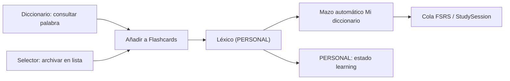

# Release notes — English Tutor v3.83.0

**Fecha:** 2026-09-24 · **Tipo:** release **DE PRODUCTO** (minor) ·
**Versión de app:** `3.82.0 → 3.83.0`

**Diccionario → Flashcards y sesión de estudio tipo juego.** Buscar una palabra y
añadirla la convierte **de verdad** en palabra en aprendizaje —aparece en PERSONAL,
en el mazo automático «Mi diccionario» y en la cola FSRS, porque es el mismo
vocabulario— y ahora **se dice en pantalla**; y estudiar deja de parecer un
formulario para parecerse a un juego: volteo 3D, barra de progreso, notas con icono
y color, atajos y un cierre que celebra **el acierto de la sesión**.

**Release SOLO FRONTEND.** Reutiliza los endpoints que ya existían
(`POST /api/vocabulary/items`, `GET /api/vocabulary/collections`, los mazos y la
cola FSRS): **SIN migración de BD, SIN endpoints nuevos y SIN cambio de contrato de
API**. **SIN bump** de `GENERATOR_VERSION` / `DECISION_POLICY_VERSION`
(`CURRICULUM_VERSION` sigue `1.3.1`) / `LISTENING_BANK_VERSION` ni de las
evaluaciones. **No se añade ni se retira gate** —siguen los **ocho**, todos en
`pending`—.

---

## 0. El diagnóstico: dos mitades del mismo problema

1. **El vínculo «todo uno» existía, pero no se veía.** `addVocabularyItem` ya creaba
   la fila de léxico (estado `learning`) **y** la carta FSRS, así que una palabra
   añadida desde el diccionario ya entraba en PERSONAL y en el mazo automático
   (`AUTO_DECK_ID = 0`, que es una **vista del léxico**). Pero el botón se llamaba
   «Añadir a Personal» y no explicaba nada: desde fuera parecía un cajón, no la
   puerta del proceso de estudio.
2. **Flashcards se veía como un formulario.** La tarjeta era plana (un `button` con
   texto), no había forma de ver el avance salvo un número, y las cuatro notas FSRS
   eran botones de texto idénticos entre sí.

---

## 1. Diccionario → «Añadir a Flashcards»

- El botón **«Añadir a Personal»** pasa a **«Añadir a Flashcards»** y abre un
  **panel** (animado con `motion`) bajo la cabecera de la tarjeta de resultado.
- El panel **declara el vínculo** antes de confirmar: la palabra queda en
  **aprendizaje**, aparece en **Personal** y en el mazo **«Mi diccionario»**, y se
  repasa con **repetición espaciada**.
- **Selector de lista opcional** con las listas propias del alumno
  (`listVocabCollections`, filtrado a `kind === "user_list"`), cargado **de forma
  perezosa** al abrir el panel. Un **pack curado no es un destino de archivo**: no
  se ofrece. Si las listas no cargan, se avisa y el alta sigue siendo posible.
- Al confirmar se llama al **mismo** `addVocabularyItem(userId, término, {
  translation, collectionId })`. Nada nuevo en el backend: el alta **es** la entrada
  al proceso de estudio.
- **Éxito honesto:** «{palabra} ya está en aprendizaje» + «Aparece en Personal y en
  tu mazo Mi diccionario» + **CTA «Estudiar en Flashcards»**, que salta al modo de
  estudio de la misma pantalla (`onOpenFlashcards` → `setView("flashcards")`).
- Si la palabra **ya está** en el léxico (`entry.usage.tracked`), **no se ofrece un
  alta que no cambiaría nada**: se declara «Ya está en tu diccionario — forma parte
  de tu proceso de estudio» y se ofrece **estudiar**. Sin duplicados.
- En **ES→EN** se añade el **equivalente inglés** (el mismo término de práctica que
  usa el drill), nunca el término español.

---

## 2. Sesión de estudio tipo juego

- **Volteo 3D real** con `motion/react`: las dos caras viven en una misma escena
  (`perspective` + `transform-style: preserve-3d` + `backface-visibility`) y solo
  una mira al frente. El control sigue siendo el **botón** con `aria-label` «Flip
  card» y las caras son `span` decorativos, así que **accesibilidad y contratos de
  los tests no cambian**.
- **Barra de progreso** de la sesión. Además de verse, **se anuncia**: se reenvía
  `value` a la raíz de Radix (`components/ui/progress.tsx`), que antes solo movía el
  indicador y **no pintaba `aria-valuenow`**.
- **Botones de nota con icono y color semántico** (Again rojo / Hard ámbar / Good
  primario / Easy verde; `RotateCcw`, `Frown`, `Smile`, `Zap`) y **atajo 1–4**. El
  rótulo vive en su propio nodo para conservar el **nombre accesible exacto** de cada
  grado (se sigue leyendo «Good», no «3Good») y el atajo se declara con
  `aria-keyshortcuts`.
- **Cierre de sesión con celebración** (`Sparkles` animado con `useReducedMotion`)
  que declara el **acierto de ESTA sesión** —grados ≥ 3 sobre las tarjetas
  repasadas— **en línea aparte** del «Session done — N cards reviewed.», sin
  convertirlo en una nota de dominio (D5/E3).
- **`prefers-reduced-motion` respetado:** con «reducir movimiento» el volteo y la
  celebración se apagan; la información no cambia.
- Se conservan **intactos** los idiomas (`lang`), los badges, el lápiz de reverso
  propio, la hidratación de la cara B y sus mensajes («Generando…» / modelo caído).

---

## 3. Cambios, pieza a pieza

| Pieza | Antes (`v3.82.0`) | Ahora (`v3.83.0`) |
|---|---|---|
| Botón del diccionario | «Añadir a Personal», sin contexto | «Añadir a Flashcards» con panel que explica el vínculo |
| Destino del alta | léxico + FSRS (ya era así) | igual, **pero visible y explicado** |
| Lista de archivo | no se ofrecía | selector opcional (solo listas propias) |
| Palabra ya en léxico | se ofrecía «Añadir» igualmente | se declara y se ofrece **estudiar** |
| Tarjeta de estudio | plana, sin volteo | **volteo 3D** (dos caras) |
| Progreso | solo un número | **barra** con `aria-valuenow` |
| Notas FSRS | 4 botones de texto | icono + color + **atajo 1–4** |
| Fin de sesión | solo «N repasadas» | + **acierto de la sesión** y celebración |
| Movimiento | — | apagable con `prefers-reduced-motion` |

Ficheros principales: `frontend/src/features/vocabulary/DictionaryLookup.tsx`,
`DictionaryScreen.tsx`, `StudySession.tsx`,
`frontend/src/components/ui/progress.tsx` y `frontend/src/utils/i18n.ts`
(**12** cadenas nuevas/actualizadas, en `en` y `es`).

---

## 4. Verificación

- `tsc --noEmit` limpio.
- `vitest run` **1033/1033** (109 ficheros). **+14 casos nuevos**:
  - `DictionaryLookup.test.tsx`: alta con `translation` y `collection_id`, filtrado
    del selector a listas propias y palabra ya rastreada sin re-alta.
  - `StudySession.test.tsx`: barra de progreso, atajos 1–4 y acierto del resumen.
- i18n `--strict` **1772** cadenas con **0 huérfanas / 0 usadas sin definir / 0
  duplicadas**.
- Contraste **480 pares + 6 guardas / 0 bloqueantes** (`contrast_audit.mjs --strict`),
  incluidos los nuevos tonos de los botones de nota.
- `validation_gate.py auto` **10/10** (8 gates, todos `pending`).
- `check_release_consistency` OK en los **6 orígenes** (`3.83.0`).

---

## 5. Honestidad

1. **Solo frontend.** No se toca ni el backend ni la BD. El alta usa el endpoint que
   ya existía, así que una palabra añadida desde el diccionario **ya era** palabra
   en aprendizaje antes de esta release: lo que cambia es que **ahora se ve y se
   dice**.
2. **Sin gamificación de datos.** No hay XP, niveles ni rachas: el «juego» es visual
   y de movimiento, como se pidió.
3. **El acierto es de la sesión** (grados ≥ 3 sobre lo repasado), no una promesa de
   dominio.
4. **El alta deja la palabra en `learning` por diseño.** No hay un estado «nuevo»
   aparte para lo buscado: comparte la misma cola de estudio que las demás palabras.
5. **El selector solo archiva, nunca saca del estudio.** Archivar en una lista
   propia añade pertenencia; no retira la palabra del léxico, del mazo automático ni
   de la cola FSRS.
