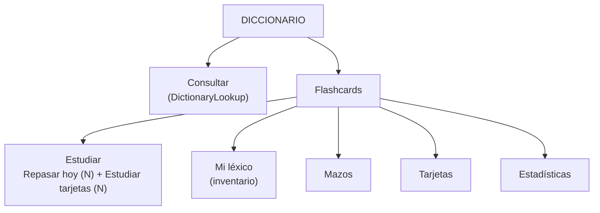

# Release notes — English Tutor v3.85.0

**Fecha:** 2026-09-26 · **Tipo:** release **DE PRODUCTO** (minor) · **Versión de app:**
`3.84.1 → 3.85.0`

**SOLO FRONTEND, SIN migración de BD, SIN endpoints nuevos y SIN cambio de contrato de API.**
**SIN bump** de `GENERATOR_VERSION` / `DECISION_POLICY_VERSION` (`CURRICULUM_VERSION` sigue
`1.3.1`) / `LISTENING_BANK_VERSION` ni de las evaluaciones. **No se añade ni se retira gate**
—siguen los **ocho**, todos en `pending`— y `docs/audit/validation-evidence.json` **sigue sin
existir**.

**En una frase.** El diccionario deja de tener tres pestañas —el inventario pasa a ser la
sub-pestaña `Mi léxico` de Flashcards— y «Repasar hoy» deja de ser una lista de estados con un
botón por fila para convertirse en una **acción** que encadena la cola del día.

---

## 1. El defecto, y era de diseño

«Repasar hoy» era una **lista de hasta 20 filas**, cada una con cuatro capas de texto (motivo,
`why`, señales de la decisión y badges) y **un botón por ítem cuya etiqueta era una palabra de
estado**:

```246:261:frontend/src/features/vocabulary/ReviewQueueSection.tsx
                <button
                  type="button"
                  onClick={() => setActive(entry)}
                  ...
                >
                  {t("dictionary.review.overdue")}
                </button>
```

En móvil eso se lee como un **informe**, no como algo que se pulsa: el botón dice lo que la
palabra *es* («vencida»), no lo que va a pasar si lo pulsas. Y la lista no aportaba nada que no
dijera ya la cifra del día.

La segunda mitad del problema era **dónde vivía cada cosa**: el inventario del léxico era una
pestaña de primer nivel (`Personal`) **al lado** del estudio, cuando en realidad es una de las
cinco cosas que se hacen dentro de Flashcards.

## 2. La estructura resultante



Una pestaña de primer nivel para **mirar** (`Consultar`) y otra para **trabajar** (`Flashcards`).

## 3. «Repasar hoy»: resumen + sesión encadenada

Sustituye a `ReviewQueueSection` por `ReviewToday`:

- **Resumen** (`ReviewTodayCard`): «tienes N palabras para repasar hoy» + botón **«Repasar
  ahora (N)»**. Con `N = 0`, mensaje de «nada pendiente» y **sin botón**. Desaparecen la lista
  de 20 filas, sus badges, `reason`, `WhyThisActivity` y `DecisionSignals` de la vista de cola.
- **Sesión encadenada** (`ReviewSession`): recorre la cola (**mismo**
  `GET /api/learning/review`, sin backend nuevo) y monta `WordDrill` para cada ítem con
  `initialStep = item.activity` y su `decisionId`, igual que antes.
- **Avance**: al superar el peldaño (`onProduced`) la sesión muestra **«Siguiente palabra»** (y
  **«Terminar»** en la última) y **mantiene el drill montado** para que el alumno lea el
  feedback; al pulsarlo avanza. Al agotar la cola o cerrar el drill, vuelve al resumen con los
  conteos refrescados.

> **Nota de honestidad.** Se añade ese botón **en lugar** de auto-avanzar en `onProduced` porque
> el drill dispara `onProduced` en cuanto el intento **pasa el peldaño**, y desmontarlo en ese
> instante ocultaría el feedback de lo que el alumno acaba de escribir. La traza declarada
> (motivo, `why` y señales de la decisión) **no se pierde**: deja de repetirse veinte veces y
> pasa a mostrarse **una sola vez**, para la palabra que se está trabajando.

## 4. Persistencia: sin migración y sin romper el panel incrustado

Se **conserva** el dominio persistido `DictionaryView = "lookup" | "personal" | "flashcards"`
(`localStorage` + setting `dictionary_view`). La pantalla **proyecta** los tres valores:

| Valor persistido | Qué abre |
|---|---|
| `"lookup"` | pestaña **Consultar** |
| `"personal"` | pestaña **Flashcards** en la sub-pestaña **Mi léxico** |
| `"flashcards"` | pestaña **Flashcards** en la sub-pestaña de estudio |

Y al revés, al navegar: elegir `Mi léxico` persiste `"personal"`; cualquier otra sub-pestaña
persiste `"flashcards"`. Así «recuerda tu última vista» sigue teniendo sentido y **un valor
`"personal"` guardado antes de esta versión abre exactamente donde debe**, sin tocar el
almacenamiento ni el ajuste por usuario. El panel incrustado de APRENDER → Vocabulario
(`QuizRoutePage`) sigue funcionando **sin cambios** vía `toPanelView`.

> `FlashcardsScreen` pasa a tener la pestaña **controlada** (`tab` + `onTabChange`) porque el
> padre necesita abrirla en «Mi léxico» y decidir qué se persiste. Es seguro porque **solo** la
> monta `DictionaryScreen`.

## 5. Sub-pestaña Estudiar con dos acciones claras

`TABS` gana `{ id: "lexicon", labelKey: "dictionary.myLexicon" }` y el orden queda **Estudiar ·
Mi léxico · Mazos · Tarjetas · Estadísticas**. `StudyTab` presenta **un bloque con dos acciones
etiquetadas y con su recuento**:

- **«Repasar hoy (N)»** → arranca `ReviewSession` (drill de competencia).
- **«Estudiar tarjetas (N)»** → la sesión FSRS de siempre, con su selector de mazo y su filtro
  de colección intactos.

Antes había **un solo botón** («Iniciar sesión») y el repaso vivía al otro lado, en la pestaña
Personal. El rótulo nuevo es el que evita confundir dos superficies distintas.

## 6. Lo que se retira, declarado

`PersonalDictionary` pasa a `LexiconInventory` y **pierde `StudyEntryCard` y
`<ReviewQueueSection>`**: el inventario es **posesión y producción** (buscador, filtros por
estado y procedencia, resumen, matriz de competencia, CEFR, lista de palabras, alta de palabras,
listas, packs y micro-drill oral), **no** estudio. El encabezado de la sección
`dictionary.practiceToday` se reescribe para describir solo el micro-drill oral, sin prometer un
estudio que ya no vive ahí.

`VocabularyRoutesPractice` pasa a apuntar al componente renombrado.

> **El panel incrustado pierde el acceso al drill de repaso** (decisión declarada): conserva sus
> dos modos —consulta + inventario— y el estudio vive en Flashcards.

## 7. Responsive

- Sub-tablist de Flashcards con **5** elementos: pills compactas y fila **desplazable** en
  anchos estrechos (`overflow-x-auto` + scrollbar oculta), sin desbordar la página.
- Las dos acciones de estudio van a **ancho completo en móvil** y en una columna; a partir de
  `sm` comparten fila.
- Cabecera de la sesión encadenada y botones «Siguiente/Terminar» con `flex-wrap`.
- `responsiveOverflow.spec.ts` recorre ahora también las **cinco** sub-pestañas de Flashcards a
  **320/390/768/1280 px**.

## 8. i18n

- **Nuevas:** `dictionary.review.todaySummary`, `dictionary.review.todayAction`,
  `dictionary.review.sessionProgress`, `dictionary.review.sessionNext`,
  `dictionary.review.sessionFinish`, `flashcards.study.cardsTitle` y
  `flashcards.study.startCards`.
- **Retiradas** (si no quedan huérfanas falla `check_i18n_coverage.py --strict`):
  `dictionary.tabs.personal`, `dictionary.review.overdue`, `dictionary.review.practice`,
  `dictionary.review.practiceHidden`, `dictionary.review.hidden.*`,
  `dictionary.review.dueCount`/`hint` y las de `dictionary.inventory.study*`.

## 9. Pruebas

**Unit (Vitest, 109 ficheros / 1041 tests):**

| Fichero | Qué fija |
|---|---|
| `DictionaryScreen.test.tsx` | dos pestañas; `"personal"` heredado abre Flashcards en `Mi léxico`; persistencia al navegar |
| `LexiconInventory.test.tsx` (renombrado) | inventario **sin** estudio ni repaso; el salto a estudio es del contenedor |
| `ReviewToday.test.tsx` | resumen con N, estado vacío, y la sesión encadenada avanzando al pulsar «Siguiente palabra» hasta terminar |
| `FlashcardsScreen.test.tsx` | cinco sub-pestañas, `Mi léxico` monta el inventario, y Estudiar ofrece **las dos** acciones |

**E2E (Playwright, barrido completo 99 passed · 0 failed · 30 skipped):**

- `dictionarySmoke.spec.ts`: dos pestañas y captura de `Mi léxico` en lugar de `Personal`.
- `flashcardsSmoke.spec.ts`: recorre también la sub-pestaña `Mi léxico`.
- `responsiveOverflow.spec.ts`: `DICTIONARY_TABS = ["Look up", "Flashcards"]` y las cinco
  sub-pestañas en el barrido (incluye 320 px).
- `drillProvenance.spec.ts`: entra al drill por **Flashcards → Estudiar → Repasar ahora** en vez
  de por la pestaña Personal.
- **`reviewSession.spec.ts` (nuevo):** la sesión encadenada arranca, avanza de palabra y termina
  volviendo al resumen. Los ítems se sirven con `activity: "write"` porque es el único peldaño
  que acredita producción **sin micrófono** (Recognition y Recall no disparan `onProduced`).

Se actualizan además `studySessionVisual.spec.ts` y `studySessionKeyboard.spec.ts`, que buscaban
el rótulo viejo «Start session» y ahora pulsan «Study cards (N)».

## 10. Documentación

- `docs/audit/PARKED.md §V3.85.0`: lo cerrado, lo que queda abierto y la deuda heredada.
- `docs/RELEVO.md`: nota de relevo con los números verificados.
- `docs/audit/F-UX-JOURNEY.md`: la superficie del «por qué» (Q5) se actualiza a `ReviewToday`,
  conservando `ReviewQueueSection` como referencia histórica.
- `backend/tests/test_docs_drift_v372.py`: el candado de las superficies del «por qué» apunta a
  `features/vocabulary/ReviewToday.tsx` y exige que el journey declare **el nombre viejo y el
  nuevo**, para que un futuro renombrado no pase en silencio.

---

## 11. Verificación

| Comprobación | Resultado |
|---|---|
| `npx tsc --noEmit` | limpio |
| `npm run test` (vitest) | **1041/1041** (109 ficheros) |
| `python -m ruff check .` (backend) | limpio |
| `python -m ruff check .` (lanzador) | limpio |
| `python -m pytest -q` (backend) | **3141/3141** |
| `python -m pytest -q` (lanzador) | **269/269** |
| `python scripts/check_i18n_coverage.py --strict` | **1774** cadenas, 0 huérfanas / 0 sin definir / 0 duplicadas |
| `node scripts/contrast_audit.mjs --strict` | **480 pares + 6 guardas / 0 bloqueantes** |
| `npm run build` | OK |
| `python scripts/validation_gate.py auto --require-dist` | **10/10** (8 gates) |
| `npx playwright test` (barrido **completo**) | **99 passed · 0 failed · 30 skipped** |
| `python scripts/check_release_consistency.py` | OK en los **6 orígenes** (`3.85.0`) |

> Nota de honestidad sobre `ruff`: un `python -m ruff check .` **desde la raíz** señala **1
> hallazgo preexistente** ajeno a esta release —`DTZ005` en
> `scripts/purge_virtual_testers.py:198`, un script que esta release **no toca**—. `backend/` y
> `launcher/`, que son los árboles que la release sí modifica, quedan **limpios**. El propio
> candado documental de V3.72 (`test_docs_drift_v372.py`) **falló primero**: exigía que
> `ReviewQueueSection.tsx` existiera y siguiera usando `WhyThisActivity`; se actualizó a la
> superficie nueva, que es justo lo que ese candado está para hacer.

---

## 12. Honestidad

1. **No hay motor de sesión nuevo.** La sesión encadenada reutiliza `WordDrill` ítem a ítem con
   el mismo `GET /api/learning/review`: no hay planificador de sesión, ni estado persistido de
   «sesión en curso», ni reanudación. Salir del drill sale de la sesión.
2. **El panel incrustado (APRENDER → Vocabulario) pierde el drill de repaso.** Es una decisión
   declarada, no un olvido: se queda con inventario + consulta.
3. **`StudyEntryCard` desaparece** y con él el alta directa a estudio desde la fila del
   inventario. Esa puerta sigue en Flashcards (Estudiar y Mazos), pero **ya no está donde
   estaba**.
4. **El avance no es automático, a propósito.** Un auto-avance habría ocultado el feedback del
   intento; el precio es un clic más por palabra.
5. **Renombrar «Estadísticas» a «Progreso» no se incluye**, aunque la pestaña ya no sea solo
   estadísticas de tarjetas.
6. **Esta release se apila sobre la `3.84.1`**, que se publica antes con **su propio commit y su
   propio tag `v3.84.1`**: el rango `v3.84.0..v3.84.1` es suyo y el de `v3.85.0` no lo repite
   (arrastra, eso sí, el commit documental `AX` heredado). Ver el punto de entrada
   `agentes/auditoria-total-externa-v385.md §0.1`.
7. **Los 8 gates humanos siguen `pending`** y `validation-evidence.json` **no existe**; el ancla
   de certificación sigue en `v3.83.1`.

---

## Para auditar esta release

- **Ancla:** el tag **`v3.85.0`**.
- **Alcance:** `frontend/src/features/vocabulary/` (`DictionaryScreen.tsx`,
  `FlashcardsScreen.tsx`, `LexiconInventory.{tsx,test.tsx}` **nuevos**,
  `ReviewToday.{tsx,test.tsx}` **nuevos**, `PersonalDictionary.*` y `ReviewQueueSection.*`
  **retirados**, `VocabularyRoutesPractice.tsx`), `frontend/src/utils/i18n.ts`,
  `frontend/tests/visual/` (`reviewSession.spec.ts` **nuevo**, `dictionarySmoke`,
  `flashcardsSmoke`, `responsiveOverflow`, `drillProvenance`, `studySessionVisual`,
  `studySessionKeyboard`), `backend/tests/test_docs_drift_v372.py` (candado documental),
  documentación y bump de versión.
- **Lo que NO toca:** esquema de BD, contrato de API, endpoints, `GENERATOR_VERSION`,
  `DECISION_POLICY_VERSION`, `CURRICULUM_VERSION`, `LISTENING_BANK_VERSION`, evaluaciones y el
  número o la definición de los gates. **No hay una sola línea de lógica de backend.**
- **Punto de entrada al detalle:** `docs/audit/PARKED.md §V3.85.0` y `docs/RELEVO.md`.
