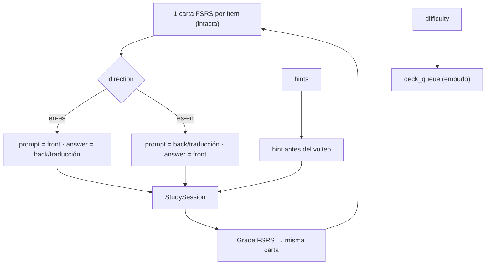

# Release notes — English Tutor v3.87.0

**Fecha:** 2026-09-27 · **Tipo:** release **DE PRODUCTO** (minor) · **Versión de app:**
`3.86.1 → 3.87.0`

**Con backend y frontend, SIN migración de BD, CON dos endpoints nuevos** (`GET`/`PUT
/api/study/config`) y **CON un cambio de contrato ADITIVO** en la cola de flashcards: los ítems
publican `prompt`/`answer`/`hint` y la cola publica `study_config`, mientras `front`/`back` se
conservan intactos. **SIN bump** de `GENERATOR_VERSION` / `DECISION_POLICY_VERSION`
(`CURRICULUM_VERSION` sigue `1.3.1`) / `LISTENING_BANK_VERSION` ni de las evaluaciones. **No se
añade ni se retira gate** —siguen los **ocho**, todos en `pending`— y `docs/audit/validation-evidence.json`
**sigue sin existir**. Es el **incremento 1 de la FASE 2**.

**En una frase.** El alumno deja de estudiar como el programa decide: elige **dirección** (EN→ES o
ES→EN), **modo** (reconocimiento, producción o mixto), **ayudas** antes del volteo y **dificultad**;
la elección se **recuerda por usuario**, se aplica a la sesión de flashcards y **el Planner 3.0 la
respeta**; y de paso se cierran las **dos deudas P2** que dejó V3.86.1.

---

## 1. Qué se puede configurar

| Dimensión | Valores | Defecto | Qué hace |
|---|---|---|---|
| `direction` | `en-es` · `es-en` | `en-es` | Qué cara es la **pregunta** y cuál la **respuesta** |
| `mode` | `recognition` · `production` · `mixed` | `recognition` | Qué **actividades admite** el Planner 3.0 |
| `hints` | `off` · `definition` · `mnemonic` · `all` | `off` | Qué **ayuda** se ve **antes** de voltear |
| `difficulty` | `gentle` · `auto` · `intensive` | `auto` | Cuánto material entra en la cola |

## 2. Dirección = presentación, no calendario

La decisión que **evita una migración**: se mantiene **una sola carta FSRS por ítem**, compartida
por ambas direcciones. **No se toca `fsrs_cards` ni su clave `(user_id, target_type, target_id)`**.
Lo que cambia es **la cara que se pinta**:



Elegir dirección **no duplica el calendario de repaso ni reinicia el progreso**: el mismo historial,
otra pregunta. En `es-en`, para el **léxico** se **fuerza la hidratación de la cara** aunque `back`
no esté vacío, porque si no el anverso en español sería una cadena vacía.

## 3. El modelo y su tolerancia

`backend/services/study_config.py` es **puro** (sin BD ni framework): fija el catálogo de valores y
normaliza. `backend/domain/study_config.py` persiste con **merge + normalización** sobre
`settings_repo`, en `run_in_threadpool`. La tabla `settings` admite solo `str`, así que el config
viaja como **JSON bajo la clave `study_config`**. **Sin migración de BD.**

Una vez fijado el catálogo, el endurecimiento del repositorio se centra en dos frentes: que el
`PUT` sea **parcial de verdad** —lo que no se envía se conserva— y que un valor fuera del catálogo
**caiga al defecto** en vez de romper la sesión. Los dos se cierran aquí.

```python
# backend/services/study_config.py (extracto)
DIRECTIONS = ("en-es", "es-en")
MODES = ("recognition", "production", "mixed")
HINT_LEVELS = ("off", "definition", "mnemonic", "all")
DIFFICULTIES = ("gentle", "auto", "intensive")

DEFAULTS = {
    "direction": "en-es",
    "mode": "recognition",
    "hints": "off",
    "difficulty": "auto",
}
```

## 4. API

| Método | Ruta | Qué hace |
|---|---|---|
| `GET` | `/api/study/config` | Devuelve la configuración **normalizada** del usuario |
| `PUT` | `/api/study/config` | **Merge parcial**; lo ausente se conserva, lo inválido cae al defecto |

Ambas exigen `Depends(current_user)`. Schemas en `backend/schemas/study.py` (`StudyConfigOut`,
`StudyConfigUpdate` con `Literal`), router en `backend/routers/study.py` (registrado en
`backend/main.py`).

## 5. La sesión de flashcards

`deck_queue` lee el config y modela los ítems de forma **aditiva**:

- `prompt` / `answer` por **dirección**; `front` / `back` se conservan.
- `hint` antes del volteo: definición, recordatorio o **ambos** según `hints`.
- `study_config` en `FlashcardQueueOut`, para que la UI sepa en qué modo está.

**Dificultad**, sin tocar el `schedule` de FSRS:

| Valor | Efecto en el embudo |
|---|---|
| `gentle` | No adelanta y **reduce a la mitad el techo de nuevas** |
| `auto` | Comportamiento actual |
| `intensive` | **Incluye los repasos que vencen en ≤ 24 h** |

En el frontend, `production` añade un **campo de texto antes del volteo**, con **comparación
tolerante** (`casefold` + espacios colapsados) y **autocalificación FSRS**: acierto → `Good`,
fallo → `Again`, mostrando **siempre** la respuesta correcta. El `lang` de los textos sigue la
dirección.

## 6. El Planner 3.0 solo filtra actividades

`mode` restringe el **conjunto admisible de actividades** **antes del argmax**:

| `mode` | Actividades admisibles |
|---|---|
| `recognition` | `recognition`, `recall` |
| `production` | `sentence`, `write`, `transfer` |
| `mixed` | *(sin filtro)* |

`support_level` / `difficulty` quedan **intactos**, así que `task_key`, la procedencia y la
evidencia **no cambian de semántica**. **Fallback documentado**: si el filtro deja el conjunto
**vacío** (p. ej. `production` sin contenido de producción), se cae al conjunto **sin filtrar** para
no dejar la sesión sin ítems. El modo es una **preferencia**, no una garantía dura.

## 7. Las dos deudas P2 de V3.86.1, cerradas

**(A) Docstring de `create_cards()`.** Deja de describir una «política de producto» que el código
no implementaba. Ahora documenta la identidad fuerte real: `UNIQUE(user_id, front_key)`,
**reutilización** de la ficha existente, completado de `back`/`mnemonic` no vacíos y añadido de la
pertenencia al mazo.

**(B) Carrera de identidad en `update_card`.** `update_card` y `update_card_with_decks` envuelven
el `UPDATE` en `try/except sqlite3.IntegrityError`: una colisión del índice
`idx_flashcard_cards_identity` (dos ediciones concurrentes al mismo anverso, donde antes podía
escapar un error crudo) se convierte en `CardFrontConflictError`, que el router traduce al ya
existente **`409 CARD_FRONT_TAKEN`**.

## 8. Pruebas

- **Backend · `test_study_config_v387.py` (nuevo)**: normalización y límites, valores por defecto,
  `PUT` parcial con merge, persistencia, cola con dirección/modo/ayudas/dificultad y filtro de
  actividades del planner **con su fallback**.
- **Backend · `test_multi_deck_v386.py`**: casos nuevos para la carrera de identidad en
  `update_card` y en el `PATCH` (`409 CARD_FRONT_TAKEN`).
- **Frontend · Vitest**: dirección, ayudas, autocalificación de producción y panel de configuración.
- **Playwright**: el spec nuevo que el plan marcaba como **opcional** **no** se añadió —la cobertura
  de esta superficie queda en Vitest, que es donde vive la lógica de dirección/ayudas/producción—.
  El **barrido completo** (26 ficheros × 3 breakpoints) se ejecutó igualmente y está **verde**:
  **118 passed · 0 failed · 32 skipped**, el mismo recuento que en V3.86.1, así que el panel nuevo y
  el volteo por dirección **no rompen** las guardias visuales existentes.

## 9. Verificación

| Comprobación | Resultado |
|---|---|
| `tsc --noEmit` | limpio |
| `vitest run` | **1061/1061** (109 ficheros) |
| `pytest` backend | **3178/3178** |
| `ruff check backend launcher` | limpio |
| `check_i18n_coverage.py --strict` | **1822** cadenas · 0 huérfanas · 0 sin definir · 0 duplicadas · 0 vacías |
| `contrast_audit.mjs --strict` | **480 pares + 6 guardas · 0 bloqueantes** |
| `npm run build` | correcto |
| Playwright (barrido completo) | **118 passed · 0 failed · 32 skipped** |
| `validation_gate.py auto --require-dist` | **10/10** (8 gates) |
| `check_release_consistency.py` | OK en los **6 orígenes** (`3.87.0`) |

## 10. Honestidad: lo que NO trae

1. **El calendario FSRS por dirección no existe**, y es a propósito: hay **una carta por ítem**
   compartida por ambas direcciones; lo que cambia es la cara presentada. Progresos separados por
   dirección exigirían una decisión de producto y una migración nuevas.
2. **El modo *listening* queda fuera**: es un subsistema aparte.
3. **El Planner 3.0 solo filtra actividades**: el `mode` no altera `support_level` ni la dificultad
   del planner, ni la selección adaptativa más allá del filtro.
4. **No hay overrides por mazo**: la configuración es **per-usuario**.
5. **El fallback del planner es deliberadamente permisivo**: con el conjunto filtrado vacío, el
   modo se degrada a «sin filtro» para no dejar la sesión sin ítems.
6. **`deck_id` sigue existiendo** como **proyección legacy** (declarado en V3.86.1); este
   incremento no lo toca.
7. **Los ocho gates humanos siguen `pending`** y el ancla de certificación sigue en `v3.83.1`.
8. **`ruff check .` desde la RAÍZ** sigue reportando **1 hallazgo preexistente y ajeno**
   (`scripts/purge_virtual_testers.py:198`, `DTZ005`), idéntico al de `v3.86.0` y `v3.86.1`:
   se declara en vez de arreglarse en silencio.

## 11. Archivos tocados (resumen)

**Backend:** `services/study_config.py` (nuevo) · `domain/study_config.py` (nuevo) ·
`schemas/study.py` (nuevo) · `routers/study.py` (nuevo) · `main.py` · `domain/flashcards.py` ·
`domain/review.py` · `services/planner.py` · `services/lexicon.py` · `schemas/vocabulary.py` ·
`repositories/flashcards.py` · `config.py` · `tests/test_study_config_v387.py` (nuevo) ·
`tests/test_multi_deck_v386.py`.

**Frontend:** `types/api.ts` · `api/normalize.ts` · `api/study.ts` (nuevo) ·
`features/vocabulary/FlashcardsScreen.tsx` · `features/vocabulary/StudySession.tsx` ·
`utils/i18n.ts` · `features/vocabulary/StudySession.test.tsx` ·
`features/vocabulary/FlashcardsScreen.test.tsx` · `package.json` · `package-lock.json`.

**Docs y release:** `release-notes-v3.87.0.md` (este fichero) · `CHANGELOG.md` · `PLAN.md` ·
`README.md` · `docs/RELEVO.md` · `docs/audit/PARKED.md` · `docs/audit/generated/`
(`i18n-report.{json,md}`, `contrast-report.{json,md}`, `release-validation.{json,md}`).

---

## Para auditar esta release

- **Ancla:** el tag **`v3.87.0`**, sobre `v3.86.1` (`1a49506`).
- **Alcance:**
  - `backend/services/study_config.py` (nuevo: catálogo, `normalize_study_config`,
    `allowed_activities`, `fallback_activity`, `hints_definition`/`hints_mnemonic`);
  - `backend/domain/study_config.py` (nuevo: `get_study_config`/`set_study_config` sobre
    `settings_repo`), `backend/schemas/study.py` (nuevo), `backend/routers/study.py` (nuevo),
    `backend/main.py` (registro del router);
  - `backend/domain/flashcards.py` (`_faces`, `_difficulty_new_cap`, `deck_queue`, ventana
    `INTENSIVE_HORIZON_HOURS`), `backend/schemas/vocabulary.py` (`prompt`/`answer`/`hint`,
    `study_config`);
  - `backend/services/planner.py` (`task_candidates`, `select_task_by_elv`) y
    `backend/services/lexicon.py` (`recommend_review_activity`, `_task_decision`,
    `review_queue_item`), con `backend/domain/review.py` pasando `allowed_activities`;
  - `backend/repositories/flashcards.py` (docstring de `create_cards` y traducción de
    `IntegrityError` → `CardFrontConflictError` en `update_card`/`update_card_with_decks`);
  - `backend/tests/test_study_config_v387.py` (nuevo) y `backend/tests/test_multi_deck_v386.py`;
  - `frontend/src/types/api.ts`, `frontend/src/api/normalize.ts`, `frontend/src/api/study.ts`
    (nuevo), `frontend/src/features/vocabulary/FlashcardsScreen.tsx`,
    `frontend/src/features/vocabulary/StudySession.tsx`, `frontend/src/utils/i18n.ts` y los dos
    ficheros de test de los componentes.
- **Lo que NO toca:** `GENERATOR_VERSION`, `DECISION_POLICY_VERSION` (`CURRICULUM_VERSION` sigue
  `1.3.1`), `LISTENING_BANK_VERSION`, las evaluaciones, el esquema de la BD (no hay migración), el
  número o la definición de los gates, la clave de `fsrs_cards` ni el mazo automático.
- **Punto de entrada al detalle:** `docs/audit/PARKED.md §V3.87.0` y `docs/RELEVO.md`.
